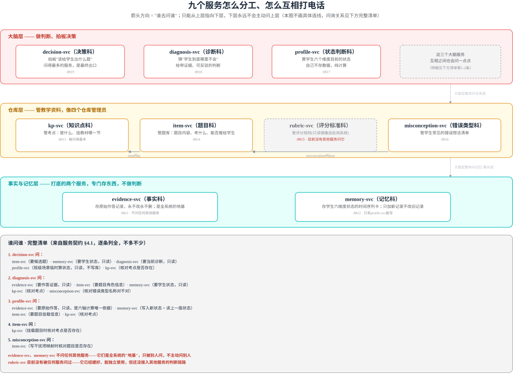
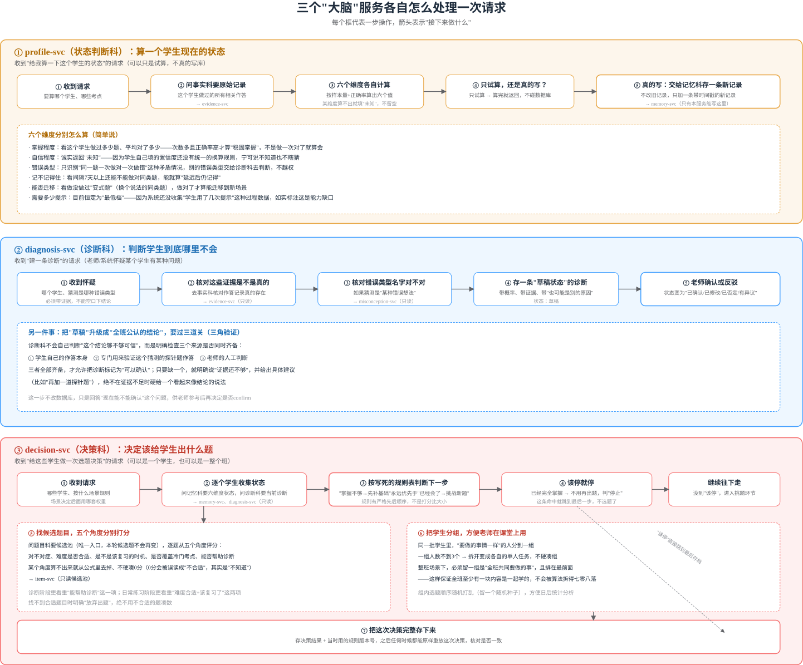

# 九个服务是什么、管什么、怎么互相配合（通俗版）

> 本文用简单的话解释 Adaptive Learning Engine（自适应学习引擎）里九个后端服务的分工、
> 谁能问谁、以及三个核心"大脑"服务各自内部怎么处理一次请求。技术细节与代码依据见
> [adaptive-learning-engine.md](./adaptive-learning-engine.md) §3.3.3/§4.1；本文只用普通话
> 复述结论，方便非技术背景的读者理解。

## 九个服务是什么，各自管什么

这套系统把"帮学生学习"这件事拆成九个各管一块的小程序（术语叫"微服务"），像九个各司
其职的部门，互相打电话（发 HTTP 请求）协作，但**谁能打给谁是写死的规矩，不能随便乱打**。

### 打底的两个服务，专门"存事实"，不做判断

- **evidence-svc（事实科）**：只管存"学生做了什么、老师说了什么"这些原始记录——谁答了
  哪道题、答得对不对、学生自己说会不会、老师批注了什么。这里存的东西**永远不改、不删**，
  因为它是后面所有判断的依据，改了就等于篡改证据。它不找任何别的服务，是整个系统的地基。
- **memory-svc（记忆科）**：专门存"这个学生现在处于什么状态"这张随时间变化的记录卡（六个
  维度：掌握程度、自信程度、错误类型、记不记得住、能不能迁移到新题、需要多少提示）。这里
  的规矩是"只能加新记录，不能改旧记录"——每次重新判断都是加一条新的时间戳记录，不覆盖
  旧的，这样才能说清楚"这个结论是什么时候、依据什么得出的"。**只有一个服务能往这里写
  东西**，就是下面要说的 profile-svc。

### 管教学资料的四个服务，像四个仓库管理员

- **kp-svc（知识点科）**：管"考点"这件事——每个考点是什么、挂在教材的哪一页哪一节。
- **item-svc（题目科）**：管题库——每道题的内容、这道题考哪个考点、能不能直接推给学生做
  （有没有经过审核）。
- **rubric-svc（评分标准科）**：管"这道题怎么打分"的规则，比如"这一步扣3分是因为没写关键
  步骤"。这些评分规则其实是从批阅系统那边搬过来的，这里只是存一份只读的副本，不允许自己
  改。**这个服务目前比较特殊**：它已经建好、能独立使用，但暂时还没有其他任何服务去问它，
  处于"建好了但还没接上用"的状态。
- **misconception-svc（错误类型科）**：管"学生常见的错误想法"这个清单，比如"把加法当成
  减法做"这种典型错误，以及每道题的哪个错误选项对应哪种错误想法。

### 做判断和决策的三个服务，是真正的"大脑"

- **profile-svc（状态判断科）**：读取学生的原始作答记录（找 evidence-svc 要），算出这个
  学生现在六个维度分别处于什么状态，然后把结果写进 memory-svc。它自己不存长期数据，纯粹
  是个"计算器"。
- **diagnosis-svc（诊断科）**：负责"猜学生到底哪里不会"，给出一个带概率、带证据、可以被
  反驳的判断（比如"70%可能是没掌握某个前置知识点，证据是这三次作答"）。它会去问
  evidence-svc 要证据、问 item-svc 要题目信息、问 memory-svc 要学生状态、问
  misconception-svc 核对错误类型名称对不对。
- **decision-svc（决策科）**：是最终拍板的地方——决定"该给这个学生（或这个班）出什么题、
  做什么练习"。它要问的服务最多：找 item-svc 要候选题目，找 memory-svc 要学生状态，找
  diagnosis-svc 要诊断结果，找 profile-svc 临时算一下班级场景的状态，找 kp-svc 核对考点
  是否存在。

## 谁能问谁——单向规则

这九个服务的问询关系是**单向的**：`decision-svc`、`diagnosis-svc`、`profile-svc` 这三个
"大脑"服务，可以向下问四个"仓库"服务（kp/item/rubric/misconception）和两个"事实/记忆"
服务（evidence/memory）；但反过来，底层的仓库和记忆服务**永远不会主动去问**上层的大脑
服务——它们不知道大脑服务的存在。这样设计的好处是：修改评分标准或题库，绝对不会不小心
影响到诊断和决策逻辑正在进行的判断。

## 三个"大脑"服务各自内部怎么处理一次请求

三个大脑服务的内部逻辑最复杂，值得单独画清楚每一步在做什么。

### profile-svc：算一个学生现在的状态（简述）

收到"给我算一下这个学生的状态"的请求后：先问事实科要这个学生的所有原始作答记录，再按
六个维度分别计算（某个维度算不出来就诚实标注"未知"，不留空、不瞎猜）；如果只是试算，
算完直接返回不碰数据库；如果是真的要写，就交给记忆科存一条带时间戳的新记录，绝不覆盖
旧记录。

### diagnosis-svc：判断学生到底哪里不会（简述）

收到"建一条诊断"的请求（通常是老师或系统怀疑某个学生有某种问题）：先去事实科核对证据
是不是真的存在，再核对猜测的错误类型名字对不对，然后存一条"草稿状态"的诊断（带概率、
带证据、带"也可能是别的原因"）。这条诊断要从"草稿"升级成"全班公认的结论"，必须经过
三道关——学生自己的作答、专门验证的探针题、老师的人工判断，三者全部齐备才能确认，缺
一个就诚实说"证据还不够"并给出具体建议，绝不在证据不足时硬给结论。

### decision-svc：决定该给学生出什么题（简述）

收到"给这些学生做一次选题决策"的请求（可以是一个学生，也可以是一整个班）：先逐个学生
收集状态和诊断结果，再按一张写死的规则表判断下一步——"掌握不够"永远优先于"已经会了"，
这是严格的先后顺序，不是打分比大小；如果学生已经完全掌握，直接判"停止"，不用再出题。
没到"该停"的，就去问题目科要候选题，从五个角度分别打分（对不对症、难度是否合适、是不是
该复习的时机、是否覆盖冷门考点、能否帮助诊断），某个角度算不出来就从公式里去掉、不硬凑
0分。选好题后把学生分组，方便老师在课堂上用——人数不到3个就拆成单人任务，整班场景下
必须留一组是"全班共同要做的事"且排最前面。最后把这次决策完整存下来，连同当时用的规则
版本号，之后任何时候都能原样重放这次决策、核对是否一致。

相关：[Adaptive Learning Engine 产品线调研](./adaptive-learning-engine.md)
