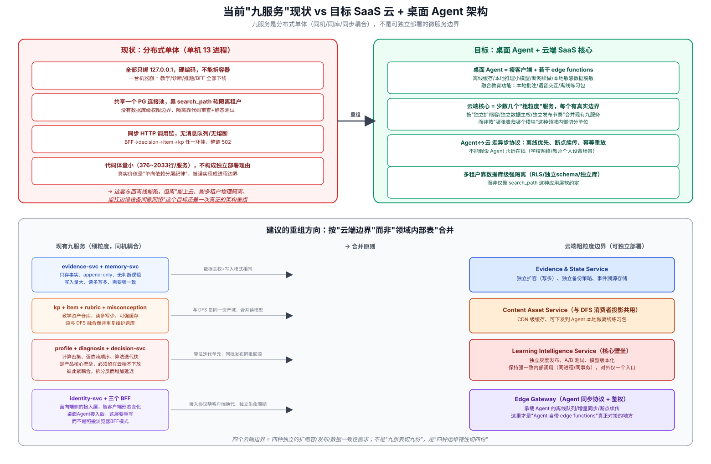
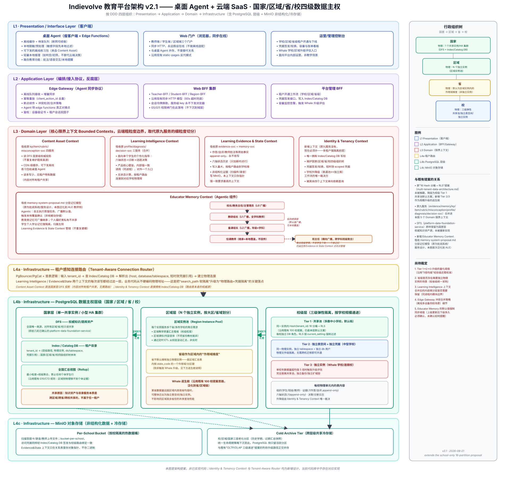

# Adaptive Learning Engine 目标架构 v2.1 —— 桌面 Agent + 云端 SaaS · 国家/区域/省/校四级数据主权

> 本文是**架构提案**，不是已实现代码的调研报告——这一点贯穿全文，多处会明确标注"当前代码库中
> 不存在对应实现"。用途是把一轮讨论（[adaptive-learning-engine.md](./adaptive-learning-engine.md)
> 的现状调研 + 本文的目标形态设计）沉淀成可复用的裁定依据，供后续实现排期参考。

## 0. 从现状到目标：为什么需要这次重组

[adaptive-learning-engine.md](./adaptive-learning-engine.md) §3.3.3/§4.1 记录的九个领域微服务
（evidence/memory/kp/item/rubric/misconception/profile/diagnosis/decision-svc）经代码实测
确认存在一个根本问题：**它们是"分布式单体"，不是真正意义上的微服务边界。**

四条代码证据（详见配图 ①）：

1. **物理耦合到无法分开部署**：全部服务硬编码只绑 `127.0.0.1`（`CONTRACT.md` §2.10），13 个
   进程必须挤在同一台机器/同一个容器里，连独立开机都做不到。
2. **代码体量小到不构成独立部署单元的理由**：实测行数 `rubric-svc` 仅 376 行，最大的
   `decision-svc` 也只有 2033 行——这是"按数据库表拆模块"的领域划分产物，不是"需要独立扩缩容
   /独立技术栈/独立团队边界"的部署单元。
3. **共享数据库，靠应用层 `search_path` 软隔离租户**，没有数据库权限层面的硬边界，隔离靠代码
   审查 + 一个静态测试脚本维持。
4. **同步 HTTP 调用链，无消息队列/无熔断**：BFF→decision-svc→item-svc→kp-svc 任一环挂，整条
   链路直接 502。

**结论**：九服务真实价值是"单向依赖的分层纪律"（大脑层可以问仓库层，仓库层不能问大脑层）——
这是很好的**代码组织原则**，但被误实现成了"进程边界"。往"桌面 Agent 客户端 + 核心逻辑落地远程
SaaS 云 + Agent 自带 edge functions"这个目标演进，需要按**运维特性**（扩缩容曲线/发布节奏/
数据一致性要求/故障隔离半径）重新分组，而不是继续按"哪张表归哪个模块"划分。

## 1. 目标架构总览（v2.1）

架构按 DDD 四层组织：**Presentation → Application → Domain → Infrastructure**。以下逐层说明
设计依据，重点标注哪些是"沿用既有提案"、哪些是"本次新增"。

### 1.1 L1 Presentation / Interface Layer（客户端）

三类客户端并存，不是替代关系：

- **桌面 Agent（瘦客户端 + Edge Functions）**——本次讨论的核心新增形态。承担离线缓存/待发队列
  （断网可续做）、本地脱敏（敏感字段先本地过滤再同步）、可下发的离线练习包（复用 Content Asset
  Context 的资产投影）、轻量本地推理（如判断"这题空着还是答了"这类初筛，不替代云端的六轴/决策
  计算）、以及融合的教育功能（本地批注、语音交互、本地提醒）。
- **Web 门户**——沿用现状（教师/学生/区域三端，同步 HTTP，永远假设在线），与桌面 Agent 并存。
- **运营/管理控制台**——新增，面向平台内部运营（租户开通/凭据签发/容量看板），非教学场景。

### 1.2 L2 Application Layer（编排/接入协议，反腐层）

- **Edge Gateway**——本次新增的关键组件，是"Agent 自带 edge functions"真正应该对接的云端入口。
  职责：离线队列接收、增量同步、幂等重放（`client_action_id` 去重，沿用现有九服务已有的幂等键
  设计思路）、断点续传、冲突检测/合并策略、设备级证书+租户会话双因子鉴权。现状完全没有这一层——
  现有的 `teacher-bff`/`student-bff` 是给浏览器设计的同步协议，假设客户端永远在线，不能直接套用
  到桌面 Agent 的间歇网络场景。
- **Web BFF 集群**——沿用现状（Teacher-BFF/Student-BFF/Region-BFF），G5/G11 权限闸门继续在此
  落地，不下沉到域层。
- **平台管理 BFF**——新增，承载租户开通工作流、凭据签发接口、容量监控告警。

### 1.3 L3 Domain Layer（核心限界上下文，取代原九服务的细粒度切分）

按运维特性合并为五个 Bounded Context：

| 限界上下文 | 吸收的原服务 | 合并依据 |
|---|---|---|
| **Content Asset Context** | kp-svc + item-svc + rubric-svc + misconception-svc | 教学资产只读仓库，读多写少，且与 DFS（platform-data-foundation-service）本质是同一资产域——不应重复维护题库真源，应直接消费 DFS 国家级权威投影 |
| **Learning Intelligence Context** | profile-svc + diagnosis-svc + decision-svc | 计算密集、强依赖顺序、算法一起迭代——是产品核心壁垒，彼此紧耦合，拆成三个进程反而增加延迟；合并后内部走强一致的同进程调用，对外只有一个入口 |
| **Learning Evidence & State Context** | evidence-svc + memory-svc | 只写事实/append-only/无判断逻辑，写入量大、需要强一致；非结构化证据（扫描件/录音）写 MinIO，本上下文只存对象指针 |
| **Identity & Tenancy Context** | （原九服务没有，新增） | 多租户强隔离的前提——唯一拥有 Index/Catalog DB 写权，维护国家/区域/省/校四级组织树，负责凭据签发/轮换与学校升降级工作流的裁决 |
| **Educator Memory Context**（Agentic 组件） | （原九服务没有，新增；吸收 [memory-system-proposal.md](./memory-system-proposal.md) 已有设计） | 承载教师侧的**主观分层记忆**——与 Learning Evidence & State Context 的客观结构化数据（作答证据、六轴状态）是两类完全不同的东西，不能合并进同一上下文 |

**关于 Educator Memory Context 的补充说明**：[memory-system-proposal.md](./memory-system-proposal.md)
最初是为批阅系统/批阅服务设计的分层记忆体系，本文首次把它泛化为 ALE 的一个独立限界上下文。
核心设计沿用该文档已有的三类记忆划分与传导规则，不重新发明：

- **纵向继承链**（教育类记忆，可广播）：校长/教务主任/主管理员（L0，全校广播）→ 教研组长
  （L1，广播给本学科全体教师）→ 备课组长（L2，广播给本年级本学科教师）→ 任课教师（继承默认值，
  可本地覆盖，覆盖不回传上级或同级）。
- **横向广播**（与纵向正交）：班主任把本班聚合学情趋势（不含学生个体）广播给本班全体任课教师，
  跨学科。
- **个人偏好类记忆**（评语风格、评分尺度微调等）私有，不进入上述任何广播/继承路径。
- **学生个人学业记忆刻意不放进本上下文**——它是强隔离、点对点查询的个体数据，继续归属
  **Learning Evidence & State Context** 管辖，避免同一份数据在两个上下文里被重复建模、
  产生"哪个上下文才是权威源"的歧义。

**为什么标注为"Agentic 组件"**：这个上下文不是被动的 K-V 存储——它需要自主执行三类行为：
①按 `teacher_id`/`subject_group_id`/`prep_group_id`/`class_id` 触发异步蒸馏任务，从原始作答/
批注事实里抽取结构化记忆；②在上级更新默认值时自主判断"未本地覆盖的下级是否需要同步"并发起
广播；③在必要场景触发人工确认环节（教师是否采纳教研组长这次更新的评分标准基线）。这三类行为
都是主动决策+执行，不是简单的读写接口，因此在架构图里单独标注为 Agentic，区别于其余四个偏
传统 CRUD 语义的上下文。

`Content Asset Context` 直连国家层 DFS 投影（内容对所有租户共享，无需路由）；其余三个上下文的
每次读写都经过 L4a 的租户感知路由。

### 1.4 L4a Infrastructure —— 租户感知连接路由（Tenant-Aware Connection Router）

新增的关键基础设施：PgBouncer/PgCat + 查表逻辑——输入 `tenant_id`，查 Index/Catalog DB，解析
出 `{host, database/tablespace, 短时效凭据引用}`，再建立物理连接。这是把现状"`search_path`
应用层软隔离"升级为"物理路由 + 凭据隔离"的关键落点：业务代码从此不再硬编码物理地址。

### 1.5 L4b Infrastructure —— PostgreSQL 数据主权层级（国家/区域/省/校）

这是本次讨论的核心诉求：**学校各自持有数据，可以是独立数据库、也可以是同一实例下的独立表空间
+独立凭据；国家和区域用独立实例（因为要跨省/跨校共享）；国家/区域/省/校是另一条组织树，用来
管理各类教育数据。**

**国家层（单一共享实例 / 小型 HA 集群）**：
- **DFS**——权威知识/题库资产，全国唯一真源，对所有区域/省/校只读共享。这正是前几轮已确认的
  `platform-data-foundation-service`，本次**未被重新实现**，原样保留为国家层组件。
- **Index/Catalog DB**——新增，租户目录本体：`tenant_id → {层级路径, 物理实例, db/tablespace,
  凭据引用}`，同时承载国家/区域/省/校四级组织树本体。
- **全国汇总视图（Rollup）**——最小粒度=校级聚合，禁止任何个体学生行，沿用既有的 G10/C13 规则
  （"区域侧物理够不到个体证据"）。

**区域层（N 个独立实例，按大区/省域划分）**：
- **区域实例池**——每个实例服务多个省/多所学校的聚合需求：区域教学质量汇总看板（校级粒度）、
  区域课标/内容变体（不同省份教材差异）、通过定时 ETL 从校层滚动汇总，非实时。这里体现"国家和
  区域用独立数据库实例，因为可以跨省/跨校共享"的要求。
- **省级作为区域内的"作用域维度"**——省默认不拥有独立物理实例，是区域汇总表内按 `state_code`
  的一个作用域/分区键；只有触发下方的 Whale 逃生舱条件才整体迁出。这是本文对"国家/区域/省/校
  是另一层级树"要求的具体落地方式：树的每一级不必然对应一个独立物理单元，物理形态按数据量/共享
  需求独立决策。

**校级层（三级弹性隔离，按学校规模递进）**——这是对"学校可以放到自己的数据库，也可以是同一
实例但独立表空间+独立凭据"这一要求的直接回应：

| Tier | 物理形态 | 适用场景 |
|---|---|---|
| Tier 1 | 共享池：同一实例内 `Hash(tenant_id)` 16 分桶 + RLS | 多数中小学校，默认档，**沿用**（未推翻）[multi-tenant-data-architecture.md](./multi-tenant-data-architecture.md) 已有的 16 分桶提案 |
| Tier 2 | 同一物理实例，独立 tablespace + 独立 db 用户 | 中型学校，物理文件级隔离，无需跨机迁移即可开通 |
| Tier 3 | 独立实例 | Whale 学校/连锁校，单校年数据量超均值 5 倍时触发升级评估，完全脱离共享池、独立备份/独立扩缩容 |

每校物理单元内的表内容保持不变：组织（学生/班级/教师）、证据 L1（作答/自评，append-only）、
六轴状态 L1（append-only）、决策/诊断日志。升降级由 Identity & Tenancy Context 唯一裁决。

**与既有 100 校提案的关系**：[multi-tenant-data-architecture.md](./multi-tenant-data-architecture.md)
提出的"16 Hash 分桶 + RLS"方案**未被推翻**，降级为本文 Tier 1 共享池的默认方案；本文新增的
Tier 2/3 是规模升级的逃生舱，思路上与该文档已有的"Whale 租户逃生舱"（§1.3）一致，本次把这个
思路从"校级单一维度"泛化到"省/区域级"同样适用。

### 1.6 L4c Infrastructure —— MinIO 对象存储（非结构化数据 + 冷存储）

对应本次讨论"MinIO 应该用来存每个学校的非结构化数据，也会用作冷数据存储"的要求：

- **Per-School Bucket**——按校隔离的热数据桶，存扫描答题卡/录音/教师上传文件，访问凭据同样经
  Index/Catalog DB 签发，与校级路由绑定一致；Evidence & State Context 只在关系表里存对象指针，
  不存二进制内容。
- **Cold Archive Tier**——跨层级共享的冷存储，承接校/区域/国家三层的老化分区（历史学期、过期
  汇总快照），统一生命周期策略下沉至此，PostgreSQL 侧只留活跃分区。与
  [multi-tenant-data-architecture.md](./multi-tenant-data-architecture.md) §3.3 已提出的
  "OLTP/OLAP 三级递进"列存升级路径正交并存，不冲突。

## 2. 行政组织树与物理形态的对应关系

组织树（国家→区域→省→校）与物理数据库实例**不是一一对应**，这是本文设计的核心取舍：

| 层级 | 物理形态 | 理由 |
|---|---|---|
| 国家 | 1 个共享实例/HA 集群 | 全国唯一真源（DFS + Index/Catalog DB），天然只需一份 |
| 区域 | N 个独立实例 | 需要跨省/跨校聚合，且数据量级支撑独立实例的运维成本 |
| 省 | 默认为区域实例内的作用域维度 | 多数省份数据量不足以支撑独立实例，强制拆分反而增加运维复杂度；Whale 逃生舱兜底特殊场景 |
| 校 | 三级弹性（Tier 1/2/3） | 学校规模差异极大（从村小到超大规模连锁校），弹性递进比"一刀切独立库"或"一刀切共享池"都更经济 |

## 3. 尚待裁定的问题

本文是提案而非最终裁定，以下问题需要后续确认：

1. **Tier 1→2→3 升级的量化阈值**——沿用 [multi-tenant-data-architecture.md](./multi-tenant-data-architecture.md)
   已有的"单校年数据量超均值 5 倍"经验值，但该文档自己也承认这是经验值，需要结合真实规模分布
   校准，本文继承同样的不确定性。
2. **省级是否存在需要独立物理实例的场景**——如省级统一采购、省级独立合规要求（教育数据不出省）
   等，本文默认"省是作用域维度"，但这个默认值未经产品侧确认。
3. **Learning Intelligence Context 合并后的内部再分层是否需要保留**——profile/diagnosis/
   decision 三者合并进同一进程后，[adaptive-learning-engine.md](./adaptive-learning-engine.md)
   §4.1 描述的六轴模型/诊断三角验证/五分量选题算法之间的模块边界是否仍需要显式维护（哪怕只是
   同进程内的代码组织），本文未给出结论。
4. **Edge Gateway 的冲突合并策略细节**——离线多设备同校场景下（同一学校多台桌面 Agent 都缓存了
   同一批学生的离线数据），增量同步产生的冲突如何合并，本文只标注了这是需要设计的点，未给出
   具体算法。
5. **Educator Memory Context 的默认值强制同步阈值**——上级（如教研组长）更新教育类记忆默认值后，
   未做本地覆盖的下级教师多久之内必须完成确认同步，未确认时如何提醒，[memory-system-proposal.md](./memory-system-proposal.md)
   §8 已指出这是需要产品侧明确裁定、不应留空的问题，本文继承同样的开放状态。

## 4. 与本仓库其余内容的关系

- 本文是 [adaptive-learning-engine.md](./adaptive-learning-engine.md) 现状调研之后的**目标
  架构提案**，两者关系是"先如实记录现状，再基于现状差距设计目标"，不是相互替代。
- [multi-tenant-data-architecture.md](./multi-tenant-data-architecture.md) 提出的 16 Hash
  分桶 + RLS 方案被**继承而非推翻**，降级为本文校级 Tier 1 的默认方案；OLTP/OLAP 三级递进的
  列存升级路径与本文 L4c 的冷存储分层正交并存。
- [platform-data-foundation-service-ingestion.md](./platform-data-foundation-service-ingestion.md)
  描述的 DFS 新数据接入流程，是本文国家层 DFS 组件的实现细节补充，两者不重复。
- [memory-system-proposal.md](./memory-system-proposal.md) 提出的分层记忆模型（三类记忆划分、
  组织层级传导规则、L1/L2 分层架构）被**直接吸收而非重新设计**，成为本文 Educator Memory
  Context 的设计依据；该文档原本面向批阅系统/批阅服务的角色体系，本文首次将其泛化应用到 ALE
  的教师侧场景，学生个人学业记忆的强隔离原则保持不变，且仍归属 Learning Evidence & State
  Context 管辖，不在 Educator Memory Context 内重复建模。
- 本文提出的 Identity & Tenancy Context、Tenant-Aware Connection Router、Edge Gateway、
  Educator Memory Context 均为**全新设计，当前代码库中不存在对应实现**，与已实测的九服务
  代码现状形成明确的"现状 vs 目标"对照，请勿混淆为已落地能力。
