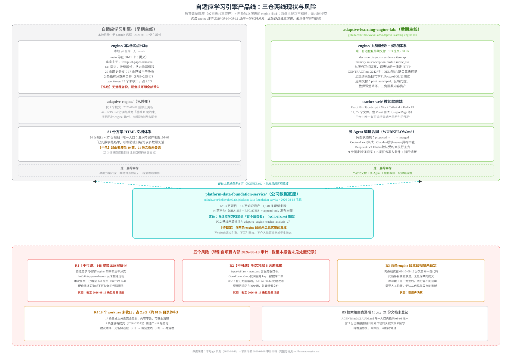
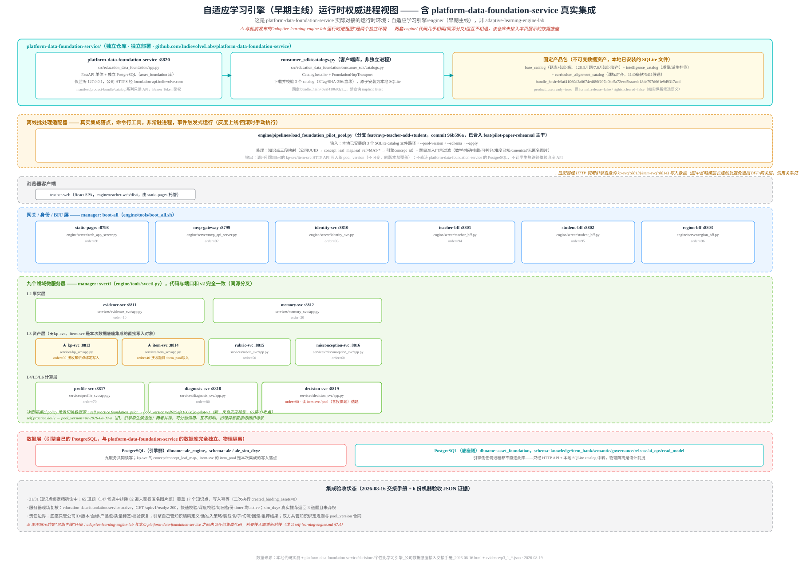
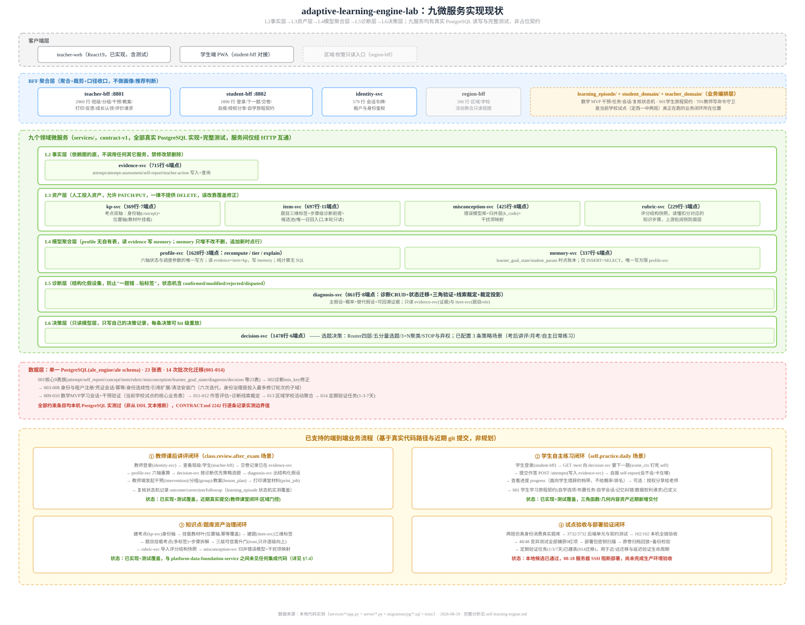
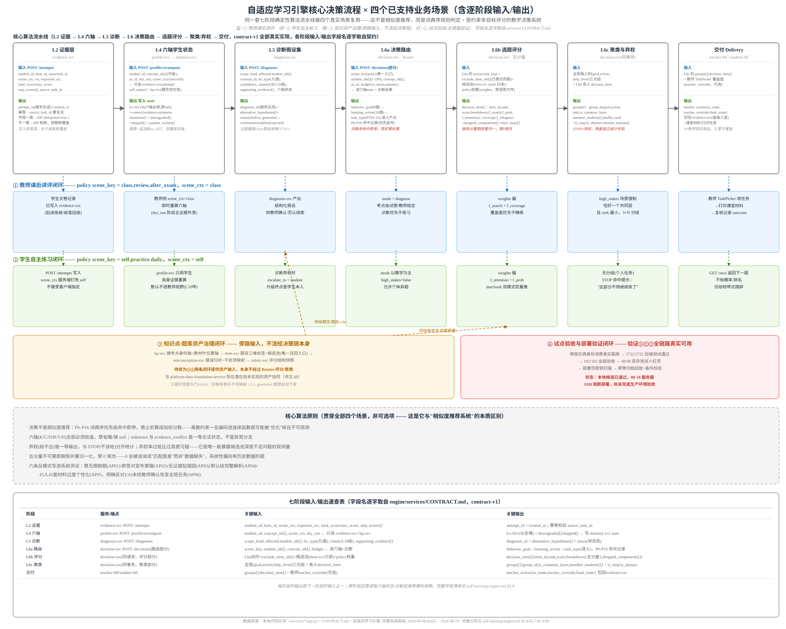
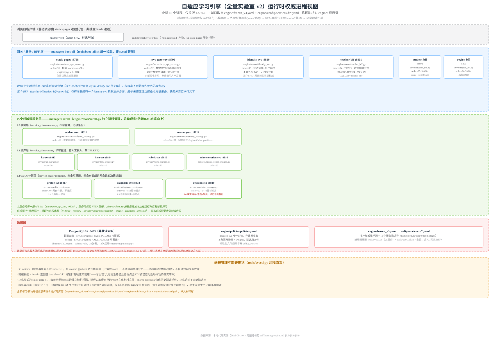

# 自适应学习引擎（Adaptive Learning Engine）产品线调研报告

本文分析 `~/src/indievolve/self-learning-engine/` 目录，这是 Indievolve 的**第二条产品线**——与
[批阅系统/批阅服务](./overall-architecture.md)（AI 阅卷）完全独立的**自适应学习/自适应推题引擎**，
目标是"高中全学科自适应教学系统"。目录下并存 3 个各自独立的本地代码/文档仓库，代表同一产品目标在不同
时间点、由不同协作模式产出的**三条并行演进线**，而非三个模块化组件——这一点是本报告的重要发现，
详见 §2。

> **命名变更记录（2026-08-20）**：为消除本地文件夹名与 git remote 仓库名不一致造成的认知负担，
> 已将两个有 remote 的顶层文件夹重命名为与 remote 仓库同名：`education-data-foundation/` →
> `platform-data-foundation-service/`；`自适应学习引擎-全量实验室-v2/` →
> `adaptive-learning-engine-lab/`。两者均为纯本地文件系统改名（`mv`），git 历史/remote/分支均未受
> 影响。`自适应学习引擎/`（无 remote，容器目录）及其内部的 `engine/`、`adaptive-engine/`、
> `dedup-service/`（均无 remote）保持原名不变。本文档全部路径引用均已同步为新名字。



## 1. 产品概览：目标、客群与优劣势

本节内容提炼自项目团队产出的三份对外/内部定位文档：`对外_产品理念介绍_教育局与县级领导_2026-08-08.html`
（面向教育局与县级领导的产品理念材料）、`利益相关者与市场结构_问题定义_2026-08-08.html`（市场结构
分析）、`师生双主体用户画像_最终结论与行动方案_v1_2026-08-06.html`（用户画像行动方案）。以下内容
均转引自这些文档的原始表述，非本报告推导。

### 1.1 产品理念与目标

**一句话理念**（对外材料原话）：**"让每一个县城孩子，都有人告诉他下一步该练什么。"**

**问题定义**：城里孩子放学后有一对一辅导，知道自己薄弱在哪、明天该练什么；县里孩子同样努力，却常常
在已经会的题上反复消耗。差的不是努力，是"针对性"——而针对性一直是个买不起的东西。产品要做的事，
是把"针对性"变成一次批改之后自动产生的结果，而不需要额外的人力投入。

**核心洞察**：教学过程里最值钱的那部分信息，今天几乎全部流失了。县中的教学绝大部分发生在纸上——
学生在纸上答题，老师在纸上批注，订正也写在纸上，但这些信息最后只沉淀成一个分数：不知道学生错在哪
一步、当时是怎么想的、讲完之后到底会没会。信息一旦流失，三件事就都做不成：老师没法针对性辅导（只能
大水漫灌）、教师减负没有抓手（重复劳动没法交给机器）、质量监测只能靠考完看分数（永远滞后一个学期）。
产品把这层信息接回来，试图让三件事同时松动。

**产品闭环**（"一次讲评的完整闭环，当天可以走完"）：学生纸笔作答（不增加屏幕时间）→ 老师照常批改+
扫描批阅（100 份卷约 5 分钟）→ 系统找出本次最值得讲的关键问题（每条结论可点回原始答卷）→ 生成分层
练习（全班共同题+分组补充，教师确认后打印下发，回到纸上不需要设备）→ 过几天再考一次验证判断是否
正确。价值不在任何单独一步，而在最后那条回线——系统必须回头验证自己上次的判断对不对，这是它和"出
一份 AI 分析报告"的根本区别。

### 1.2 目标客群与利益相关者

**四个容易被混为一谈的"单位"**（利益相关者文档最重要的发现——这四个单位的边界由不同的力决定，
且互不重合）：

| 单位 | 由什么决定 | 边界 |
|---|---|---|
| ① 竞争单位 | 分省录取制度 | 省——学生真正想知道的是全省范围内的位置，这是零和的边界 |
| ② 采购单位 | 财政与管理体制 | 校/区县/市多级并存，按金额分层；省级是"守门人"（App 备案/教材目录/白名单）而非买家 |
| ③ 续费单位 | 日常使用惯性 | 教师/班——买的人（行政/学校）不用，用的人（教师）没有采购投票权，这是决定续费率（LTV）的真实变量 |
| ④ 数据可得单位 | 租户隔离与合规 | 校——跨校聚合会触碰隐私边界，是四者中最小的一个，卡住其余三个 |

**11 类利益相关者及其真实 KPI**（并非口号）：

| 主体 | 角色 | 真实 KPI |
|---|---|---|
| 学生 | 作用对象 | 省内位次/目标校可及性；短期是"今晚少做点无用功" |
| 学科教师 | 协作者·渠道 | 班级成绩；省时；不被排名 |
| 班主任 | 跨科整体视角持有者 | 本班整体状态·跨科视角·家校沟通（现有画像全是单科，跨科整体无人持有） |
| 教研员（区县/市教研室） | 进课堂的真实闸门 | 区域教学质量·命题质量·集体备课与公开课（决定统考校准通道有没有题、教师愿不愿意在课堂上用） |
| 家长 | 付费方之一·消费者 | 孩子进步的可见性·焦虑缓解（不建独立画像，复用学生报告契约） |
| 校长/学校 | 采购+管理 | 升学率·一本上线·教师队伍稳定 |
| 区县教育局 | 最高频采购层 | 校际均衡度·双减合规·质量监测 |
| 市教育局 | 高中常见统筹层 | 全市质量·中高考成绩·区域声誉 |
| 省教育厅 | 守门人（非买家） | 合规·标准·平台统一（App 备案/教材目录/白名单，准入而非采购） |
| 考试院/命题方 | 标准与数据源 | 命题科学性·考试安全（统考数据的制度来源） |
| 教辅/题库供应商 | 上游资产 | 版权·铺货 |

**一个结构性的 KPI 冲突**：区县教育局的核心政策 KPI 是"校际/生际差异系数"（优质均衡督导评估），
学校的 KPI 是"升学率与尖子生"——若把"均衡"放进选题的目标函数，优化它最省力的方式是压制头部而非
提升尾部（给强的学生推简单题，分布自然收窄）。项目据此定下一条硬结论：**均衡类指标只能作为监测
护栏，永久禁止进入任何选题/推荐的目标函数**。

**当前真实落地规模**（对外材料 2026-08 实测数字）：2026 年 4 月起在甘肃定西驻校验证，系统已进入
常态化使用；9 学科整卷盲测批阅准确率 99%（含竞赛题，驻校实证非实验室数据）；5 所付费学校（三年
合同制）；10 省 20+ 所高中试点协议；另有 4 家教育公益机构合作。**自适应练习推荐**这一核心引擎
"已完成设计与首轮验证，正在定西的学校做真实课堂试点"——即本报告后续章节调研的代码与架构，对应
的正是这条正在试点验证中的能力线，尚未进入大规模量产阶段（批阅/学情分析已量产，自适应推题仍在
试点）。

### 1.3 产品优势

对外材料明确总结了"为什么它不是又一个 AI 批改软件"的三个技术差异点，这些同时也是产品的核心竞争力：

1. **给"学会了"一个可操作的四步证据链定义**：当场做对 → 不看答案能自己提取 → 隔几天还能做对 →
   换个情境还能做对。四步没走完，系统内部不允许标记为"已掌握"，对外也只能说"当堂表现改善，长期
   保持待验证"——解决的是"老师讲完感觉挺好，一个月后月考全忘"这个普遍痛点。
2. **能识别"最危险的那类错"**：在关键题上让学生先做置信度自评（很确定/不太确定/基本是猜的），
   与实际对错交叉出四种情况，其中"自己很确定却做错"这一格暴露的是学生脑子里一条"错误但自洽的
   规则"——他会反复用、反复错，且自己不会去问，光看分数永远发现不了这类问题。
3. **把"教是为了不教"变成可计算指标**：帮助分六级，原则是"能用第二级解决就不给第五级"，核心
   衡量指标之一是学生"在越来越少的帮助下自己做出来的比例"——如果用了一年学生每一步还要问系统，
   这个系统就算失败了一半，这条被明确写进了产品的技术目标里，而非停留在口号层面。

**成本与效率优势**：100 份试卷批阅从约 5 小时缩短到约 5 分钟（效率约 60 倍）；生均成本约为同类
的四分之一（端侧推理+国产算力路由）；全程纸笔作答，学生新增屏幕时间为零，与学校现有管理方式一致，
不需要额外设备投入即可落地。

**对区域治理的实际用处**（对外材料逐条对应）：县中振兴/留住生源（把"针对性辅导"从城里独有变成县中
标配）、教师减负（重复劳动交给系统，可按校按科统计批改与备课时长的前后对比）、双减落实（已掌握的
知识点会停止推送，作业量/重复练习占比可查）、质量监测与教研指导（考点层面的分布可下钻到具体题和
答卷）、优质均衡创建（校际差距第一次可落到具体知识点而非只有总分差）、教育数字化迎检（嵌在老师原本
就要做的批改环节里，日常真实使用日志按天按班按科可查）。

### 1.4 产品限制与主动约束

产品在对外材料中主动声明了四条**刻意不做**的限制，团队将其定位为"给客户的保险"而非能力缺陷：

| 主动限制 | 挡掉的风险 |
|---|---|
| **不承诺提分** | 提分需要严格对照研究才能下结论；对所有人口径一致：本系统提供诊断参考，教师确认后使用。批阅准确率/效率是可直接测量的工程指标，与学习效果是两回事，不混为一谈 |
| **不替代老师做判断** | 系统只负责把证据整理清楚，判断权在老师；全班教学动作必须老师确认；每条结论都能点回原始答卷 |
| **不给学生贴标签** | 不做"学习风格""智力类型"等无科学依据的分类，也不做固定分层；系统连"你是视觉型学习者"这类话都禁止输出；分组按当次具体知识点动态调整 |
| **不把教师数据用于考核** | 系统记录教师使用情况，但这些数据只用于让系统本身更准，不提供给学校/行政部门做排名与绩效，这一条在系统权限上做了硬限制 |

**数据合规要点**：学生真实姓名与学号不进入分析系统，内部用不可反推的编号，真实身份对照表单独加密
存放、与数据库物理分离；批阅在端侧硬件完成，敏感数据不必出校即可处理；查阅留痕全程可倒查；学生
可查看系统对自己的判断并提出异议，异议触发重新诊断而非被忽略。

**当前已知的能力缺口**（转引自 §3、§4 的代码实测发现，此处汇总列出）：真实判分与错因反馈链路
（学生端当前的对/错回写是占位机制）、1/3/7 天保持验证的业务编排逻辑（数据表已建但消费逻辑未实现）、
`f_prob`/`f_infogain` 距离架构设计的 BKT/IRT/真信息增益目标仍有差距（当前是简化启发式实现）、
导师/校管/区域等产品角色（身份契约已声明但注释明确"扩展前一律不可执行"）——这些缺口均有代码或
文档依据，详见 §3.3.3.4 与 §4.4.7。

## 2. 三条演进线的真实关系与当前定位

### 2.1 三个仓库/目录一览

| 目录 | git remote | 最后提交 | 定位 |
|---|---|---|---|
| `platform-data-foundation-service/` | `github.com/IndievolveLabs/platform-data-foundation-service` | 2026-08-18（活跃） | 公司级知识点与题库资产底座，服务化 API，唯一"生产级"仓库 |
| `自适应学习引擎/` | 无 remote（本地仓 `engine/` 分支 `feat/pilot-paper-rehearsal`，另有已停用的 `adaptive-engine/`） | 2026-08-19（活跃，但**无远程备份**） | 早期主线（v1）：81+ 份方案 HTML + 本地 `engine/` 试点代码 |
| `adaptive-learning-engine-lab/` | `github.com/IndievolveLabs/adaptive-learning-engine-lab` | 2026-08-17（活跃，163 提交/68 PR） | 后期主线（v2）：多 Agent 编排体系 + 独立 `engine/`（含 teacher-web 前端） |

**关键澄清（易混淆点）**：`自适应学习引擎/` 目录内部也有一个名为 `engine/` 的子目录，与
`adaptive-learning-engine-lab/engine/` **是两套完全独立、无共同提交历史的代码**，只是在
2026-08-10~08-12 之间从同一份早期代码分叉。两者都在演进，都自称"engine"，阅读或分派任务时必须先确认
究竟指哪一个。**这个区分不只是命名混淆问题**——`platform-data-foundation-service` 的真实生产集成
对象正是 `自适应学习引擎/engine/`（早期主线/v1）而非 `adaptive-learning-engine-lab/engine/`（v2），
详见 §2.4。

> **命名说明**："早期主线"/"v1" 与 "后期主线"/"v2" 仅用来标注两套同源分叉代码的**分叉时间先后**，
> 不代表"早期主线"已停用、已废弃或不再重要——早期主线目前仍承载着一次真实的生产级数据集成（见
> §2.4），且该集成代码只存在于这一个仓库、无远程备份。判断"v2 是生产主线"依据的是新功能开发的
> 活跃度和 PR 流程，与"早期主线是否还在被使用"是两个独立的问题，不能相互替代。

### 2.2 项目重心迁移的证据

`自适应学习引擎/工作总账_两条线现状与五个风险_2026-08-18.html` 是项目团队自己产出的一份只读盘取证
报告，对三条线的关系给出了比任何 AGENTS.md 都更可信的结论（本报告转引其核心事实，未重新实测）：

- **项目重心已迁出"自适应学习引擎/"这个目录**：真正走 GitHub PR 流程、每天还在提交的是
  `adaptive-learning-engine-lab`（08-17，PR #68 已合）与 `platform-data-foundation-service`（08-18）。
  `自适应学习引擎/engine/` 是一份独立、**没有远程**的本地 Git 历史，与 v2 的 `engine/`
  互不相通，两者仅在 2026-08-10~08-12 之间共享过同一份早期代码（可通过三份相同的 08-10 状态文件
  `STATUS`/`AUDIT_FIX_PLAN`/`M0` 印证），此后各自独立演进，**没有任何共同提交**。
- **协作模式的角色分工**：Codex 在这个项目里从未扮演主要写手角色，用户原话是"帮我监督 Claude"；
  149 个 Codex 会话集中在 2026-08-10~08-14，产出集中在编排方案与技术选型文档（如"多 CodingAgent
  高质量高速交付方案"），实际代码几乎全部出自 Claude 线；2026-08-15 后 Codex 会话归零，但 Claude
  代码线与文档线仍继续推进到 08-16/08-17。

### 2.3 三仓定位与任务落点判断

三个仓库各自的 `AGENTS.md`/`CLAUDE.md` 都只描述**自己仓库内部**的规则，没有一份文档说明三仓之间
该如何取舍，且其中至少两处已确认失效（详见 §2.2）。基于实测的目录结构、git 活跃度与用户确认，
本产品线的正确定位如下：

| 仓库 | 正确定位 | 依据 |
|---|---|---|
| `adaptive-learning-engine-lab/` | **本产品当前的生产/交付主线（live repository）** | 唯一有 GitHub remote + PR 流程且持续每日提交的仓库；`teacher-web` 是三仓中唯一有可运行前端产品雏形的部分；`implementation-plans/` 的版本化执行规格（V1.4–V2.6）体现出比其余两仓更强的变更管理纪律 |
| `platform-data-foundation-service/` | **数据集 + 必要数据处理管道**，当前已有真实生产集成——但消费方是**早期主线 `自适应学习引擎/engine/`**，不是 v2（详见 §2.4 更正说明） | `integrations/` 子包下 `curriculum_importer.py`、`legacy_qbank_importer.py`、`dedup_gateway.py`、`deepseek_annotation.py` 等即为实际数据摄入/清洗/标注管道代码；AGENTS.md 明确自身定位"自适应学习引擎是首个消费者，不是宿主"，且这一定位已通过 `decisions/个性化学习引擎_公司数据底座接入交接手册_2026-08-16.html` 落地为真实运行的集成 |
| `自适应学习引擎/` | **仅作 PRD、早期方案与实测证据的参考资料库**，不再是代码开发目录 | 81 份方案 HTML + PRD工作区/PRD附件承载了绝大多数产品理念与裁定历史；其内部 `engine/` 已被 v2 的 `engine/` 事实取代（两者分叉自同一份代码但此后独立演进、无共同提交），且存在无远程备份的高风险（§2.5 R1），不应再作为新功能的开发落点 |

**三仓关系图**：

```
自适应学习引擎/engine/（早期主线/v1）  ◀──（真实生产集成，见 §2.4）──  platform-data-foundation-service/
        │ PRD/早期方案/实测证据                                        （数据集 + 处理管道 API）
        │ 参考资料，不再新增功能开发
        ▼
adaptive-learning-engine-lab/（生产主线/v2：engine 九微服务 + teacher-web 前端）
        —— 与 platform-data-foundation-service 之间，本次调研未发现任何代码集成 ——
```

`adaptive-learning-engine-lab/AGENTS.md` 里"上下文源 `/Users/broadguoping/Desktop/Ai-imac/自适应
学习引擎` 永久只读"这条隔离规则，实际操作含义就是：**v2 可以读取 `自适应学习引擎/` 的方案文档作为
设计输入，但不应把它当作可修改的代码来源**——这与上表的定位判断一致，只是该仓库自己的 AGENTS.md
把这条规则局限在"文件系统权限"层面，没有说明白"为什么"，本节补充了背后的产品线定位依据。

**后续任务的落点判断**（供派发/接手任务时参考）：

| 任务类型 | 应进入的仓库/目录 | 不应做的事 |
|---|---|---|
| 教师端/学生端产品功能、九微服务业务逻辑、当前仍在交付的代码 | `adaptive-learning-engine-lab/engine/` | 不要误进 `自适应学习引擎/engine/`——两者同名九微服务但已是互不相通的独立历史 |
| 知识点/题库资产的增删改、去重、课标对齐、发布治理 | `platform-data-foundation-service/` | 不要在 v2 的 `engine/` 里重复实现资产清洗逻辑；v2 应以消费者身份调用其 API，而非直接读取原始数据 |
| 查历史方案、被裁定过的口径、早期实测证据、PRD 原文 | `自适应学习引擎/`（81 份 HTML + PRD工作区/PRD附件） | 不要在此仓库内新增代码或当作开发目录；发现与 v2 现行方案冲突时以 v2 为准 |
| 早期 `adaptive-engine/`、`dedup-service/` | 仅供历史参考 | 不要以为它们是"基线"或仍在维护——前者已被 v2 的 `engine/` 取代，后者更新频率极低 |

### 2.4 更正：platform-data-foundation-service 与早期主线的真实集成关系

此前版本的报告曾判断"两者代码/数据完全独立，尚未见已实现的协同"——**这一结论已被证伪，属于需要
更正的错误**。`platform-data-foundation-service/decisions/` 目录下有一份完整的交接验收文档
`个性化学习引擎_公司数据底座接入交接手册_2026-08-16.html`，配套 6 份 JSON 格式的机器验收证据
（`evidence/p3_1_adaptive_engine_handoff_acceptance_2026-08-16.json` 等），记录了一次**真实发生、
有 commit hash 可查证的生产级集成**。

**集成对象的关键更正**：交接证据文件明确记录 `source_repository:
/Users/broadguoping/Desktop/Ai-imac/自适应学习引擎/engine`、`source_branch:
feat/mvp-teacher-add-student`、`source_commit: 96b596a9e35a0997c8af746aed05704afac8b983`——
这是**早期主线/v1**（`自适应学习引擎/engine/`），**不是**§2.3 判定为"当前生产主线"的
`adaptive-learning-engine-lab`。本次调研在 v2 仓库全文搜索
`platform-data-foundation-service`/`EDF_BASE_URL`/`foundation_pilot` 均**无任何匹配**，也在早期主线
`engine/` 仓库核实过：该 commit **已被合并进事实主干分支** `feat/pilot-paper-rehearsal`
（`git merge-base --is-ancestor` 验证通过；注意该仓库的 git 字面 `main` 分支反而落后于
`feat/pilot-paper-rehearsal`，后者才是团队实际推进新功能、承载本次集成的分支——这也是本仓库"分支
纪律较松散"这一风险点〔见 §2.5〕的具体体现之一），即这次集成不是一次性实验分支，而是真实进入了
早期主线事实主干的代码，且截至 2026-08-19 未见任何回滚或废弃迹象。

**角色定位**（教育数据底座在自适应学习引擎里扮演的具体角色）：

1. **唯一的题库/知识点资产供给方**：`platform-data-foundation-service` 提供公司级统一的题目库（128.3 万
   题）与知识资产（7.6 万个），早期主线引擎不再自建题库，而是通过一个**离线投影适配器**
   （`pipelines/load_foundation_pilot_pool.py`）把底座的固定产品包转换成引擎自己的 `item_pool`
   表数据。
2. **只读、异步、版本锁定的服务**，不进入实时推荐路径：架构文档原话——"底座 API 即使短暂不可用，
   已装载的引擎仍可推荐"。集成方式是「控制面调用 manifest API 解析版本→同步面用 SDK 下载并校验
   三个 catalog（`ETag`/`SHA-256`/血缘）→适配器离线生成引擎专用不可变 `item_pool` 包→引擎热
   路径只读本地池，不跨服务查询、更不直连底座 PostgreSQL」。这与 §3.3.3.1 描述的 v2 九服务架构
   中 `item-svc` 的候选池角色（"唯一召回入口，本轮只读"）在设计理念上高度一致，但**目前是两套
   独立的题库来源**（v2 的 `item-svc` 数据来源与 platform-data-foundation-service 之间未见对接）。
3. **知识点身份的桥接层，而非直接复用**：底座用公司 UUID，引擎用 `SH-SX-C-####` 格式的
   `concept_id`——集成没有让两套身份直接互认，而是复用引擎里已存在的 `concept_leaf_map` 表做
   三段映射（公司 UUID → `leaf_ref=MAT-<source_id>` → 引擎 `concept_id`），31 个知识点全部精确
   命中，任何缺失或一对多的情况整批失败关闭（不猜测、不部分接受）。
4. **题目准入门禁的执行方**：并非把 128.3 万题全部导入，而是应用一套显式准入 profile（数学学科+
   来源层级叶精确挂载+可自动判分+难度已知+精确去重 canonical+题干不含未鉴权匿名图片），从 147 道
   候选中排除 82 道匿名图片题，最终只有 65 道题、覆盖 17 个知识点进入引擎候选池——这与 §3.3.3.3
   提到的试点验收数据（"两班仿真身份消费真实题库"）里的题目规模一致，说明当前试点用的真题正是
   来自这次集成，而非引擎自建题库。
5. **新旧池并存的灰度切换机制**：引擎通过 `policy` 场景区分新旧数据源——
   `self.practice.foundation_pilot` 场景指向教育数据底座投影的新池
   （`pool_version=edf-b9af41060d2a-pilot-v1`），旧场景 `self.practice.daily` 继续使用引擎原有
   候选池（`pool_version=pv-2026-08-09-a`），两者并存可分别调用，出现异常可直接切回旧场景而不
   删除任何数据——这是把 §4.1（核心算法与关键能力）提到的"版本戳驱动可重放"这条决策层设计原则，
   延伸应用到了数据供给层。

**目标架构 vs 当前实现的差距（重要区分，避免高估已落地的自动化程度）**：底座自己的目标架构文档
`知识点与题库数据底座_五轮推演与目标架构_2026-08-13.html` 明确设计了**三通道通信模型**，且与 P0.4/
P0.5 验收规格（见 `platform-data-foundation-service/decisions/`）在事件机制上互相印证：

| 通道 | 用途 | 设计文档描述 | 当前代码实现状态 |
|---|---|---|---|
| 同步查询 | 即时问答 | HTTP OpenAPI | **已实现**——即上文"API 参考"列出的 consumer API |
| **异步事件** | 状态传播 | **事务性 Outbox + CloudEvents 信封**，事件类型 `catalog.release.published.v1` | **底座侧已实现**（`release/outbox_event` 表 + `releases/service.py` 同事务写入），但**未见 ALE 侧有订阅/消费该事件的代码**——目前 ALE 拿到新数据靠适配器脚本主动拉取，不是被动接收通知 |
| 批量搬运 | 海量资产交换 | 带哈希校验的 release manifest 文件 | **已实现**——即上文角色定位第 2 点描述的 catalog 下载安装机制 |

**用户曾提出的"学校材料上传→底座生产标准包→投递到对象存储（如 MinIO）→通知 ALE 确认使用"这一
端到端场景，经代码核查确认是对目标架构的合理延伸理解，但不是已有文档明确记载的设计，且以下三个
具体环节目前均无代码证据**：
- **学校侧上传入口**：底座当前唯一的外部数据接收工具是 `tools/receive_source_snapshot.py`——
  命令行工具，从标准输入流原子接收数据后落本地文件，供内部数据团队用管道命令导入历史题库快照，
  不是面向学校用户的上传接口，也未见任何 Web 表单/API 端点承载"学校上传教材"这个场景。
- **对象存储中转（MinIO 等）**：全库搜索未发现 MinIO 相关代码或配置；该项目实际使用的对象存储是
  **阿里云 OSS**（用于批阅系统的图片资产，与自适应学习引擎的题库/知识点资产分属不同产品线，见 §5），
  底座自身的产品包分发目前直接通过 consumer API 的文件下载完成，未经由任何对象存储中转层。
- **ALE 订阅确认底座事件**：如上表所述，`catalog.release.published.v1` 事件目前只在底座侧产生，
  ALE（无论 v1 还是 v2）代码中均未找到消费该事件、或反向确认（acknowledge）已收到数据的逻辑。

**一句话结论**：目标架构里"发布方产生事件、消费方被动响应"的事件驱动闭环，目前只走通了"发布方
产生事件"这一半；消费方（ALE 早期主线）实际使用的是**主动拉取式**的适配器脚本，而非订阅底座事件
后被动触发。这不代表架构设计有问题——五轮推演文档本身也明确"先把资产身份、版本、发布与消费闭环
做对，再为真实负载增加基础设施；不为想象中的规模预付复杂度"，即事件通道的消费端目前尚未实现，
可能正是这条"渐进式收敛复杂度"路线下有意延后的部分，而非遗漏。

**关于该架构选型是否为 AWS/Azure 上的最佳实践**：这个问题的前提在本项目里不成立——项目全部基础
设施跑在**阿里云**（ECS/RDS MySQL/OSS/KMS），全部文档与代码中未见任何 AWS/Azure 相关内容，也没有
"是否上 AWS/Azure"的选型讨论。选择"事务性 Outbox + CloudEvents"这个模式的驱动因素是**云厂商中立
的分布式系统设计考量**，不是云平台特定选择：五轮推演文档的论证是——同步串行 HTTP 通知多个下游消费
方会制造事实上的分布式事务风险；直连数据库或用 CDC 暴露内部表结构又会破坏服务边界；outbox 模式把
"业务状态变更"与"事件写入"绑定在同一数据库事务内提交，是保证一致性的标准手段，且不需要引入 Kafka/
RabbitMQ 等外部消息中间件（文档原话"当前不引 Kafka、gRPC 或新的微服务群"，是刻意的复杂度收敛决策）；
CloudEvents 只是 CNCF 定义的事件信封标准格式，云厂商中立，用于让事件 payload 结构标准化。

**API 参考**（基于当前代码实现，`platform-data-foundation-service/src/education_data_foundation/consumer_api/routes.py`）：

底座对外暴露统一前缀 `/api/v1/assets` 的只读消费 API（`Depends(require_service_token)` 服务级
Bearer Token 鉴权），按用途分四组：

| 分组 | 关键端点 | 用途 |
| --- | --- | --- |
| 产品包/Catalog 交付 | `GET /product-bundles/{bundle_hash}/manifest`、`GET /internal-catalogs/{catalog_hash}/manifest`+`/shards/{shard_hash}`、`GET /intelligence-catalogs/{catalog_hash}/manifest`+`/artifacts/{artifact_hash}`、`GET /curriculum-alignment-catalogs/{catalog_hash}/manifest`+`/artifacts/{artifact_hash}` | `consumer_sdk/catalogs.py` 的 `CatalogInstaller` 下载并校验固定产品包，即上文角色定位第 2 点提到的"同步面"步骤；所有响应带 `ETag`（内容哈希），manifest 均为不可变资源 |
| 历史快照浏览 | `GET /qbank/snapshots`、`GET /qbank/{source_snapshot_id}/items`、`GET /knowledge-trees/snapshots`、`GET /knowledge-trees/{source_snapshot_id}/nodes`、`GET /curriculum/standards`、`GET /curriculum/standards/{source_snapshot_id}/clauses` | 按分页浏览遗留题库/知识树/课标快照，供人工核对或离线分析使用，非引擎适配器的调用路径 |
| 批量解析（引擎适配器实际调用） | `POST /engine-concept-bindings:batchResolve`、`POST /claims:batchGet`、`POST /concepts:batchGet`、`POST /items:batchGet` | 供消费方按 ID 批量换取知识点绑定/题目知识声明/知识点与题目详情的规范化数据；`load_foundation_pilot_pool.py` 的知识点三段映射与题目投影即依赖这组批量接口的等价数据（脚本本身直接读本地已安装的 SQLite catalog，而非逐条实时调用这组 API——见下方"调用路径澄清"） |
| 内部候选/发布 | `GET /internal-candidates/qbank/{source_snapshot_id}/items`（受 `require_internal_candidate_api` 特性开关保护）、`GET /releases/{release_id}/manifest` | 未走完整质量流程的候选题目查询（默认关闭）、发布版本 manifest 查询 |

**调用路径澄清**：`load_foundation_pilot_pool.py` 适配器**不直接调用上表任何 HTTP 端点**——它读取
的是 `consumer_sdk/catalogs.py` 提前下载并安装好的本地 SQLite 文件（`base_catalog`/
`intelligence_catalog`/`product_bundle`），只在最后写入阶段调用**引擎自己的** `kp-svc`
（`POST/PUT /api/v1/concepts`、`/api/v1/concepts/{concept_id}/leaves/{leaf_ref}`）与 `item-svc`
（`POST /api/v1/items`、`PUT /api/v1/items/{item_id}/concepts`）。换言之，底座的 consumer API
只在"同步面"（SDK 下载安装）被调用一次，适配器脚本运行时是纯离线读本地文件 + 写引擎自身服务，
这也是 §2.4.1 图中把两次调用画成不同颜色/不同阶段的原因。

**责任边界划分**（交接手册原文）：教育数据底座只负责稳定的公司 ID/版本、来源血缘、产品包/API/SDK、
质量与候选标签、版本不可变性、备份与恢复；不涉及学生画像、推荐策略、活动池指针或在线决策。个性化
学习引擎负责自己的知识点编码定义、池准入策略、兼容包装载、影子对比、灰度切流、回滚与最终推荐结果；
不得改写底座资产、不得直连底座私有数据库、不得把候选状态（`proposed`）升格为已审核事实。双方共同
维护知识点绑定规则、ID/哈希兼容 ADR、`pool_version` 合同与验收门槛，任何一方不得未经证据单方改变
已冻结的合同。

**对本报告结论的影响范围**：§5"与批阅系统产品线的关系"一节的判断不受影响（批阅系统与自适应
学习引擎两条产品线之间确实未见集成，这次发现的集成是自适应学习引擎内部两个子仓库之间的集成，不
涉及批阅系统）。§2.3"三仓定位"表格中"v2 是生产主线"的判断本身也不受影响（那是基于 git 活跃度和
PR 流程得出的独立结论），但"`自适应学习引擎/` 仅作参考资料库不再开发"这一表述需要加一条限定：
**该仓库的 `engine/` 虽不建议承接新功能开发，但已完成的这次数据底座集成是真实生产代码，不应被
当作"纯历史遗留"随意删除或忽略**——若后续决定把 v2 作为唯一主线，这次集成的适配器代码
（`pipelines/load_foundation_pilot_pool.py`）与其验证过的映射规则需要作为迁移参考，而非从零
重新设计。

#### 2.4.1 早期主线运行时权威进程视图（含 platform-data-foundation-service 真实集成）

§4.5 的运行时进程图仅覆盖 **adaptive-learning-engine-lab（v2）** 环境，且该环境目前未接入
platform-data-foundation-service（上文已证实两者互不相通）。为了如实反映 platform-data-foundation-service
**实际对接的运行时环境**——早期主线 `自适应学习引擎/engine/`——本报告单独绘制以下进程图，而不是把
底座画进 v2 的图里制造"v2 已集成底座"的误导：



该图的九个领域微服务层与 §4.5 的 v2 进程图在代码、端口、`svcctl`/`boot_all.sh` 编排工具上完全一致
（同源分叉），可直接对照阅读；核心差异集中在两处：

- **顶部新增 platform-data-foundation-service 独立服务区块**（:8820，独立仓库、独立 PostgreSQL、独立部署，
  通过 `manifest`/`product-bundle`/`catalog` 系列只读 API 对外提供固定产品包）；
- **离线批处理适配器 `engine/pipelines/load_foundation_pilot_pool.py`**——这是真实集成的落点，是一个
  命令行工具而非常驻进程，事件触发式运行（灰度上线/回滚时手动执行）：读取本地已安装的 SQLite catalog
  文件，做知识点三段映射与题目准入门禁过滤后，调用引擎自己的 `kp-svc`（★:8813）/`item-svc`（★:8814）
  HTTP API 写入新的 `pool_version`。适配器**不直连** platform-data-foundation-service 的 PostgreSQL，也
  **不直连**引擎自己的数据库——两次写入都经过各自服务的 HTTP API，物理隔离在设计上贯穿始终。

decision-svc 通过 `policy` 场景在两个 `pool_version` 之间灰度切换（`self.practice.foundation_pilot`
→ 底座投影的新池 65 题/17 考点；`self.practice.daily` → 引擎原生候选池），两者并存、可分别调用、
出现异常直接切回旧场景，不删除任何数据——这与 §4.1 提到的"版本戳驱动可重放"决策层设计原则一致。

> **与 §4.5 图的边界说明**：本图范围严格限定在早期主线/v1（`自适应学习引擎/engine/`），
> §4.5 的图范围严格限定在 v2（`adaptive-learning-engine-lab/engine/`），本次调研在 v2 仓库全文
> 搜索未发现任何底座相关代码。两张图对应两套互相隔离、不共享部署的环境，不可直接拼合阅读。

### 2.5 遗留风险清单（截至 2026-08-19 未见处置记录）

综合 §2.2 审计文档与后续调研发现，以下风险独立存在，建议在后续跟进本产品线时先确认是否已被处理：

1. **【不可逆】`自适应学习引擎/engine/` 事实主干分支无远程备份**——`feat/pilot-paper-rehearsal`
   （审计时 144 提交，本报告复核时已增至 148 提交）是三个仓库中唯一无远程的高价值代码资产，且
   §2.4 的发现进一步提高了这条风险的严重性：该仓库不只是可能含有未迁移的功能分支，还含有一次
   已验收通过的真实生产集成（教育数据底座对接），其唯一代码副本目前仍然没有远程备份。这一核对
   工作建议作为确认"v2 为主线"后的第一个后续任务，且优先级应提升。
2. **【不可逆】明文凭据未轮换**——`input/API.txt`、`input/.env` 内明文凭据（服务器 SSH 口令、
   OpenRouter/Groq/批阅服务 key、两个数据库口令）自 2026-08-10 登记为阻塞项后 8 天未轮换，且
   `API.txt` 在 08-14 仍被修改过，说明凭据仍在被使用而非遗留文件。
3. **主线归属长期未有人正式拍板**——两条 `engine/` 线各自演进、互不相通，"哪条是主线"直到本报告
   §2.3 才基于 git 活跃度给出判断依据，此前未见任何团队内部的正式裁定记录。
4. **19 个 worktree 未收口**——`自适应学习引擎/engine/.worktrees/` 下 19 个 worktree 全部未收口，
   占用 2.2G（约占该目录总体积的 61%），其中 17 条已被主分支完全吸收（可安全清理），2 条有独有
   提交需要逐个 diff 确认后再定（`feat/identity-v2-integrate` 领先 4 提交/8786 行、
   `fix/teacher-home-data` 领先 2 提交/295 行）——在明确弃用该仓库的 `engine/` 之前不应直接删除，
   以免丢失尚未迁移的功能。
5. **检索路由表滞后**——两份 AGENTS.md/CLAUDE.md 的检索路由表已滞后 10 天，21 份后续产出的文档
   （含 3 份直接推翻旧计划口径的关键文档）未回写进入口文档，可能导致后续会话读到过期计划。

尤其应优先关注风险 1（本地未备份代码，现已知承载真实生产集成）与风险 2（明文凭据未轮换），两者
均具有不可逆性质。

## 3. Adaptive Learning Engine（代码与产品实现）

### 3.1 顶层方案文档主题分组

顶层现存 **45 份** HTML 方案文档（`自适应学习引擎/AGENTS.md` 检索路由表统计口径"24 份现行"已滞后，
实测数已增至 45），按内容主题可分为以下 8 组；另有 `archived/` 子目录下 31 份已作废/被取代的历史
版本（题目标注 v1–v5、知识点资产 v3/v4、技术架构 v1/v2、开源检索调研等）不计入本次分组。

#### 3.1.1 唯一入口与总纲（3 份）—— 阅读优先级最高
- `自适应引擎_总纲与资产地图_2026-08-08.html` ← **唯一入口**，40 条已裁定口径 + 81 份文档状态 +
  18 项未决清单
- `自适应引擎_分层账本_2026-08-08.html` —— 七层决策账本（哲学/理念/产品/架构/数据/现实/约束）
- `自适应学习引擎_定稿与行动计划_2026-08-08.html`

#### 3.1.2 核心架构与事实基线（5 份）
- `自适应学习引擎_完整系统架构_2026-08-08.html`（124K，六层内核，全局架构现行版）
- `自适应引擎_架构与PRD_主控整合_v2_2026-08-06.html`（**基线 A**：DB 实测事实数字来源）
- `自适应推题架构V1_第0步三方差分与裁定_2026-08-06.html`（**基线 B**：代码上位文档，硬约束）
- `自适应学习引擎_架构方案_v3_2026-08-07.html`
- `自适应推荐题目_完整架构设计_2026-08-08.html`（推题/出题架构，标记"待修订"）

#### 3.1.3 PRD 与流程修复（3 份）
- `自适应引擎_九域PRD_排版稿_2026-08-07.html`（756K，全目录最大文件，草稿·无人消费）
- `PRD第三轮_根因反思与机制修复_2026-08-07.html`
- `记忆架构_设计方案_v1_2026-08-07.html`

#### 3.1.4 知识点/题库资产（7 份）—— 数量最多的主题簇
- `知识点资产_九科课标锚定与分层修正_实测版_v5_2026-08-06.html`
- `知识点资产_事实基线与可复用资产_2026-08-06.html`
- `知识点与题库数据底座_五轮推演与目标架构_2026-08-13.html`（104K，最大非 PRD 文档）
- `知识资产全量盘点与回灌总账_2026-08-14.html`
- `题目标注_资产化框架与推题调用事实_v7_2026-08-06.html`
- `相似度系统_终版方案与全量验证_v3_2026-08-07.html`（去重系统）
- `资产同化层_设计方案_v1_2026-08-06.html` / `自进化推题系统_设计方案_v1_2026-08-06.html`

#### 3.1.5 实测证据与试产报告（6 份）
- `P0探针实测与go-no-go判定_2026-08-07.html`
- `A0实测报告_同化层跑通定西批_2026-08-07.html`
- `立体几何标注器_A2判定与C落地_2026-08-07.html` / `_验证结果与no-go_2026-08-07.html`
- `试产报告_立体几何_2026-08-06.html`
- `系统验收测试报告_2026-08-10.html`

#### 3.1.6 产品化/上线/试点（6 份）—— 日期最新，含推翻旧口径的关键文档
- `产品化全景规划与上线方案_2026-08-10.html` / `全量产品方案_v2_2026-08-10.html`
- `区域级自适应学习平台_目标回溯与全量交付计划_2026-08-15.html` ⚠️ 已推翻旧口径但未回写检索路由表
- `自适应学习平台_目标差距与下一纵切_2026-08-16.html` ⚠️ 同上，且明确"下一步应聚焦教师六页闭环，
  不再扩 dashboard"
- `学校试点_名册与答卷全真仿真及商业上线前测试计划_2026-08-16.html`
- `学校试点_非公网验收状态_2026-08-18.html`（最新，3732/3732 测试通过但**服务器 SSH 被阻断，不能
  宣称已上线**——止血信号，与 §2.2 审计文档时间点相近，指向同一段基础设施风险）

#### 3.1.7 用户/市场/多层决策支线（6 份）—— AGENTS.md 明确"支线纪律"：不改主线，需拍板才并入
- `师生双主体用户画像_最终结论与行动方案_v1_2026-08-06.html`
- `利益相关者与市场结构_问题定义_2026-08-08.html`
- `支线_多层教育决策单位_七层重塑_2026-08-08.html`
- `支线_教育设计层_零和制度下的非零和设计_2026-08-08.html`
- `支线_租户与聚合轴_决策记录_2026-08-08.html`
- `支线_收口_主体准入与指标口径_2026-08-08.html` / `支线_并入清单_可粘贴条目_2026-08-08.html`
  （16 条 + E1–E7 待并入）

#### 3.1.8 协作编排/技术选型/API/审计（9 份）
- `多CodingAgent高质量高速交付方案_2026-08-10.html`
- `数学MVP_优先级与多Agent分工_2026-08-13.html`
- `公司数据底座_最终开发与部署方案_对抗冻结版_2026-08-13.html`
- `API调用规则_统一入口_2026-08-04.html` / `知识点与题库开放API_调用速查_2026-08-04.html`
- `对外_产品理念介绍_教育局与县级领导_2026-08-08.html`（对外物料，§1 已转引其核心内容）
- `工作总账_两条线现状与五个风险_2026-08-18.html` ← 即 §2.2 引用的关键审计文档

### 3.2 v1（自适应学习引擎，早期主线）

这是体量最大（1.4G，42,920 个文件）但**治理最薄弱**的一份：81 份顶层方案 HTML（24 份现行 + 37 份
归档 + 若干未登记，其中 45 份现行文档见 §3.1 主题分组），加一份本地 `engine/` 试点代码库。

#### 3.2.1 文档体系与检索路由

`AGENTS.md`/`CLAUDE.md`（内容相同）建立了一套"检索路由表"机制：**唯一入口**是
`自适应引擎_总纲与资产地图_2026-08-08.html`（40 条已裁定口径 + 81 份文档状态 + 18 项未决清单），
按主题分流到现行文档，并列出 6 条"支线"文档（利益相关者、租户与聚合轴、教育设计层、多层决策单位、
收口、并入清单）—— 支线纪律要求支线只改自己的文件，不改主线分层账本，需用户拍板才能并入。

**事实基线管理机制**（值得复用到其他项目的做法）：文档显式维护一份"**已死数字黑名单**"—— 列出曾经
写错、后来被实测纠正、但仍可能在旧文档里被重复引用的数字（如"教材树 75,427 节点"已被纠正为
"74,930（叶 53,959）"），命中黑名单即判错，防止旧数字通过"广泛取证"以多数票复活。2026-08-07 曾
实测发生过一次六处回归、五个域同错的真实事故。

#### 3.2.2 本地 engine/ 试点代码

Git 仓库无 remote，当前 `main` 停在 08-11（13 提交），事实主干在分支 `feat/pilot-paper-rehearsal`
（截至 08-19 已 **148 个提交**，仍在增长，**全程未推送到任何远程**）。历史上有 20 条分支，其中 17
条已被 pilot 分支完全吸收，2 条独有分支（`feat/identity-v2-integrate` 领先 4 提交/8786 行、
`fix/teacher-home-data` 领先 2 提交/295 行）尚未合并。另有历史遗留的 `adaptive-engine/`（1 个提交，
2026-08-07 后已停用，被本 `engine/` 取代，但 AGENTS.md 检索路由表未同步更新，仍误称其为"基线 B 硬
约束、CI 强制"）与 `dedup-service/`（6 提交，2026-08-15，相似度去重服务，低频更新）。

**adaptive-engine/ 的设计**（历史参考价值）：选题决策引擎，"个性化程度"（全班同卷→组内同题→矩阵抽样
→全异题）被建模为 `policy` 表里的一个参数而非系统属性；四层单向依赖 `api → services → repos → core`
配三条 CI 铁律（单向依赖、在线路径禁止 import 进化/仿真代码、仿真数据与真实数据物理隔离禁止共表）和
四条不自暴露的 DDL 硬约束（曝光来源强制标记、propensity 非确定性排序禁止伪造、等级赋分零和不可当
疗效锚、仿真租户锁定）。MVP 实况：立体几何候选池 4,340 道，仍有 26% 考点池深 < 5（`POOL_EMPTY`
弃权是常态出口）；`item_tier`/`student_tier` 全库恒为最低档 `d0`（学情库题号与题库无可连接键、考试
通道结构性给不出 d1 级别归因）。

### 3.3 v2（adaptive-learning-engine-lab + platform-data-foundation-service）

这是三者中**唯一走 GitHub PR 流程、有 CI/CD 心智、且当前仍每日交付**的仓库：8 天内 130+ 提交（
`main` 分支），另有 9 条功能分支在途（`chore/boot-*`、`feat/i01-claim-ledger`、`feat/o01-controller`
等）。真实作者 `Guoping-Wang`，与内部文档提到的"主项目上下文源"路径
`/Users/broadguoping/Desktop/Ai-imac/自适应学习引擎` 吻合，说明这是**跨机器协作**场景：本地这份是
在另一台机器主项目基础上拉出的"全量可信并行工厂"隔离沙盒。

#### 3.3.1 隔离与编排纪律（AGENTS.md + WORKFLOW.md）

- **主项目边界**：`/Users/broadguoping/Desktop/Ai-imac/自适应学习引擎` 对本仓库所有 Agent **永久
  只读**，禁止新增/修改/移动/删除，禁止创建可写软链接；要进入主项目需经"设计批准→验收标准→隔离实现
  →自动验证→独立审查→用户确认"六步。
- **完整的任务状态机**：`proposed → specified → ready → leased → running → verifying →
  reviewing → accepted → integrating → merged → internal_released`，另有 `blocked` /
  `failed` / `cancelled` / `superseded` / `external_blocked` 五个异常态；Agent 自称完成不能直接
  置为 `accepted`。
- **任务进入 `ready` 的 7 个强制条件**：绑定不可变 `base_sha`+输入文件哈希、声明范围与禁止触碰项、
  声明可执行验收命令、声明风险等级/预算/最大尝试次数、声明回滚方式、共享 schema 已由唯一真源发布、
  验证命令用 `argv`+`shell=false` 执行。缺任一字段调度器必须拒绝派发。
- **模型路由**：Codex 任 Lead/Integrator（契约/迁移/安全/集成/发布裁定）；Claude Code 任独立模块
  owner 或异构 reviewer（教育产品/UX/前端/安全审查，不得审查自己的产出）；OpenCode+DeepSeek V4
  Flash 为默认受约束执行主力（普通功能代码/测试/合成数据/批量资产，不得碰真实学生身份数据或生产秘密
  ，不得自批晋级）；路由等级按首轮通过率/阻断缺陷率/返工轮数动态升降，非永久固定。
- **验证固定 9 步顺序**：写入范围与秘密扫描 → schema/类型/契约 → 目标测试 → 受影响回归 → 权限/
  安全/数据边界 → 决策重放与回滚 → 预算检查 → 非作者模型独立审查 → 临时集成与合并后主线回归。
- **背压熔断**：reviewer 待审任务 > 2、合并队列有未定位红灯、同类任务连续两次首轮失败、出现范围外
  diff/秘密命中/跨租户/不可逆迁移/伪造验证证据、成本或墙钟达预算上限——任一条件立即暂停新增生产任务。

#### 3.3.2 engine/ 代码现状

`engine/` 是从"main 上下文源"经允许清单导出、扫描秘密/PII/备份/原始库/运行产物后才成为的"实验室
唯一 Canonical Git 代码主线"（`adaptive-engine/` 仅作历史硬约束/迁移参考，不再是权威）。九个领域
微服务（`services/` 下 `decision_svc`/`diagnosis_svc`/`evidence_svc`/`item_svc`/`kp_svc`/
`memory_svc`/`misconception_svc`/`profile_svc`/`rubric_svc`），另有 `contracts/`（16 文件，含
`identity_v2` 子契约）、`migrations/`（30 文件）、`pipelines/`、`server/`、`specs/`（25 文件）、
`tests/`（77 文件）。

**九微服务接口契约**（`engine/services/CONTRACT.md`，2242 行，`contract-v1`）是本产品线里工程严谨度
最高的单一文档：明确五层权威顺序（迁移 SQL > `frozen_v3.yaml` 枚举 > 分层账本裁决 > 系统架构机制 >
本契约），区分【DDL】（数据库强制）/【契约】（服务层强制，比 DDL 更需要测试因为写错数据库会"安静烂
掉"）/【缺口】（做不到、已登记、禁止假装不存在或私自加表补）三类标记；全部约束条目均标注"本机
PostgreSQL 实测过"而非从 DDL 文本推断，并记录了具体实测边界值（如 `propensity` 有效区间
`[0.00001, 1]`，`decision_id` 与 `propensity` 两条 CHECK 联合后**同一行不可能共存**）。

**`teacher-web/`** 是独立的教师端前端应用：React 19 + TypeScript + Vite + Tailwind + Radix UI +
Vitest，11,372 个文件（含 `node_modules`），已有 `RegionPage`/`StudentTaskPage`/`GroupingPage`/
`TeacherEntryPicker` 等具体页面组件与测试文件，是三个子目录中唯一有可运行前端产品雏形的部分。

**近期真实交付**（git log 可查证，均含前后端联动测试）：`add pilot launchpad`（教师端接入选项）、
`hide unavailable region entry`（区域可用性门控）、`close teacher classroom workflow`、
`complete triangle content roles`（数学内容资产，`self_study` JSON 资产文件直接改动）、
`schedule 1-3-7 day verification tasks`。

#### 3.3.3 九微服务逐一实现现状与已支持的端到端业务流程



本节基于对 `services/*/app.py`、`server/*.py`、`migrations/pg/*.sql`、`tests/` 的直接代码阅读
（而非仅读 CONTRACT.md 的声明），逐一确认九个服务的**真实实现程度**——结论是：九个服务均为真实
PostgreSQL 读写实现，非占位契约，且均有专属测试文件（`profile_svc` 测试达 2405 行，全库最重）。

##### 3.3.3.1 九服务分层与代码规模

| 层级 | 服务 | 代码规模 | 端点数 | 核心职责 |
|---|---|---|---|---|
| L2 事实层 | `evidence-svc` | 715 行 | 6 | `attempt`/`attempt_assessment`/`self_report`/`teacher_action` 的写入与查询；依赖图的底，不调用任何其它服务，不做存在性校验（孤儿引用由运维对账发现） |
| L3 资产层 | `kp-svc` | 369 行 | 7 | 考点双轴：身份轴（`concept`，课标条目）+ 位置轴（`concept_leaf_map`，教材树叶挂载，支持多标签与幂等覆盖），含祖先链成环检测 |
| L3 资产层 | `item-svc` | 697 行 | 11 | 题目三维标签（教学用途×可信等级×学科配置包）+ 多标签考点挂载 + 步骤级诊断前提 + 候选池（唯一召回入口，本轮只读）+ 三级可信晋升门 |
| L3 资产层 | `misconception-svc` | 425 行 | 8 | 错误模型库 + 归并层（`k_code`，跨题同类误解泛化的唯一依赖）+ 干扰项映射（`item_distractor_map`，以 id 连接禁文字匹配） |
| L3 资产层 | `rubric-svc` | 229 行 | 3 | 评分结构快照，把"第几步扣几分"翻译成"卡在哪一步"；上游批阅系统的防腐层，只读缓存 |
| L4 模型聚合层 | `profile-svc` | 1628 行 | 3 | 六轴状态与调度参数的唯一写方；**没有自有表**、不连库，纯计算——读 evidence-svc+item-svc+kp-svc，写 memory-svc |
| L4 模型聚合层 | `memory-svc` | 337 行 | 6 | `learner_goal_state`/`student_param` 时点账本；仅 INSERT+SELECT（禁 UPDATE/DELETE），重算=追加新时点行；唯一写方限定 `X-Engine-Caller: profile-svc` |
| L5 诊断层 | `diagnosis-svc` | 861 行 | 8 | 结构化假设集（主假设+概率+替代假设+可回溯证据）；状态机 `confirmed`/`modified`/`rejected`/`disputed`；只读 evidence-svc 与 item-svc |
| L6 决策层 | `decision-svc` | 1478 行 | 6 | 选题决策：Router 四层、五分量加权选题、3+N 候选聚类、`STOP`/弃权判定、`policy` 表驱动的场景化策略；每条决策可 bit 级重放 |

九服务合计 **6,739 行**核心逻辑代码，`services/CONTRACT.md`（2242 行）是其接口契约唯一真源，服务
间仅经 HTTP 互通（`_shared/client.py` 在运行时拦截越权调用边），依赖方向单向（L2→L3→L4→L5→L6，
无反向依赖、无同层横向直连）。

##### 3.3.3.2 数据层现状

单一 PostgreSQL 库（`ale_engine` / `ale` schema），23 张表，14 次批次化迁移（`001`–`014`，每个
`_up` 强制配对 `_down`）：`001` 一次性建齐九服务的核心表族（`attempt`/`concept`/`item`/`rubric`/
`misconception`/`learner_goal_state`/`diagnosis`/`decision` 等），随后 `002` 修正诊断表字段，
`003`–`008`（六次迭代）集中投入身份与租户治理（注册、凭证会话、幂等、身份连续性、引用扩展、清洁
安装门——是投入修订轮次最多的子域），`009`–`010` 建立"数学 MVP"学习会话与干预验证表（**当前学校
试点的核心业务表**），`011`–`012` 补充作答评估与诊断线索裁定，`013` 新增区域学校活动聚合，`014`
新增 1-3-7 天定期验证任务表（对应近/远迁移与延迟验证生命周期，是尚未产品化的能力项之一）。

##### 3.3.3.3 已支持的端到端业务流程（基于真实代码路径，非规划文档）

**① 教师课后讲评闭环**（`policy` 场景 `class.review.after_exam`）：教师经 `identity-svc` 登录 →
`teacher-bff` 查看班级/学生 → 学生交卷记录已在 `evidence-svc` → `profile-svc` 六轴重算 →
`decision-svc` 按"诊断优先"策略（`mode: diagnose`，考点由请求方给定）选题 → `diagnosis-svc` 产出
结构化假设 → 教师端发起干预（`intervention`）/课堂分组（`group`）/教案（`lesson_plan`）→ 打印课堂
材料（`print_job`）→ 复核状态机记录 `outcome`/`correction`/`followup`（`learning_episode` 服务，
`INTERVENTION_FIELDS`/`REVIEW_FIELDS` 已定义完整字段集）。teacher-bff 另支持反思（`reflection`，
教师私密）、成长认领（`growth_claim`，需多源佐证）、受控评价请求（`evaluation_request`，人工复核，
明确禁止用于人事决策/绩效管理/薪酬/排名/资源分配）——这条链路是近期真实 git 提交（教师课堂闭环、
区域可用性门控、pilot launchpad）落地的功能。

**② 学生自主练习闭环**（`policy` 场景 `self.practice.daily`）：学生经 `student-bff` 登录 →
`GET /next` 向 `decision-svc` 请求下一题（`scene_ctx` 服务端钉死为 `self`，客户端无权指定）→
提交作答 `POST /attempts`（写入 `evidence-svc`，`vis` 默认 `private`）→ 自报 `self-report`（会不会/
卡在哪）→ 查看进度 `progress`（面向学生措辞的档带，不给概率、不给排名）→ 可选主动授权
`share`（分享给老师，走 `consent` 新增一条记录而非回改 `attempt`，可撤回）。另有 S01 学生学习旅程
契约（`/api/v1/student/*`）已定义但独立于旧版 `/sbff/v1/*` 端点：`home`/`self-study-options`/
`assigned-sessions`/`self-study-sessions`/`session/{id}/commands`/`memory`/`memory/corrections`/
`data-rights/requests`，覆盖自学选项浏览、任务分配、自学会话、记忆纠错、数据权利请求。

**③ 知识点/题库资产治理闭环**：建考点（`kp-svc`，身份轴）→ 挂载教材叶（位置轴，幂等覆盖，支持
一叶多标签）→ 建题（`item-svc`，三维标签）→ 题目挂载考点（多标签）+步骤拆解 → 三级可信晋升门
（`trust`，只许逐级向上晋升不可降级）→ `rubric-svc` 导入评分结构快照 → `misconception-svc`
归并错误模型 + 建立干扰项映射。这条闭环与 §3.3.6 的 `platform-data-foundation-service`
在业务概念（知识点、题目资产）上高度相似，但两者代码/数据完全独立，尚未见已实现的协同（详见 §5）。

**④ 试点验收与部署验证闭环**：两班仿真身份消费真实题库 → 3732/3732 后端单元与契约测试通过 →
102/102 本机 A–N 全链验收（另 5 项环境性跳过）→ 48/48 变异测试全部捕获 0 红项 → 部署包密钥扫描 →
原卷内容寻址归档回放 + 备份恢复校验 → 两班浏览器验收。**该闭环截至 2026-08-18 卡在最后一步**：
本地候选（`b9b3a60`）已通过全部测试，但服务器部署被 SSH 基础设施阻断（TCP 可达但在协议握手 banner
前主动断开），与应用代码/数据库迁移无关，因此不能宣称"内测版已上线"。`014` 迁移新增的定期验证任务
（1/3/7 天）表已就绪，但依赖的近/远迁移判定与正式诊断生命周期尚未产品化，是下一步"能力账本"里标注
的明确缺口。

##### 3.3.3.4 尚未产品化的能力缺口（供后续任务参考，均有代码/文档依据，非推测）

- **1/3/7 天保持验证、近/远迁移判定、干预 episode 与正式诊断生命周期**——`014` 迁移已建表，但
  消费这些表的业务编排逻辑未见实现（`自适应学习平台_目标差距与下一纵切_2026-08-16.html` 明确列为
  "仍缺"项）。
- **真选项、真判分、错因反馈、帮助层递进、学生异议**——学生端当前的模拟对/错回写是占位机制，
  真实判分与错因反馈链路未落地。
- **题图鉴权/归档、选项与自动判分前端投影、六类教学角色内容包**——知识资产侧的消费端呈现能力缺口。
- **导师、校管、区域只读等产品角色**——`teacher_domain/teacher_contract.py` 中
  `PRODUCT_ROLE_CANDIDATES` 已声明但注释明确"身份契约扩展前一律不可执行"，仅 `subject_teacher`/
  `head_teacher` 两个角色当前可用。

#### 3.3.4 产品设计与实施计划文档

`product-design/` 3 份 HTML：问题边界与正交抽象契约、全量可信并行工厂固定方案、多 Agent 内容寻址
租约与增量同步方案。`implementation-plans/` 12 份主计划（`00`–`12`，控制平面/教育智能与可信决策/
九科学科包/学生产品/教师产品/身份治理/统一网页/仿真验证/开工门禁/契约物化/内容寻址/Codex-Claude
协作与 Token 优化）+ 十余份版本化"执行规格"（V1.4–V2.6，涵盖智能诊断推荐、教师反馈闭环、班级智能
计划延迟优化、确定性可信机器评分、学生自学分层帮助、弃权计划证据入口等具体功能点，均带版本号和日期，
体现出比早期主线更强的变更管理纪律）。

#### 3.3.5 产品交互形态

**技术形态**：纯 Web 单页应用（SPA），非原生 App/小程序——React 19 + TypeScript + Vite，通过 URL
路径路由区分三种身份入口，无 Tauri/Capacitor/React Native 封装（这点与[批阅系统](./deployment.md)
的多端形态不同，批阅系统才有 Windows/Android 原生封装）。此前口径中出现过"学生端 PWA"的说法，经
核实 `index.html` 无 manifest/service worker，实际只是普通响应式 Web 页面，特此更正。

**三个身份入口**（同一份代码，按 URL 路径分流）：`/`（教师，默认）、`/student`（学生，独立鉴权）、
`/region`（区域/校管，独立 token 体系）。

**教师端**（三者中最完整）：登录后先看"试点启动页"（有权班级数/学生数/作答数三张概览卡），选班级+
考点后进入核心的**"课堂闭环"六步导航**：`发现问题 → 核对证据 → 确认或修改 → 课堂材料 → 活动进展
→ 结果与例外`。分组结果按卡片呈现——"共同任务"（高亮）与"分层任务"分列，教师可用 `TaskPicker`
手动改任务（标"已改(原XX)"）、开 `EvidenceDialog` 查看支撑证据；证据不足时系统显式"弃权"并给出
理由文案，不凑数据。另有独立的"诊断候选与个性化建议"页（单学生视角）：展示"当前六轴候选"+"推荐
学习路线"，配"确认线索/否认线索/证据不足"三态裁定控件。

**学生端**：落地"学生学习空间"→"今天的学习"，三块并列：教师布置的任务（需等待确认才生效）、自主
学习（默认仅自己可见，含可撤回的"共享授权"开关）、"我的学习记忆"。作答页含实时判分反馈 + 分级提示
（`hint_index`/`hint_total` 按需展开）+ 老师反馈展示区。**全程不给分数排名、不给概率数字**，只给
"档带"式措辞。

**区域/校管端**：独立登录体系，展示区域概览（可调时间范围）+ 资产列表，标注"聚合数据新鲜/已过期/
最近刷新失败/尚无数据"四种状态，是纯只读观察台，不能操作教学。

**另有一个内部验收专用页面**（`/mvp`，"数学学习闭环验证台"）：把"教师发任务→学生登录领取→学生
作答→教师确认复测"四步压缩到一页，用于内部快速验证链路是否打通，不面向真实用户。

**一句话总结**：形态是克制的、B 端管理后台风格的响应式 Web 应用，没有花哨的可视化或动画，交互设计
的心思主要花在"数据不足时如何诚实弃权""教师人工修改后如何不被自动覆盖""哪些数字不能给学生/教师
看"这类纪律性约束上，而非视觉呈现本身。

##### 3.3.5.1 static-pages 承载的已实现业务功能清单（按前端代码逐页梳理）

`static-pages`（:8798，`server/web_app_server.py`）本身只是静态资源+同源反代网关，不含业务逻辑；
真正的业务功能实现在它托管的 `teacher-web/src/features/*.tsx` 与 `pages/*.html` 里，按页面梳理
**已实现**的业务能力（非规划）：

| 页面（源文件） | 已实现业务能力 |
| --- | --- |
| 教师端·课堂分组下发（`GroupingPage.tsx`） | 选班级+知识点自动生成"共同任务"+"分层任务"；`TaskPicker` 手动改任务并留痕"已改(原XX)"；`EvidenceDialog` 查看支撑证据；确认后才下发（非自动推送）；`restoreClassPlan` 恢复历史计划版本 |
| 教师端·单学生诊断线索裁定（`DiagnosticClueAdjudication.tsx`） | 对每条诊断候选线索做**确认 / 否认 / 证据不足**三态人工裁定（AI 诊断需人工审核这条设计宪法的前端落地，见 §4.1.5） |
| 学生端·今天的学习（`StudentTaskPage.tsx`） | 教师任务（需确认领取才生效）；自主学习（默认仅自己可见，可开启/撤回"共享给老师"）；"我的学习记忆"；作答页机器判分反馈 + 分级提示（逐步展开，不直接给答案） |
| 区域/校管端（`RegionPage.tsx`） | 独立登录；只读区域数据概览（可调时间范围）；标注"新鲜/已过期/刷新失败/无数据"四种数据状态；不能操作教学 |
| 内部验收页（`MvpJourneyPage.tsx`，`/mvp`） | "教师发任务→学生领取→作答→教师复测"四步压缩到一页，仅供内部链路验证，不计入正式产品功能 |
| 两个遗留独立 HTML（`pages/teacher_home.html`、`pages/teacher_diagnosis_detail.html`） | 早期非 React 版教师首页/诊断详情页，`dist/` 找不到对应路径时兜底served，与 React 版并存，无明确下线计划 |

**尚未实现**（基于代码事实）：教师端成绩报表/统计分析页、家长端入口、跨班级/跨知识点宏观分析视图——
目前只有区域端的纯只读看板，尚未做成教师可交互的分析工具。

#### 3.3.6 platform-data-foundation-service ——公司数据底座

**定位**（AGENTS.md 原话）：建设公司级知识点与题库资产底座；自适应学习引擎是其**首个消费者**，不是
本仓库的宿主。这是三个仓库里唯一明确走向"公司级共享资产"定位、而非单一产品内部模块的一个。**这不
只是设计定位——两者已有真实的生产级集成落地，详见 §2.4。**

**技术栈**：Python 3.11+ FastAPI + Pydantic v2 + PostgreSQL（psycopg3），单体 API + 轻量 worker，
显式禁止提前拆微服务/Kafka/图数据库/向量数据库。仅监听 `127.0.0.1:8820`，公司 HTTPS 入口经
`foundation-api.indievolve.com`，跨机访问需私网反代或服务网关。

**代码结构**（`src/education_data_foundation/`，11 个子包）：`ai_ops`、`consumer_api`、
`consumer_sdk`、`core`、`governance`、`integrations`（18 文件，最大）、`item_bank`、`knowledge`、
`read_model`（11 文件）、`releases`、`semantics`（12 文件）。数据库 8 个 schema：governance /
knowledge / item_bank / semantic / release / ai_ops / read_model，全部落在单一 PostgreSQL 库
`asset_foundation`。26 个批次化迁移（`migrations/001`–`026`，每个 `_up` 强制配对 `_down`）。

**资产真源与治理模型**（`decisions/frozen.yaml` 契约版本 `p1.3-2026-08-14`）：
- AI 输出永远是**不可变 proposal/claim**，模型身份不能直接发布公司资产；`review_decision`/
  `rights_decision` 默认 `absent_pending`，决策只可追加不可覆盖（append-only）。
- 内容寻址：`SHA-256 + RFC 8785` JSON 规范化，禁止负零，`content_hash` 全链路可验证。
- 发布需要显式 gate 证据（`deterministic_validation_passed` / `rights_cleared` / `review_approved`
  / `release_role_granted`），无隐式"最新版本"语义——消费方必须显式传 catalog hash。
- 消费者 SDK（`consumer_sdk/catalogs.py`）支持鉴权、Range 断点续传、ETag/SHA-256 校验、原子安装，
  一次调用完成产品包三个 catalog（题库+知识库、质量标签、课标对齐）的哈希/数量/血缘联合验证。

**当前资产规模**（README.html 实测数字，产品包哈希 `b9af4106...`）：
- 题目 **1,282,727** 道、知识资产 **76,070** 个、课标条款 **1,140** 条；来源映射 522,211 条。
- 精确去重：890,386 个不同指纹、148,545 个重复簇；近似去重经隔离 HTTP 服务持续接入。
- 课标—知识候选对齐：5,411 候选中 5,139 已唯一解析，272 保留 unknown（不伪造归属）。
- DeepSeek V4 Flash（低成本首轮候选）+ V4 Pro（高价值复核）：225 条九科隐藏控制集上两模型均
  99.11% 准确率，双模型共识精度 100%；已形成 1,089 条学科共识候选，模型结论不能写成人工审核结论。
- **明确的 4 个非目标**：不修改自适应引擎/不写引擎库/不介入推题策略或学生状态；不修改任何原始题目
  /知识树/历史课标映射/旧 catalog；近似重复与模型标签保持候选语义，不升格为事实；unknown/unmapped
  /冲突/未唯一解析是正式数据状态，不用模型猜测补齐。

**Agent 编排合同**（AGENTS.md）：默认单个 Codex Lead 串行完成核心开发（契约/迁移/导入/鉴权/API/
安全/集成/验收状态不拆给其他模型）；里程碑结束可加一个非作者 Codex 只读审查；Claude/DeepSeek 仅在
任务强隔离、可机械验收、收益明显时作为可选 candidate worker，禁止接触真实题面/学生数据/生产秘密/
迁移/发布权限；越界 diff、秘密命中、连续两次同类首轮失败或主线回归红灯立即暂停扇出、回退单 Lead。

## 4. 核心算法与运行时架构

### 4.1 核心算法与关键能力

产品的关键能力集中在 `decision-svc`（选题决策引擎，L6 决策层）与 `profile-svc`（六轴模型聚合，
L4 模型层），两者共同构成"学习者状态 → 决策路由 → 选题" 的核心算法链路。以下原理均转引自项目内部
《自适应学习引擎完整系统架构》文档（2026-08-08）与 `engine/services/CONTRACT.md` 的实测约束，非
本报告推导。

#### 4.1.1 学习者六轴模型（Learner Model，profile-svc 的输出）

六个独立维度描述"学生 × 考点 × 时间"的状态，**不描述这个人**（宪法 III："State before Label"）：

| 轴 | 含义 | 取值 |
|---|---|---|
| K（掌握） | 当前掌握程度 | `insufficient`/`emerging`/`provisional`/`stable` |
| C（置信） | 学生自评置信度 | `HIGH`/`MEDIUM`/`LOW`/`UNKNOWN` |
| D（错因） | 诊断出的错误类型 | `unknown`/`concept_gap`/`misconception`/`prerequisite_gap`/`procedural_error`/`condition_miss`/`retrieval_failure`/`transfer_gap`/`evidence_conflict`（9 值） |
| R（保持） | 延迟复测表现 | `not_tested`/`immediate_only`/`delayed_failed`/`delayed_passed` |
| T（迁移） | 变式题迁移能力 | `not_tested`/`near_only`/`far_failed`/`far_passed` |
| H（帮助层级） | 当前所需最小提示强度 | `H0`–`H5` 六档 |

六轴**全部必须给值**，任何一轴算不出来要填该轴的"合法未知值"（如 `K=insufficient`、`D=unknown`），
**禁止省略或填 null**——`unknown` 与 `evidence_conflict` 被架构文档明确列为"一等合法状态"（宪法
V），而非异常分支。`profile-svc` 是六轴的唯一写方，读 `evidence-svc`（作答/自评/教师批改）计算，
写入 `memory-svc`（仅追加新时点行，不覆盖历史，"重算不出来才叫记忆"）。

#### 4.1.2 决策路由：四层动作空间 + 词典序优先级（decision-svc 核心算法一）

**为什么分四层**：项目文档指出，若把"教育动作"和"交付形态"混进同一层（如把"若干人凑成一组"这个
结果当成一个动作），会导致"分组理由无法向教师解释"，进而导致教师不采用。因此拆成：

1. **L1 Behavior Goal**（促成哪种学习行为，8 值：`FOCUS`/`INSPECT_EVIDENCE`/`PREDICT`/
   `SELF_DIAGNOSE`/`INDEPENDENT_RECOVERY`/`VERIFY`/`STOP`/`NEXT_ACTION`）
2. **L2 Learning Action**（执行哪个教育动作，16 值，如 `DIAGNOSE`/`CONTRAST`/`MINIMAL_HELP`/
   `WORKED_EXAMPLE`/`REMEDIATE_CONCEPT` 等）
3. **L3 Task Type**（落成什么题包，`PT01`–`PT10`，如"基线探针""对比案例""近迁移""远迁移"）
4. **L4 交付形态**（怎么组织到班级：组包 3+N / 个人任务 / 无任务——这是聚合*结果*，不是决策本身）

**核心是一张词典序（lexicographic）优先级表（P0–P16）**，逐条判断、命中即停，不折算成加权分数：

| 优先级 | 触发条件 | 动作 |
|---|---|---|
| P0 | 教师已锁定路由 | 执行教师指定，引擎不覆盖 |
| P1 | 不可判分/数据错误/合规风险 | 转教师复核 |
| P2 | 连续失败达上限，或已给最高提示仍错 | 转教师复核，停止自动出题 |
| P3 | 证据冲突且已发多次探针 | 转教师复核 |
| P4 | 证据冲突（探针未满） | 重新诊断，暂停掌握判定 |
| P5 | 答错+高置信 | 对比题，并升教师端高优先级证据 |
| P6 | 前置知识缺口 | 补前置 |
| P7 | 命中误概念 | 概念补救 |
| P8 | 即时会但延迟后忘 | 提取练习（不重新教学） |
| P9 | 远迁移失败但近迁移可以 | 远迁移结构变式题 |
| P10 | 答对但低置信 | 无提示近迁移（目的是校准自信心） |
| P11 | 答错且诊断未知 | 走信息增益选题（见 4.1.3） |
| P12 | 答错+低置信+诊断明确 | 最小提示，从最低可行帮助层级开始 |
| P13 | 部分正确 | 只处理断点步骤 |
| P14 | 未作答 | 诊断（不直接归因为"不会"） |
| P15 | 全部 STOP 条件满足 | 停止出题或推进下一目标 |
| P16 | 以上都不命中 | 默认场景 |

**为什么不能把优先级折成加权分数**：文档给出的理由是——"基础缺失"必须无条件先于"远迁移"；一旦
折成权重，只要某道远迁移题难度分恰好很高，就可能挤掉前置补缺题，且**这种越权在打分范式里完全不可
观测**（分数是正常数值，不会报警）。项目原话："把离散约束编码进连续目标函数，就等于把它变成可以
被交换掉的东西，这是整个架构里最容易被'优化'掉的一条。"

**STOP 与弃权的区别**（决策链路的另一个关键判断）：
- **STOP**（"不该给"）：连续答对达标 + 延迟复测通过 + 近远迁移都通过 + 帮助层级已低 ⇒ 判定当前
  没有理由继续消耗学生时间。**STOP ≠ 永久掌握**，未来仍按复现调度重新抽样验证。
- **弃权**（"给不出"）：候选池空/全部做过/档位不足/无好匹配/卡住升级。弃权是**一等输出**，降级路径
  有序（放宽→减量→降级场景→转教师），且明确**禁止**三件事：不得降级为"随机同考点选题"、不得把
  缺失难度参数当中间值凑数、不得放弃"不超纲"约束。
- 两者必须分开统计：若 STOP 被误计入弃权，"系统正确停止"会被误读成"系统给不出题"，从而掩盖真实
  存在的候选池深度不足问题——弃权率是唯一能暴露这个问题的观测量，**弃权率过低反而更可疑**。

#### 4.1.3 选题引擎：五分量加权 + 双模式（decision-svc 核心算法二）

五个独立分量各自评估候选题的一个维度，不可算的分量直接从公式剔除并对剩余分量重新归一化（权重和
强制等于 1），**绝不用 0 填充**——因为 0 会被系统误读成"匹配度差"而非"数据缺失"，从而系统性偏向
有标注、有历史数据的题：

| 分量 | 评估什么 | 计算要点 |
|---|---|---|
| `f_match` | 对症度（考点层 × 误概念层） | 考点层=考点角色×挂载质量×召回通道权重；误概念层=学生活跃误解集 ∩ 该题可诊断误解集，**以 id 连接不做文字匹配**，带置信度与时间衰减 |
| `f_prob` | 难度适配（预测正确率与目标点的距离） | 四档实现可换不换接口：静态难度成因向量→启发式→Rasch→双参数 IRT；测量取中点、练习取偏高（"练考分离"）；归一化必须对称，否则内建对简单题的偏好 |
| `f_retention` | 复现时机（遗忘曲线驱动） | 唯一必须"学生×题"粒度的分量；两种子模式：`due`（快忘时复现最省）/ `fresh`（刚做过的不重推） |
| `f_coverage` | 覆盖面，唯一与学生水平无关的分量 | 抗塌陷的结构性来源，长尾考点不得因权重归零而被系统性排挤 |
| `f_infogain` | 信息增益，区分候选诊断假设 | 目标是 `argmax E[H(S_t) − H(S_{t+1}|response)]`（选一道题使得看到作答后对"学生到底是哪种错因"的不确定性下降最多）；**与 `f_prob` 方向不同，不可混用** |

**双模式**（同一套五分量，两种目标函数方向）：
- **诊断模式**：`f_infogain` 主导。目的是"弄清问题"而非"练对"，下一题不一定是最适合练习的题，
  而是信息增益最大的题——例如学生连续两道同类错误时，不推荐"再来5道同类题"，而是发一道刻意简化
  计算量的题，用来区分"计算错"还是"概念错"。
- **教学模式**：`f_prob`/`f_retention` 等主导，目标是巩固与迁移。

**模型版本可插拔但接口不变**（B6 原则）：`f_prob` 的具体估计器可以从 `heuristic`（启发式规则）
升级到 `BKT`（贝叶斯知识追踪）再到 `IRT`（项目反应理论），每次升级只换 `model_version` 标识，
不改变 `decision-svc` 对外的调用接口——截至本次调研，`model_version` 实际取值为 `phat-heuristic-1`，
即**当前生产使用的是启发式规则版本，尚未启用 BKT/IRT**。

#### 4.1.4 3+N 决策聚类（把个体决策组织成课堂可执行的分组）

在同一个数据库事务内完成：① 为每个学生独立计算 Router 输出（behavior_goal+action+help_level）
→ ② 按三元组 `(goal, action, help_level)` 聚类 → ③ 成员数 <3 人不建组，退化为个人任务 → ④ 相邻
帮助层级的小组可合并 → ⑤ 组内随机选题（写入 `shuffle_seed`，使 propensity 可计算，供未来离线策略
评估使用）。班级场景下强制"共同层"必须存在且排第一优先级（`rank` 最小），这是"全班至少要有一块
共同教学内容"的技术实现，防止班级被算法打散成互不相关的个体。

#### 4.1.5 五条设计宪法（贯穿全部算法的评审判据，而非纯技术原理）

项目文档明确这五条是"可执行的评审判据"，任何模块/页面/字段都要能回答"它符合这五条吗"：

1. **Evidence before Judgment**（先证据后判断）——重要结论必须能点回原始作答，事实与推断在数据库
   层物理分开存储，永不允许推断覆盖事实。
2. **Autonomy before Optimization**（先自主后优化）——系统不秘密操纵行为，默认路径可退出。
3. **State before Label**（描述状态不定义人格）——状态属于"学生×学习目标×时间"，不属于这个人，
   禁止贴身份标签（包括"视觉型学习者"这类看似温和的标签）。
4. **Capability before Dependency**（提升能力不制造依赖）——AI 依赖度必须显式进入损失函数，否则
   产品会天然优化"使用时长"，而教育的最好结果恰恰是学生对 AI 的依赖下降。
5. **Revision before Certainty**（任何模型必须允许被推翻）——`unknown` 与 `evidence_conflict`
   是一等合法状态；学生本人有权查看并反驳 AI 对自己的判断。

配套六条"反模式"直接写进系统测试而非仅写文档：无限刷题（AP01）、即答对即宣布掌握（AP02）、无
证据贴错因（AP03）、默认给完整解析（AP04）、45 人生成 45 套完全不同材料（AP05，明确反对过度
个性化）、AI 未经教师确认改变全班教学任务（AP06）。

### 4.2 澄清："推荐系统"是不准确的概括

一个常见的简化理解是把这个产品的核心说成"一个基于考试表现分析、为不同学生推荐题目以提升知识掌握的
推荐系统"。这个说法**部分正确但概括不准确**，容易引导出错误的技术联想（协同过滤、embedding 相似度
匹配等典型 RecSys 技术），而本项目完全不用这些技术。更准确的定位是：**这是一个教育约束下的确定性
教学决策系统，选题只是它众多输出形态之一，不是全部**。



**与"推荐系统"相符的部分**：确实基于作答/考试表现分析（`evidence-svc`→`profile-svc` 六轴计算）；
确实为不同学生推送不同题目/任务（`decision-svc` 选题）；目标确实是提升知识掌握。

**与典型推荐系统的本质区别**（上图"核心算法原则"区块汇总）：

1. **不是相似度匹配，是词典序规则判定**——没有协同过滤、没有 embedding 相似度、没有"和你类似的
   学生喜欢这道题"这类逻辑。核心是 §4.1.2 的 P0–P16 优先级树，命中即停，明确禁止折算成加权分数。
   这更接近专家系统/临床决策支持系统的设计范式，而非推荐算法。
2. **诊断先于推荐**——诊断模式下 `f_infogain` 主导，下一题的目标是"弄清楚学生哪里不会"而非"最
   适合练习"，这是诊断学（diagnostic）逻辑，不是推荐学（recommendation）逻辑。
3. **明确反对"过度个性化推荐"**——AP05 直接禁止"45 人生成 45 套完全不同材料"，且班级场景强制
   "共同层"必须存在。典型推荐系统追求的正是"越个性化越好"，这个系统反而把它当作反模式。
4. **STOP 机制是推荐系统里没有的概念**——系统会主动判断"不该再推了"，这与推荐系统"持续推荐提升
   engagement/使用时长"的天然激励方向相反（对应宪法 IV）。
5. **教师是决策环内的强制节点**——P1/P2/P3 等多条路径直接转教师复核，系统不是自主给学生推题的
   黑盒，而是"辅助教师决策+经教师确认"的半自动系统。
6. **范围比"个人推题"更宽**——班级分组编排（3+N 聚类）、纸笔课堂闭环、教师工作台六页面这些
   都不属于"推荐系统"范畴，但都是本产品线的核心产品面。

**四个已支持业务场景（§3.3.3.3）与核心流水线的复用关系**（如上图所示，同一套 L2→L4→L5→L6a→L6b→
L6c→交付的七阶段流水线被四个场景共用，区别只在 `policy` 场景参数和权重配置）：
- **① 教师课后讲评闭环**：`scene_ctx=class`，`mode=diagnose`，考点由试卷/教师给定，诊断优先于
  练习，`high_stakes` 场景强制共同层存在。
- **② 学生自主练习闭环**：`scene_ctx=self`（服务端钉死，客户端无权指定），默认不进教师视野，
  弃权时升级终点是学生本人而非教师，权重偏向 `f_retention`+`f_prob`（教学而非诊断为主）。
- **③ 知识点/题库资产治理闭环**：**旁路输入，不流经决策链本身**——`kp-svc`/`item-svc`/
  `misconception-svc`/`rubric-svc` 持续为①②两条闭环提供概念/题目/错误归并资产，本身不经过
  Router/评分/聚类三个核心算法步骤。
- **④ 试点验收与部署验证闭环**：不是一个独立的算法路径，而是验证①②③全链路真实可用的测试闭环
  （3732/3732 后端测试、102/102 全链验收），当前卡在服务器 SSH 阻断部署（详见 §3.3.3.3）。

### 4.3 核心算法流程逐阶段输入/输出详表

本节把 §4.2 图表里每个阶段的输入/输出字段完整列出，字段名逐字取自 `engine/services/CONTRACT.md`
（contract-v1），而非概括转述——便于需要对接具体接口或核对字段命名时直接查阅，不必回到原始契约文档。

#### 阶段一：L2 证据层（`evidence-svc`，`POST /api/v1/attempts` → 201）

| | 字段 | 说明 |
|---|---|---|
| **输入** | `student_id`、`item_id` | 必填，非空字符串 |
| | `answered_at` | 必填，ISO8601+时区，事件时间，服务不兜底 |
| | `scene_ctx` | 必填，`class` \| `self` |
| | `vis` | 必填，`private` \| `authorized` \| `class_aggregate` |
| | `exposure_src` | 必填，七值枚举（如 `engine_push`/`exam`/`explore_slot` 等） |
| | `decision_id` | 可选；非空则 `exposure_src` 必须是 `engine_push` |
| | `propensity` | 可选；非空则 `exposure_src` 必须∈`{explore_slot, calibration}`，取值∈[0.00001, 1] |
| | `total_score`/`max_score` | 可选，≤3 位小数 |
| | `step_scores` | 可选，JSON 数组，如 `[{"step":"定点坐标","score":5.0,"max_score":5.0}]` |
| | `source_task_id` | 可选，上游批阅系统 task_id，**用作幂等键** |
| | `child_id`/`exam_id` | 可选，默认空字符串 |
| **输出** | `attempt_id`、`created_at` | 服务生成，客户端不可传（传了拒绝） |
| | 幂等语义 | `source_task_id` 重复且其余字段一致 → `200`+`idempotent:true`（返回已存在行）；不一致 → `409`，指出第一个不同字段名，禁静默覆盖 |

#### 阶段二：L4 六轴学生状态（`profile-svc` 计算 → `memory-svc` 落库，`POST /api/v1/profile/recompute` → 200）

| | 字段 | 说明 |
|---|---|---|
| **输入** | `student_id` | 必填 |
| | `concept_ids` | 可选数组，省略＝该生有证据的全部考点（上限 200） |
| | `as_of` | 可选，默认 now，写入状态行的时间戳 |
| | `dry_run` | 可选布尔，`true`＝算但不写（教师/学生端即时查看用） |
| | `scene_ctx` | 可选，场景收窄：省略＝不收窄，`class`＝只取课堂作答，`self`＝只取自主练习 |
| | （只读依赖） | `evidence-svc`（`attempt`/`self_report`）+ `kp-svc`（考点存在性校验） |
| **输出** | `computed[]` | 每个考点一条：`concept_id`+`k`/`c`/`d`/`r`/`t`/`h`（六轴全填，禁 null）+`context`+`written` |
| | `context` 固定形状 | `{evidence:{attempt_ids[],self_report_ids[],n}, estimator:{name,code_version}, situational:{is_exam,scene_ctx,time_pressure}}` |
| | `downgraded[]` | 记录因硬约束（如 `stable_requires_chain`）被迫降级的轴值及原因 |
| | `skipped[]` | 记录未能计算的考点及原因（如 `concept_not_found`/`no_attributable_attempt`） |
| | `params_written[]` | 调度参数（如 `half_life_days`）连带写入 |
| | 落库约束 | 写入 `memory-svc` 的 `learner_goal_state` 表：`(student_id, concept_id, as_of)` 已存在 → `409`，重算＝追加新 `as_of` 行，禁覆盖（append-only） |

#### 阶段三：L5 诊断假设集（`diagnosis-svc`，`POST /api/v1/diagnoses` → 201）

| | 字段 | 说明 |
|---|---|---|
| **输入** | `scope_kind` | 必填，`student`\|`group`\|`class` |
| | `affected` | 必填，固定形状 `{"student_ids":[...]}`，非空数组 |
| | `concept_id`/`step_ref` | 可选，考点/步骤级断点定位 |
| | `dx_type` | 必填，`axis_d` 九值枚举 |
| | `mis_key` | `dx_type='misconception'` 时必填，其它取值禁传（双向绑定校验） |
| | `confidence` | 必填，[0,1]，≤3 位小数 |
| | `claim` | 必填，断言等级 `A_fact`/`B_tentative`/`C_stable_misconception`/`D_class_decision` |
| | `supporting_evidence` | 必填非空数组，元素需可回溯到 `evidence-svc` 的真实 `attempt`/`self_report` id |
| | `alternative_hypotheses` | 可选，但 `claim∈{B,C,D}` 时必须非空（禁止只给结论没有替代假设） |
| **输出** | `diagnosis_id`、`created_at`/`updated_at` | 服务生成 |
| | `status` | 状态机：`draft`/`ai_generated` → 经教师操作可转 `confirmed`/`modified`/`rejected`/`disputed` |
| | 证据量校验 | `claim` 等级越高要求证据越多且更多样（如 `C_stable_misconception` 需 ≥3 条且覆盖 ≥2 个不同 `item_id`） |

#### 阶段四：L6a 决策路由（`decision-svc` · Router，`POST /api/v1/decisions` 请求体的路由部分）

| | 字段 | 说明 |
|---|---|---|
| **输入** | `scene_key` | 必填，**policy 唯一入口**，决定后续权重/约束/算子模板 |
| | `student_ids` | 必填，1–100 个 |
| | `concept_ids` | 可选，省略则由 policy 的算子模板决定 |
| | `as_of` | 可选，默认 now，用于取六轴状态 |
| | `budget` | 可选，`{n_items, minutes}` |
| | （只读依赖） | 六轴状态（`memory-svc`）+ 诊断结果（`diagnosis-svc`，用于 P11 等分支判断） |
| **输出** | 逐人的 `behavior_goal`（8 值）→`learning_action`（16 值）→`task_type`（`PT01`–`PT10`） | 沿 P0–P16 词典序优先级表逐条判断，命中即停 |
| | 版本戳 | `policy_version`/`pool_version`/`model_version`/`code_version` 全部由服务自行解析并写入决策快照，供事后可重放校验 |

#### 阶段五：L6b 选题评分（`decision-svc` · 五分量，同一请求内延续）

| | 字段 | 说明 |
|---|---|---|
| **输入** | L6a 输出的 `learning_action`/`task_type` | 决定候选题的教学动作范围 |
| | `exclude_item_ids` | 可选，已作答过的题目排除 |
| | 候选池 | 只读 `item-svc` 的 `/pool`（唯一召回入口） |
| | `weights` | 由 `policy` 行给出，**禁止调用方直传**（38001 拦截） |
| **输出** | `decision_item[]` | 每条：`item_id`、`rank`、`score`、`breakdown`（五分量明细：`{f_match:{value,weight},...}`）、`dropped_components[]`、`relax_steps[]`、`propensity`（条件性非空） |
| | 分量约束 | `breakdown` ∪ `dropped_components` 必须恰好等于五分量全集且无交集；缺失分量剔除后按比例重归一化，禁 0 填充 |

#### 阶段六：L6c 聚类与弃权（`decision-svc`，同一数据库事务内完成）

| | 字段 | 说明 |
|---|---|---|
| **输入** | 全班每人的 `(goal, action, help_level)` 三元组 | 来自阶段四逐人计算结果 |
| | 各人的 `decision_item` | 来自阶段五 |
| **输出** | `groups[]` | 每组：`group_id`、`goal`、`action`、`task`、`help_level`、`is_common_layer`、`member_students[]`、`shuffle_seed` |
| | 聚类规则 | 成员数 <3 人不建组（退化为个人任务）；`high_stakes` 场景强制恰好一个共同层且 `rank` 最小 |
| | `is_stop`/`is_abstain` | 两个独立布尔字段，不得同真；`is_stop=true`⇒`decision_item` 必须为空；`is_abstain=true`⇒`abstain_reasons` 非空 |
| | `abstain_reasons` | 取自九值枚举（`frozen_v3.yaml#abstain_code`），`STOP` 不在其中（刻意设计，防止两者统计混淆） |

#### 阶段七：交付（`teacher-bff`/`student-bff`）

| | 字段 | 说明 |
|---|---|---|
| **输入** | 阶段六的 `groups[]`/`decision_item[]` | 作为教师端分组卡片/学生端下一题的数据源 |
| | `teacher_override` | 可选，教师经 `TaskPicker` 手动修改任务后的覆盖值 |
| **输出** | `teacher_action` | `{ai_route, teacher_override, final_route}` 三层留痕，写回 `evidence-svc`，永不覆盖 AI 原始结果 |
| | 产出物 | 课堂材料（打印任务）/ 学生端下一题（`GET /next`，不含概率与排名字段） |
| | 最高优先级覆盖 | `P0`：教师已锁定路由时，引擎不覆盖，直接执行教师指定动作 |

**跨阶段的横向依赖提醒**：上表按流水线顺序呈现，但阶段四（决策路由）实际还需要横向读取阶段二产出
的六轴状态与阶段三产出的诊断结果，阶段五的候选池读取还依赖 §3.3.3.3 提到的知识资产治理闭环（③）
产出的题目/考点数据——这些依赖是只读的旁路输入，不改变七阶段的主干顺序，但完整实现时不能只看"上一
阶段输出"，还要核对本节标注的"（只读依赖）"行。

### 4.4 算法实现细节：具体用了什么算法、解决什么问题

§4.1/§4.3 已说明每个阶段"做什么"，本节补充"**怎么算的**"——转引自 `profile_svc/README.md`、
`decision_svc/README.md` 两份服务自带的"算法口径"文档（均标注为 `heuristic-v1`/`heuristic-1`，
即当前生产使用的启发式规则实现，非机器学习模型；README 明确写着"换实现会换版本戳"）。这些细节是
契约（CONTRACT.md）之外的**实现选择**，不属于跨服务契约，但决定了系统实际计算行为。

#### 4.4.1 六轴计算算法（profile-svc，`recompute` 内部）

| 轴 | 用什么算法 | 解决什么问题 |
|---|---|---|
| **K（掌握）** | 阈值规则：`n`=可判定得分的作答数，`acc`=**各次作答得分率的算术平均**（不是总得分/总满分——避免一道 20 分大题掩盖四道小题的表现）。`n≥5` 且 `acc≥0.8` 且延迟提取已通过→尝试 `stable`；`n≥3` 且 `acc≥0.8`→`provisional`；其余→`emerging`；`n=0`→最低档 | 用样本量+平均正确率的简单规则判断掌握程度，避免总分制下"一道大题决定整体印象"的偏差 |
| **C（置信）** | 恒返回合法未知值（`UNKNOWN`）——因为 `self_report.value` 的取值未被冻结表定义，服务**明确拒绝**自造"取值→轴"的映射清单 | 宁可诚实返回"未知"，也不用未经裁定的映射规则editorialize 学生自评数据 |
| **D（错因）** | 只判定 `evidence_conflict` 一种情况：同一题目/小问既有满分记录也有零分记录。其余错因类型不在本轴计算范围内（是诊断层 `diagnosis-svc` 的产出，不是六轴的一部分） | 六轴只负责"发现矛盾证据"这个客观可判定的信号，不越权做主观诊断归因 |
| **R（保持）** | 距**首次**作答 ≥7 天的作答视为"延迟提取"；取最晚一条，得分率 ≥0.6 判通过（`delayed_passed`），否则失败；无此类作答→`immediate_only` | 用固定时间窗口（7天）近似"是否经历过遗忘再回忆"，而非复杂的遗忘曲线拟合 |
| **T（迁移）** | 依据题目 `role`（取自 item-svc）：有 `transfer_far` 角色的作答→取最晚一条判定 `far_passed`/`far_failed`；只有 `transfer_near`→`near_only`；都没有→`not_tested` | 用题目预先标注的角色标签（而非题目内容相似度计算）判断迁移能力，可解释性优先于自动化程度 |
| **H（帮助层级）** | 恒为 `H0`——README 明确说明"`help_level` 需要过程交互数据，evidence 事实表里没有"，属于已知能力缺口 | 诚实标注数据缺口，不用默认值伪装成"已评估" |

**统一判据**：单次作答"答对"的标准统一为**得分率 ≥ 0.6**（而非二元的对/错），避免部分正确被粗暴归为
"错"或"对"两个极端。

#### 4.4.2 半衰期遗忘模型（`half_life_days` 参数，供 `f_retention` 分量使用）

用的是标准的**指数衰减保持模型**：`p(Δ) = 2^(-Δ/H)`（Δ 是间隔天数，H 是半衰期）。具体估计算法：

1. 找出所有"重测对"——同一题目/小问相邻两次作答、间隔 ≥1 天、且前一次答对。
2. 计算保持率 `ρ` = 保住的对数 / 全部重测对数，并**夹逼到 [0.05, 0.95]** 区间（防止 `ln(0)` 或
   `ln(1)` 导致 H 算出 0 或无穷大，越界时在响应中标注 `retention_rate_clamped`）。
3. `H = Δ̄ · ln2 / (−ln ρ)`，其中 `Δ̄` 是重测对的平均间隔天数。
4. 结果量化到 5 位小数；`source_n`=重测对数量，**没有重测对就不写这个参数**（而非默认值+
   `source_n=0`，避免"没统计过"伪装成"统计出0个样本"）。
5. 按 `(学生, 学科)` 分别估计——同一学生数学和语文的遗忘速度分开算，不混用全部学科的作答数据。

这是一个经典心理学记忆模型（艾宾浩斯遗忘曲线的指数简化形式）的直接工程实现，用于 §4.1.3 提到的
`f_retention` 分量，判断"这道题/考点现在是不是该复现的时机"（`due`）还是"刚做过不该重推"（`fresh`）。

#### 4.4.3 有效样本量算法（`n_eff`，Kish design effect）

用于判断某考点的证据量是否"看起来多、实际有效信息少"。算法：把可判定得分的作答按 `exam_id` 聚簇
（同一场考试内的题高度相关），计算 **Kish 有效样本量**：

```
n_eff = ⌊(Σnⱼ)² / Σnⱼ²⌋      (向下取整，nⱼ 为第 j 场考试贡献的作答数)
```

这是统计学里处理"聚簇抽样"（cluster sampling）的标准做法——一场25道题的考试不能算作25条独立证据，
因为同场考试内的表现高度相关。选择向下取整（保守方向）是刻意的："门控上宁少勿多"。这个算法直接
支撑了 §3.3.3.4 提到的"(生,考点)达d1门槛者仅0.1%"这个关键发现的量化依据。

#### 4.4.4 决策路由 Router 算法（decision-svc，`heuristic-1`）

§4.1.2 的 P0–P16 词典序表是**产品设计层面**的规则；`decision_svc/README.md` 给出了当前实现实际
使用的简化版 Router 四层映射表（输入：目标考点里 `k` 档最低的那条六轴状态）：

| 六轴条件 | Behavior Goal | Learning Action | Task Type |
|---|---|---|---|
| `k=insufficient` | FOCUS | DIAGNOSE | PT01 |
| `k=emerging` 且 `d=unknown` | INSPECT_EVIDENCE | DIAGNOSE | PT02 |
| `k=emerging` 且 `d` 已定 | SELF_DIAGNOSE | CONTRAST | PT04 |
| `k=provisional` 且 `r≠delayed_passed` | VERIFY | RETRIEVE | PT09 |
| `k=provisional` 且 `r=delayed_passed` | VERIFY | NEAR_TRANSFER | PT07 |
| `k=stable` 且 `t=far_passed` | STOP（不该给） | STOP | — |
| `k=stable` 且 `t≠far_passed` | NEXT_ACTION | FAR_TRANSFER | PT08 |

帮助层级（`help_level`）不另建映射表，而是以 `learner_goal_state.h` 为基准，按学生自评置信度
`c` 上下浮动一档（高置信→少给帮助，低置信→多给帮助）。**这是一张比 P0–P16 简化得多的规则表**——
说明当前生产实现只覆盖了架构设计中的核心分支，P0–P16 里教师锁定/数据错误/连续失败告警等边缘分支
的具体判定逻辑在本次调研中未见到对应的详细算法口径文档，可能仍以契约层的规则描述为准，尚未见到
像六轴计算这样细致的独立算法说明。

#### 4.4.5 五分量精确公式（decision-svc，选题评分）

| 分量 | 精确算法 | 不可算的触发条件 |
|---|---|---|
| `f_match` | 规则匹配：动作要求的题目角色 vs `item.role` 一致→1.0，不一致→0.5（不是连续相似度，是二值/半值规则） | 题目没有 `role` 标签，或该教学动作没有对应的题目角色定义 |
| `f_prob` | **1PL（单参数 Logistic，Rasch 模型简化版）**：θ（学生能力）由六轴 `k` 档位映射得出，b（题目难度）由 `est_b` 参数给出；`mode=diagnose` 时取**分辨力** `1 − 2·\|p̂ − 0.5\|`（越接近0.5猜对概率越有诊断价值）；`mode=teach` 时直接取预测正确率 `p̂` | 缺少题目的 `est_b` 难度参数，或该学生该考点缺六轴状态 |
| `f_retention` | 见 4.4.2 的半衰期模型：`1 − 0.5^(elapsed/half_life)` | 该学科没有估计出 `half_life_days` 参数（无重测对） |
| `f_coverage` | 简单倒数规则：`1/(1+该考点本次已选条数)`，随选题过程贪心逐位重算（每选一道题就更新一次计数） | 恒可算（分母至少为1，不存在无法计算的情况） |
| `f_infogain` | 规则映射而非真正的信息论计算：该考点存在"活跃诊断假设"（`diagnosis.status` 不在 `{rejected, closed}`）时，`role=probe` 的题给1.0、其余给0.3；否则不可算 | 没有活跃诊断假设，或题目没有 `role` 标签 |

**值得注意的实现现实**：§4.1.3 描述的 `f_infogain` 概念定义是"argmax 信息熵下降"（标准的主动学习/
最优实验设计思路），但当前 `heuristic-1` 实现**并未实现真正的信息增益计算**，而是用一条简单规则
（探针题给高分、其余给低分）近似——这是典型的"架构设计目标 vs 当前启发式实现"之间的差距，README
自己也标注这是 `heuristic-1`（会随 `MODEL_VERSION` 升级到更精确实现，如 BKT/IRT，见 §4.1.3 的
模型版本可插拔说明）。`f_prob` 的 1PL 实现同理，是四档规划（静态→启发式→Rasch→双参数IRT）中的
第二档，**当前并非完整的项目反应理论模型**，只是用固定难度参数做简化 Logistic 计算。

#### 4.4.6 三角验证算法（diagnosis-svc，`triangulate` 端点）

判断"一条诊断证据是否够格从草稿转为班级共识"，用的是简单的**三源证据核对表**而非统计置信度计算：

```
triangle = {student_work: bool, diagnostic_probe: bool, teacher_judgment: bool|null}
missing  = 三源中缺失的部分
may_confirm = triangle 三项全部为 true 才允许确认
```

三个来源分别是：学生作答本身、专门的诊断探针题作答、教师人工判断。**任一缺失就返回 `may_confirm:
false` 且不给结论性文案**，只建议"增加一道诊断探针题"或"暂不建议形成全班讲评判断"。这不是概率
模型，是一个显式的核对清单（checklist）逻辑，体现宪法 I（先证据后判断）在实现层面的落地方式。

#### 4.4.7 小结：这是规则引擎 + 简化统计模型的组合，不是机器学习推荐

汇总以上六个算法点可以看到一个清晰的模式：**除了半衰期模型（标准指数衰减）和 n_eff（标准 Kish
有效样本量）这两个借用自统计学的成熟公式外，其余全部是显式的 if-else 规则表或简单阈值判断**，
没有一处使用协同过滤、embedding 相似度、神经网络评分或强化学习。`f_prob` 和 `f_infogain` 两个
"听起来最像机器学习"的分量，当前实现分别只是简化 Logistic 和规则映射——这印证了 §4.2 的结论：
这是一个以可解释性、可审计性为第一优先级的规则决策系统，"模型"在当前阶段主要是统计学意义上的
参数化公式，而非训练出来的预测模型；架构文档里提到的 BKT/IRT 升级路径（§4.1.3）目前尚未落地。

### 4.5 运行时权威进程视图（v2）



本节把 §3.3.3.1 描述的九个领域微服务，连同它们依赖的 BFF/网关/身份/前端/数据层，还原成**一次真实
启动会拉起的全部进程清单**，每个进程标注端口号与相对 `engine/` 根目录的代码路径（数据来源：
`engine/frozen_v3.yaml`、`engine/config/services.d/*.yaml`、`engine/tools/boot_all.sh`、
`engine/tools/svcctl.py`，均为本地代码实测而非文档转述）。

**完整进程清单（共 15 个，全部仅监听 `127.0.0.1`，不对公网暴露）**：

| 层级 | 进程 | 端口 | 相对路径（相对 `engine/`） | 管理方 | 启动序号 |
|---|---|---|---|---|---|
| 数据层 | PostgreSQL 16 | 5433（非默认 5432） | 数据目录 `$HOME/pgdata`，socket `$HOME/pgsock`（均可用环境变量覆盖） | `pg_ctl`（`boot_all.sh` 内调用） | — |
| L2 事实层 | evidence-svc | 8811 | `services/evidence_svc/app.py` | svcctl | 10 |
| L2 事实层 | memory-svc | 8812 | `services/memory_svc/app.py` | svcctl | 20 |
| L3 资产层 | kp-svc | 8813 | `services/kp_svc/app.py` | svcctl | 30 |
| L3 资产层 | item-svc | 8814 | `services/item_svc/app.py` | svcctl | 40 |
| L3 资产层 | rubric-svc | 8815 | `services/rubric_svc/app.py` | svcctl | 50 |
| L3 资产层 | misconception-svc | 8816 | `services/misconception_svc/app.py` | svcctl | 60 |
| L4 模型层 | profile-svc | 8817 | `services/profile_svc/app.py` | svcctl | 70 |
| L5 诊断层 | diagnosis-svc | 8818 | `services/diagnosis_svc/app.py` | svcctl | 80 |
| L6 决策层 | decision-svc | 8819 | `services/decision_svc/app.py` | svcctl | 90 |
| 网关/静态 | static-pages | 8798 | `server/web_app_server.py` | boot-all | 91 |
| 网关/静态 | mvp-gateway | 8799 | `server/mvp_api_server.py` | boot-all | 92 |
| 身份 | identity-svc | 8810 | `server/identity_svc.py` | boot-all | 93 |
| BFF | teacher-bff | 8801 | `server/teacher_bff.py` | boot-all | 94 |
| BFF | student-bff | 8802 | `server/student_bff.py` | boot-all | 95 |
| BFF | region-bff | 8803 | `server/region_bff.py` | boot-all | 96 |

**关于"权威"的三层含义**（图中已标注，此处补充说明）：

1. **数据权威**：PostgreSQL 是唯一的持久化存储，`decision-svc` 额外只读 `engine/policies/policies.yaml`
   这一份非数据库的策略配置文件（决定 §4.1.3 的五分量权重，禁止调用方在请求里传入覆盖）。
2. **配置权威**：`engine/frozen_v3.yaml` 是全部枚举取值的唯一权威源（§4.1.1 六轴取值、§4.1.2
   动作空间取值均来自这里，不允许代码里另造字面量）；`engine/config/services.d/*.yaml` 是全部
   15 个进程的服务发现权威源（每个进程一个 `.yaml` 文件，含 `name`/`module`/`port`/`order`/
   `manager` 五个字段，`svcctl.py` 和 `boot_all.sh` 都从这里读取，不在代码里硬编码端口）。
3. **进程管理权威**：九个领域微服务由 `tools/svcctl.py` 独立管理（无 systemd 权限时的替代方案，
   `crontab @reboot` 做开机自启，不做自动重启守护——进程崩溃时如实报告而非自动拉起掩盖故障）；
   网关/身份/BFF 层由 `tools/boot_all.sh` 统一拉起（含 PostgreSQL 启动）。**两套管理机制并存**
   是当前实现的现实，而非设计目标——`svcctl.py` 注释里也提到"正式的服务发现"仍在演进中。

**启动顺序即依赖顺序**：九服务按 `service_class` 分三层自底向上启动（L2 事实层→L3 资产层→L4/L5/L6
计算层），被调方必须先于调用方启动，否则启动期的健康探测会失败——这是 §4.1 里"单向依赖、下层不知道
上层存在"这条架构纪律在进程管理层面的直接体现。三个 BFF（教师/学生/区域端）都横向依赖同一个
`identity-svc` 换取会话主体身份，浏览器客户端只能拿到会话令牌，永远拿不到能直接调九服务的服务级
API key——这是 §3.3.5 提到的"教师/学生浏览器安全边界"在进程通信层面的落地。

**当前部署状态**（与 §3.3.3.3 一致，此处从进程管理角度复述）：本地全部 15 个进程已通过
3732/3732 测试 + 102/102 全链验收，但 2026-08-18 服务器 SSH 被阻断（TCP 层可达但协议握手前
主动断开），尚未完成生产环境的进程部署验收——这意味着上图展示的是"本地已验证可运行"的进程拓扑，
而非"生产环境已在运行"的拓扑。

> **与 §2.4.1 图的边界说明**：上图范围严格限定在 `adaptive-learning-engine-lab/engine/` 这一个
> 独立部署环境，**不包含** platform-data-foundation-service——本次调研在 v2 仓库全文搜索未发现任何底座
> 相关代码。若需查看 platform-data-foundation-service 真实接入的运行时环境（另一个独立仓库
> `自适应学习引擎/engine/`），请见 §2.4.1 的独立进程图；两张图对应两套互相隔离、不共享部署的
> 环境，不可直接拼合阅读。

## 5. 与批阅系统产品线的关系

目前没有发现自适应学习引擎与批阅系统/批阅服务之间存在代码或数据层面的直接耦合——两条产品线在本地
是完全独立的目录、独立的 git 历史、独立的技术栈选型（批阅线是 FastAPI+Vue3.5+MySQL，自适应学习线是
FastAPI+PostgreSQL+React19，`platform-data-foundation-service` 额外强调"不介入批阅系统的题库/知识树"）。
`platform-data-foundation-service` 的 P0.2 基线数据来源标注为 `adaptive_engine_teacher_analysis_v7`——
这个命名本身就说明其原始种子数据来自**自适应学习引擎**（"教师分析"场景），而非批阅系统，进一步
印证两条产品线（批阅 vs 自适应学习）之间没有数据交叉。**注意区分**：这里讨论的是"批阅系统↔自适应
学习引擎"两条产品线级别的关系（结论：无耦合），不同于 §2.4 发现的"`platform-data-foundation-service`↔
自适应学习引擎早期主线"这一自适应学习引擎产品线**内部**两个子仓库之间的关系（结论：已有真实集成）
——两个问题层级不同，不要混淆。是否应该、以及如何让批阅系统也接入这套知识点/题库资产底座，仍是一个
尚未见到裁定的产品级问题，建议作为后续与用户确认的问题项。

## 6. 教育领域 AI 工作台候选框架选型调研（Work Buddy / 千问办公 / OpenCode / Goose / DeepSeek Harness）

用户提出的具体场景约束：**教育领域 AI 工作台，且一定要做定制开发**——这条约束直接排除了不提供源码
或不支持自托管二次开发的候选，详见 §6.1 的澄清。

### 6.1 前置澄清：两个候选无法进入"定制开发"对比，但各自有真实优势

- **Work Buddy**：核查后确认这是**腾讯的闭源商业 SaaS/桌面产品**（`workbuddy.ai`/`copilot.tencent.com/work`），
  面向"文档生成/数据分析/PPT/批量文件处理"等通用办公场景，提供 Desktop（Windows/Mac）+ IDE + CLI
  三种客户端。
  - **优势（客观存在，不因排除对比而抹去）**：开箱即用、零运维负担，产品已有 100+ 预置领域专家和
    企业级 UI 打磨，多 Agent 协同、云端 7×24 任务托管、飞书/企微/钉钉等国内 IM 平台接入齐全，若
    团队只是想快速验证"AI 办公助手"这个方向本身而不追求教育域深度定制，采用成本最低。
  - **不足（决定其被排除）**：**官方文档未见任何自托管部署方案、源码开放或可扩展 SDK**——产品页面
    对"技术架构"的唯一回应是"请联系我们的销售和技术支持团队"。团队无法在其上做定制开发，只能作为
    受限的最终用户订阅其云端服务，学生数据和教育决策逻辑也无法自主掌控，不满足"一定要做定制开发"
    的前提条件。
- **千问办公**：核查后**未找到以此为名的独立开源项目或可自托管产品**（`QwenLM` 官方 GitHub 组织下
  没有对应仓库）。这个说法大概率指向阿里通义千问 App 内嵌的办公场景功能，或钉钉/夸克等产品内置的
  千问办公助手。
  - **优势**：若确指通义千问生态内的办公能力，同样具备开箱即用、国内合规与备案已就绪、中文场景
    理解与本地化程度高等优势，且背靠阿里云基础设施，长期可用性有保障。
  - **不足**：与 Work Buddy 同属**平台内嵌的闭源商业功能**，不具备可定制开发的开放形态。若用户
    实际指向的是某个具体的阿里开源项目（如 Qwen-Agent SDK 本身），建议明确该项目名称，本报告可
    另行补充评估；就"千问办公"这一具体名称本身，结论与 Work Buddy 相同：不满足定制开发前提。

因此，可真正进入"定制开发候选"对比的只有 **OpenCode、Goose、DeepSeek Harness** 三者——均为开源、
可自托管、提供可编程扩展点的 Agent 框架/运行时。以下逐一列出每个候选的优势与不足，再做横向对比。

### 6.2 三个开源候选：逐一列出优势与不足

**OpenCode（sst，MIT）**

- 优势：
  - 本项目团队已在生产环境实际使用（`opencode-go/deepseek-v4-flash` 是当前默认受约束执行主力），
    验证最充分，团队熟悉度最高，引入几乎零学习成本。
  - MIT 协议限制条款最少，商业化和二次分发的法律风险最低。
  - 支持 MCP（Model Context Protocol）扩展工具，与团队现有多 Agent 编排体系（Codex/Claude Code/
    OpenCode 协作，见 §3.3.1）已经打通，接入成本低。
  - CLI 形态轻量，跨 macOS/Linux/Windows（经 Node 运行时）均可运行。
- 不足：
  - 定位是"终端优先的通用编码 Agent"，产品形态偏开发者工具，不是面向教师/学生的图形化终端用户
    界面，若要用作教育场景的交互界面本体，需要团队自建大量前端改造工作。
  - 不含任何教育领域概念（六轴状态、课程图谱、诊断假设集等），对本项目核心决策逻辑没有直接贡献。
  - 依赖 Node 运行时，无专门边缘设备优化，资源占用中等，无内置强断点恢复机制。

**Goose（Block，Apache 2.0）**

- 优势：
  - **三形态覆盖最全**：Desktop App（macOS/Windows/Linux 原生）+ CLI + API，更贴近"教师/学生
    桌面工作台"这类需要图形界面的终端用户场景，团队若要做面向真实用户的产品界面，起点比纯 CLI
    工具更接近成品。
  - Rust 核心带来更低的资源占用与更快启动，理论上更适合边缘/低配设备（如学校侧的批阅一体机、
    低配教室终端）。
  - Apache 2.0 附带明确的专利授权条款，企业采用时法务风险比 MIT 更低（尤其涉及潜在专利纠纷时）。
  - Block 公司背书，社区活跃，作为独立第三方项目有持续维护的可信度。
  - 有 Session 持久化机制，长任务的中间状态保留能力优于另外两者。
- 不足：
  - 团队此前**未在本项目内有过实测**，引入需要从零建立信任和踩坑经验，与 OpenCode 的"零学习成本"
    形成明显对比。
  - 同样是通用任务 Agent，不含教育领域模型，长于"本地文件操作+工具调用"的通用生产力场景，与
    本项目决策层（六轴状态、词典序 Router）的匹配度不比 OpenCode 更高。
  - 官方未见教育硬件（批阅一体机等）的现成适配案例，"更适合边缘设备"目前只是基于 Rust 核心的
    理论推断，未经本项目实测验证。

**DeepSeek Harness（DSH，MIT，仍处 Developer Preview）**

- 优势：
  - **插件化程度三者中最高**：模型适配器、工具管线、Session 持久化（JSONL/SQLite）、Web/headless
    表面、子 Agent、workflow 全部可替换，理论扩展面最广，若团队需要频繁更换底层模型或深度定制
    执行管线，架构自由度最大。
  - Cordis"Everything is a Plugin"运行时设计有明确的架构哲学，模型适配器解耦做得比另外两者更彻底
    （换模型只需换适配器，不改上层调用接口）。
  - 官方仓库虽 2026-08-13 才公开，但保留了大量历史提交（约 234 万行/2344 个 TS/TSX 文件/882 个
    测试文件），说明其内部工程积累并非从零开始，测试覆盖形式上不薄。
- 不足：
  - 官方仓库最新版本仍是 `0.1.0-rc.6`，明确标注 **Developer Preview**，官方自己声明会有破坏性
    变更——生产环境引入需要锁版本并自建反腐层，维护成本高于另外两者。
  - **Web Carrier 当前没有认证层**，官方明确禁止 `0.0.0.0` 暴露，直到远程认证功能就绪——若用于
    教师/学生端产品，必须自建 BFF/认证层做隔离，不能直接暴露，这是本项目场景（涉及学生数据）下
    最直接的落地障碍。
  - 沙箱**仅限制文件系统效果，不限制网络/进程/系统调用/设备/凭据**——官方原话明确这一限制；若
    要在校园边缘设备上跑，安全边界必须团队完全自建（容器化+网络 egress 控制+最小凭据）。
  - 模型编写的 workflow **当前无 journaling/resume**，只有前台收集，worker/vm 也非安全边界——
    不适合直接承接长批次任务（如题目标注、资产同化流水线），与本项目 §3.3.3.4 提到的"1/3/7天保持
    验证"这类需要断点恢复的长周期任务不匹配，三者中长任务支持最弱。
  - "公开时间短"不等于"生产验证时间长"——历史提交量大只能说明代码积累，不能替代真实生产环境
    的兼容性验证周期，这是采用前需要独立评估的风险点。

### 6.3 三者横向对比表（便于快速扫描，细节以 6.2 逐条描述为准）

| 维度 | OpenCode | Goose | DeepSeek Harness |
|---|---|---|---|
| 开源协议 | MIT | Apache 2.0 | MIT（但仍是 rc.6 预览版） |
| 团队实测经验 | ✅ 已在生产使用 | ❌ 未实测 | ❌ 未实测 |
| 跨平台覆盖 | CLI 为主 | Desktop+CLI+API 最全 | Web/headless，但无认证层 |
| 边缘设备友好度 | 中等（Node） | 理论更优（Rust），未经本项目验证 | 未做边缘优化，沙箱不限网络/设备 |
| 扩展性/插件化 | 支持 MCP | 支持 MCP，有 extension 体系 | 插件化程度最高，但教育域仍需从零写 |
| 长任务断点恢复 | 无强内置机制 | 有 Session 持久化 | 无 journaling/resume，最弱 |
| 成熟度风险 | 低（已验证） | 中（第三方但活跃维护） | 高（Developer Preview，官方明示会破坏性变更） |
| 教育业务匹配度 | 低（通用编码 Agent） | 低（通用任务 Agent） | 低（通用 Agent Loop 外壳） |

**三者在"教育业务匹配度"上打平，都是低分**——这是本节最重要的客观结论：没有一个候选天然理解课程
图谱、学生状态、诊断假设集或词典序决策，教育域的核心逻辑无论选哪个都需要团队从零实现（详见 §6.4
逐层判断）。三者的差异主要体现在工程成熟度、跨平台形态和团队熟悉度上，而非业务适配本身。

### 6.4 逐层适配判断（沿用本项目 L1–L6 分层框架，见 §4.1）

以 DeepSeek Harness 项目内部已有的逐层评估结论为基准（`archived/DeepSeek_Harness_用于自适应学习引擎的适配性评估_2026-08-14.html`），OpenCode/Goose 作为同类"通用 Agent 执行外壳"，结论方向一致，仅工程细节不同：

| 本项目分层 | 三者共同的适配度 | 可以贡献什么 | 不能交给它们什么 |
|---|---|---|---|
| L1 治理层 | 中低 | 工具前后置拦截、审批事件、会话留痕 | 租户授权、数据漏斗、学生/教师身份、隐私同意、审计主体——教育场景特有的合规模型 |
| L2 证据层 | 低 | 采集 Agent 交互与工具执行轨迹 | 原始作答、扫描件、分步得分、propensity、延迟/迁移结果的权威真源；三者的 Session 日志都不是 `evidence-svc` 的 `attempt` 事实 |
| L3 知识底座 | 低 | 通过工具/MCP 检索课程图、题库、Rubric、误解库 | 五库一图的实体模型、版本管理、映射质量、去重与 PostgreSQL 事务——这是 `kp-svc`/`item-svc`/`misconception-svc` 的核心资产逻辑 |
| L4 模型层 | 中低 | 调用语言模型生成候选解释、组织多模型/工具步骤 | 六轴状态唯一写方、档位、校准、状态晋升/回退——`profile-svc` 的确定性计算逻辑 |
| L5 诊断层 | 中高（受限于工具调用能力） | 辅助生成诊断候选文案、三角验证的自然语言呈现 | 结构化假设集的状态机（confirmed/modified/rejected/disputed）、证据回溯的强约束校验 |
| L6 决策层 | 低 | — | 词典序 Router（P0–P16）、五分量选题公式、3+N 聚类、STOP/弃权判定——这是本项目最需要"确定性、可重放、可审计"而非"LLM 自主决策"的部分，恰恰是通用 Agent 框架设计哲学的反面 |

**核心结论（沿用项目自己的第一性原理判断，本报告认为对 OpenCode/Goose 同样适用）**：这三者都是
"概率组件的执行与编排外壳"，而本项目的核心问题是"如何获得可归因证据，并在教育约束下做确定、可审计、
可证伪的状态更新与选题决策"——这是**教育控制系统**要解决的问题，不是**通用 Agent 编排**要解决的
问题。把任何一个通用 Agent 框架当作教育决策内核的完整底座都是范畴混淆；三者的合理定位是**教师/学生
交互界面外围的可插拔 LLM 编排边车**，服务于少数需要语言推理、多轮追问、工具调用的辅助场景（如
诊断假设的自然语言解释生成、教师侧智能问答），而不是替代 `decision-svc`/`profile-svc` 里已经用
确定性 Python 代码实现、且已过 3697 项测试验证的核心决策逻辑。

### 6.5 选型建议

若一定要在三个开源候选中选择一个作为"教育领域 AI 工作台"的可定制开发基座，建议顺序：

1. **优先 Goose**——三形态覆盖最全（Desktop+CLI+API），Apache 2.0 协议对商业化更友好（无 MIT 的
   "语句必须包含在所有副本"这类相对更严格的传染性要求差异不大，但 Apache 2.0 附带明确的专利授权
   条款，企业采用时法务风险更低），Rust 核心对边缘设备资源占用更友好，更适合教师/学生桌面工作台
   这类需要图形界面的终端形态。
2. **其次 OpenCode**——本项目团队已有实测经验（`opencode-go/deepseek-v4-flash`），学习成本最低，
   但当前定位偏"终端优先的编码 Agent"，用作教育场景交互界面需要更多前端改造工作。
3. **DeepSeek Harness 当前阶段暂不建议，但不代表长期排除**——其插件化架构（模型适配器完全解耦、
   换模型不改上层接口）是三者中设计最彻底的，若团队未来需要频繁切换底层模型或做深度执行管线定制，
   DSH 的架构自由度理论上最高。但**当前阶段**的三项具体缺口足以让它排在后面：仍处于 Developer
   Preview（`0.1.0-rc.6`），官方明示会有破坏性变更；Web Carrier 无认证层、沙箱不限制网络/进程/
   设备、workflow 无断点恢复——这三项限制都是教育场景（尤其涉及学生数据）的关键缺口，需要团队
   自建的安全边界工作量三者中最大。项目内部已有的复审条件（DSH 退出 Developer Preview、远程认证
   成熟、长工作流具备 checkpoint/resume、团队自己的 A/B 证明相对直接网关有可重复增量，四项满足
   至少三项）目前均未达成，建议保持观察而非现在投入。

**无论选择哪一个，都不改变一个更基础的判断**：本项目当前实测的真实瓶颈是证据通道（学情题号与题库
无连接键、`(生,考点)` 达 d1 门槛者仅 0.1%，见 §3.3.3.4）——换任何 Agent 执行框架都不能生成不存在的
连接键、作答与延迟结果。证据回收工程仍然是比"换 Agent 框架"更高杠杆的投入方向。
