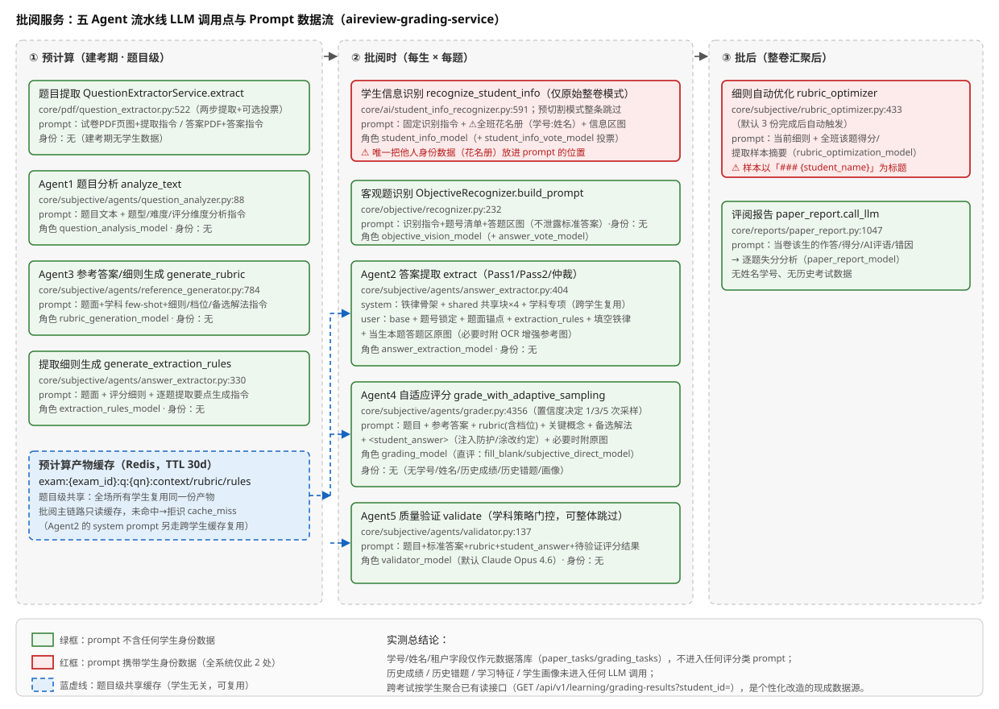

# 批阅服务 API 清单与核心业务流程（含 LLM 调用追踪）

> 调研对象：`~/src/indievolve/aireview-grading-service`（main 分支，2026-08，提交 `f3dddc8`）。
> 与既有文档的分工：[代码调研报告](./codebase-grading-service.md)回答「仓库里有什么」，[软件架构](./architecture-grading-service.md)回答「代码内部怎么分层/依赖」，本文回答「对外暴露哪些 API、每条业务路径端到端怎么走、每个环节在哪一行碰到 LLM、prompt 由什么组成」。本文是[批阅系统 API 与业务流程](./api-and-process-grading-system.md)（姐妹仓库侧）的对侧印证——批阅系统已确认「题目提取+整卷评分全部转发给批阅服务，提交载荷含学号/姓名/租户 code·name」，本文从批阅服务侧确认这些字段实际如何被接收与使用。所有结论均直接读源码得出，关键论断附文件路径+函数名。

## 1. 完整 API 清单

共 19 个路由文件、约 205 个端点（`api/routes/`，`main.py:_AUTHZ_ROUTE_SOURCES` 登记全部 19 个 router）。

**鉴权机制只有一种框架、三种凭证**（`main.py:AuthMiddleware`，全局中间件）：

- **管理员会话**：`POST /api/v1/auth/login` 签发的 Bearer token（管理后台/前端用），全权放行；
- **受限 API Key**：`Authorization: Bearer <key>` 或 `X-API-Key` 头，按 `(method, 路由模板) → scope` 查 `core/authz.py:required_scope` 校验能力域，未登记 fail-closed 403。scope 体系共 23 个能力域（`paper:submit/paper:read/paper:write/exam:read/exam:write/grading:run/task:read/task:write/config:read/config:write/samples:read/samples:write/report:read/report:write/dashboard:read/dashboard:write/deploy:read/deploy:write/logs:read/external:read/media:read/*`）；
- **X-Review-Token**：复核门户/抽查门户/问题样本页的路由器级依赖（`/api/v1/review-portal/*`、`/api/v1/spotcheck/*`、`/fails*` 页面在 `_PUBLIC_PREFIXES` 里绕过 admin 认证，但数据接口强制 token）。

下表按功能族分组。「鉴权」列给出该族受限 key 所需的主要 scope（`core/authz.py` 映射）。

### 1.1 批阅主链路（上游批阅系统直接消费的接口）

| 族 | Method + Path | 鉴权 scope | 用途 |
|---|---|---|---|
| 考试/题库 `api/routes/exam.py` | POST /api/v1/exam/create-with-questions | exam:write | 外部题库下推建考，默认触发主观题预计算 |
| | POST /api/v1/exam/extract-questions | exam:write | 从试卷/答案 PDF 用 AI 提取全部题目并预计算 |
| | POST /api/v1/exam/precompute | exam:write | 手动触发/重跑主观题预计算 |
| | POST /api/v1/exam/{id}/save-regions | exam:write | 保存答题卡区域标注 |
| | POST /api/v1/exam/{id}/retry-extract · POST /{id}/question/{qn}/retry-extract | exam:write | 整场/单题重提取 |
| | PUT /api/v1/exam/{id}/question/{qn}/extraction-rules · /rubric | exam:write | 人工修订提取细则/评分细则 |
| | GET /api/v1/exam/list · /{id}/detail · /{id}/questions · /export · /export-review | exam:read | 考试与题库查询、导出 |
| | PATCH /api/v1/exam/{id}/meta · DELETE /{id} · DELETE /{id}/cache | exam:write | 改考试元信息、删考试、清预计算缓存 |
| 整卷批阅 `api/routes/paper.py` | POST /api/v1/exam/submit-precut-paper | paper:submit | **主提交口**：预切割区域图 + 下推身份（§2） |
| | POST /api/v1/exam/submit-paper | paper:submit | 原始整卷图 + 区域坐标模式（含花名册识别） |
| | POST /api/v1/exam/upload-paper-file | paper:submit | 上传试卷文件后转提交 |
| | GET /api/v1/exam/paper-results/{paper_task_id} | paper:read | 轮询整卷结果（分数/批语/用量费用） |
| | GET /api/v1/exam/paper-tasks | paper:read | 整卷任务列表 |
| | POST /api/v1/exam/paper-task/{id}/recalculate · /retry | paper:write | 重汇聚/重批 |
| | PATCH /api/v1/exam/paper-task/{id}/status · /student-info | paper:write | 修状态、人工修正学生信息 |
| | POST /api/v1/exam/paper-task/{id}/recognize-student | paper:write | 用留存切图重新识别学生信息 |
| | POST /api/v1/exam/exam/{id}/fix-answers · POST /admin/fix-paper-status · DELETE /paper-task/{id} | paper:write | 客观题答案批量修正重算、管理修复、删除 |
| 直接批阅 `api/routes/grading.py` | POST /api/v1/grade/objective · /subjective · /auto · /student · /batch | grading:run | 单题/自动识别类型/学生级/批量直接批阅（绕过整卷管道的调试与旧通道） |
| 单题任务 `api/routes/task.py` | POST /api/v1/task/submit · /batch · /submit/objective · /batch/objective | task:write | 单题异步任务投递 |
| | GET /api/v1/task/list · /{task_id} · /{task_id}/detail · /{task_id}/image · /paper-groups · /batches · /tenants · /analysis · /queue/status · /stream · /cluster/status | task:read | 任务/队列/集群查询与 SSE 进度流 |
| | POST /{task_id}/retry · /cancel · /restart · /wake · /retry-failed · /batch-fix-scores · /rebuild-counts · /cleanup-* · /cluster/scale · /cluster/drain · /cluster/undrain · /backfill-teacher-scores；PUT /{task_id}/extracted-answer；PATCH /{task_id}/fix-score；DELETE /{task_id} · /batch/{id} · /cluster/* | task:write | 任务运维与人工干预 |
| PDF 切割 `api/routes/pdf_cutting.py` | POST /api/v1/pdf/cut | exam:write | 答题卡 PDF 按区域切割（预处理辅助） |

### 1.2 治理与运维接口（内部平台自用）

| 族（路由文件） | 代表端点 | 鉴权 scope | 用途 |
|---|---|---|---|
| 配置管理 `config.py` | GET/PUT/DELETE /api/v1/config/settings · /strategies · /confidence · /prompts · /providers · /models · /subject-overrides · /subject-groups · /feature-overrides；GET /meta · /exchange-rate · /balance/openrouter · /provider-models/{id} | config:read / config:write | 动态配置、学科策略、置信度阈值、**Prompt 注册中心热改**、provider/模型角色、学科覆盖、汇率与 OpenRouter 余额 |
| 仪表盘 `dashboard.py` | GET /api/v1/dashboard/stats · POST /rebuild | dashboard:read / write | 监控看板统计与重建 |
| 节点部署 `deploy.py` | POST /api/v1/deploy/node · /stop · /redeploy；GET 日志/默认值/autoscale/status · POST autoscale/manual | deploy:read / write | SSH 一键部署 Worker、自动扩缩容 |
| 评阅报告 `report.py` | POST /api/v1/report/paper/{paper_task_id} · /batch；GET /batch/{id} · /batch/{id}/download | report:write / read | 单卷/批量评阅报告（LLM 生成，见 §3.6）与 PDF 下载 |
| 样本库 `samples.py` | 样本/评测 bench/外部核对 token/抽查批次 CRUD（约 35 个端点） | samples:read / write | 错例样本库、bench 评测、外部核对链接、抽查批次管理 |
| 复核门户 `review_portal.py` | GET /session · /next · /media · /flags · /my-samples · /review-results/*；POST /{task_id}/flag · /accuracy · /error · /discard · /latex-assist 等 | X-Review-Token | 人工复核工作台（含 LaTeX 辅助 LLM 小调用） |
| 抽查门户 `spotcheck_portal.py` | GET /session · /tasks · /media · /me/summary；POST /tasks/{sample_id}/verdict | X-Review-Token | 核对结果抽查工作台 |
| 问题样本裁定 `fails_admin.py` / `fails_settlements.py` | GET/POST /api/v1/fails-settlements[/...]（列表、采纳、诊断、裁定） | X-Review-Token / fails 能力位 | 达标看板问题样本在线诊断与裁定（LLM 辅助诊断，默认关） |
| 学情对接 `learning.py` | GET /api/v1/learning/grading-results · /questions | external:read | 向自适应推题系统输出批阅结果（**可按 student_id 查跨考试作答历史**，§5） |
| 对外结算 `external_api.py` | GET /api/v1/exams · /exams/{id}/papers · /exams/{id}/questions · /papers/{paper_id} | 全局 AuthMiddleware | 对外只读数据接口（考试/试卷/结果与费用） |
| 认证 `auth.py` | POST /login · /logout；GET /me · /api-keys · /scopes；POST/PUT/DELETE /api-keys | 公开（login）/ 管理员会话 | 登录与受限 API Key 管理 |
| 日志 `logs.py` | GET /api/v1/logs/stream · /recent | logs:read | 日志流 |
| 健康 `health.py` | GET /health · /metrics · /health/ready · /api/v1/system/stats · / | 公开 | 健康检查与系统指标 |

## 2. 学生身份信息的接收与去向（逐项实测）

### 2.1 提交接口实际接收的字段

`POST /api/v1/exam/submit-precut-paper`（`api/schemas/requests.py:SubmitPrecutPaperRequest`，`extra="forbid"` 严格模式）接收：

| 字段 | 必填 | 说明 |
|---|---|---|
| `paper_id` / `exam_id` / `subject` / `tenant_code` | 是 | 业务主键与租户键（tenant_code 必传，切分产物按 `{tenant_code}/` 归置） |
| `exam_name` / `tenant_name` / `grade` | 否 | 展示用元数据 |
| `pushed_identity{student_no, name}` | 否 | **外部下推的学生身份，提供则跳过本系统识别** |
| `student_id` / `student_name` | 否 | 旧版身份字段（pushed_identity 优先覆盖，见下） |
| `region_images[]` | 是 | 预切割区域图片列表 |
| `questions[]` | 否 | 题目列表（缺省从 Redis 预计算缓存读取） |

入口合并逻辑（`api/routes/paper.py:_request_data_from_precut_paper`，:170-194）：`pushed_identity.student_no/name` 优先，回落到 `student_id/student_name`，统一写入内部 `request_data`。**预切割模式 `class_students`（花名册）恒为 None**——花名册只在原始整卷模式 `submit-paper`（`SubmitPaperRequest.class_students`，{班级名: ['学号:姓名', ...]}）中接收。

姐妹仓库报告的提交载荷（学号/姓名/租户 code·name/考试名/学科/年级）与本侧 schema **完全对得上**；班级信息本侧**不接收**（grading-system 提交载荷中也没有班级字段，花名册只在原始模式使用）。

### 2.2 这些字段进入 LLM prompt 的实际情况

逐字段追踪（`core/scheduler/paper_pipeline.py` 与各 Agent 源码）：

| 字段 | 去向 | 是否进 LLM prompt |
|---|---|---|
| `student_id`/`student_name`（含 pushed_identity 归并后） | 写 `paper_tasks.student_id/student_name/student_no`、冗余到 `grading_tasks`（`core/db/exam_models.py:138-140, 308-309`）；整卷轮询响应回填（`paper_pipeline.py:1199-1208`） | **❌ 不进任何 Agent 的评分/提取/验证 prompt**。全部五 Agent 的 prompt 构造函数（§3）均不含学生身份参数 |
| `tenant_code`/`tenant_name` | 对象存储路径归置、MySQL 冗余列、按租户过滤/计费/清理 | ❌ 不进 prompt |
| `exam_name`/`subject`/`grade` | subject 决定 prompt 学科裁剪（`extractor:subject:{学科}` 等），exam_name/grade 仅元数据 | ⚠️ 仅 subject 影响 prompt 选块（学科≠个人） |
| `class_students`（仅原始模式） | `recognize_student_info`（`core/ai/student_info_recognizer.py:591`）的花名册强约束段 | ✅ **进学生信息识别 prompt**（`PROMPT + _build_roster_hint(class_students)`，:85-107）——这是全场身份数据唯一进入 LLM 的位置 |
| 预切割模式的学生信息识别 | **整条跳过**（`paper_pipeline.py:1199` 注释「跳过切割/上传/识别」），身份直接采用下推值 | — |

**结论**：预切割主链路（当前生产路径）中，学号/姓名纯粹是元数据——落库、关联结果、按学生过滤查询，**不参与任何评分 prompt 的组装**。唯一的例外是**细则自动优化**（§3.7）：`rubric_optimizer` 汇总全年级样本时把 `student_name` 作为样本标题写进优化 prompt（`core/subjective/optimization_shared.py:format_grading_summary:177` / `format_extraction_samples:216`，`### {name} - 得分...`）——这是**批次级**上下文（区分样本用），不是个体化评分，但构成一处「学生姓名 PII 进入 LLM 请求体」的事实，值得在合规层面记录。

## 3. 五 Agent 流水线的 LLM 调用点与 Prompt 组装（逐 Agent 实测）

调用点总图见 §4。每个 Agent 给出：LLM 调用位置（文件:函数:行）、模型角色、prompt 组成、是否含学生个人属性。

### 3.1 Agent1 题目分析（预计算，批阅时不调）

- **调用点**：`core/subjective/agents/question_analyzer.py:analyze_text`（:88，预计算主路径）与 `analyze`（:47，图像版兼容路径）；底层 `client.structured_completion`（:67/:120/:130）。模型角色 `question_analysis_model`。
- **预计算入口**：`api/routes/exam.py:_precompute_one`（:312，建考/预计算时逐题并发调用，:371）。
- **Prompt 组成**（`_construct_text_analysis_prompt`，:153）：system=「资深{学科}教师」+ user=题目文本 + 任务指令（题型识别/难度估计/评分维度推断/置信度）+ JSON 输出格式。**纯题目级内容，无任何学生数据**。

### 3.2 Agent2 答案提取（批阅时，每生每题一次）

- **调用点**：`core/subjective/agents/answer_extractor.py:extract`（:404）→ `client.chat_completion`（:1325，Gemini 直连走 :1313）；Pass2 独立复提与仲裁复用同一调用函数。模型角色 `answer_extraction_model` / `answer_extraction_audit_model`（Pass2/仲裁）。另有预计算侧的 `generate_extraction_rules`（:330→:381，角色 `extraction_rules_model`）。
- **Prompt 组成**（三层叠加，`_build_system_prompt`:281 + `_construct_extraction_prompt`:1776 + `_construct_messages`:1852）：
  - system（Anthropic prompt caching 包装，跨学生复用）：`extractor:common:system` 铁律骨架 + `{{shared_modification}}/{{shared_latex}}/{{shared_ocr}}/{{shared_injection}}/{{extractor_adjudication}}/{{extractor_layout}}` 六占位符逐块替换（OCR 块按学科组装，`prompt_manager.build_ocr_corrections`）+ 末尾 `extractor:subject:{学科}` 专项段；
  - user：`extractor:common:base` + 目标题号锁定段（题号边界/停止符）+ 题面锚点（题目前 120 字）+ 填空题逐空铁律（`extractor:common:fill_blank` + 空号清单/横线数）+ 逐题 `extraction_rules` 完整性清单 + 学生答题区**原图**（必要时加 OCR 增强参考图）。
- **学生个人属性**：❌ 无。prompt 里没有任何学生身份/历史字段；跨学生共享的是 system prompt（缓存友好），个体差异完全由答题区图片承载。

### 3.3 Agent3 参考答案/评分细则生成（预计算，批阅时不调）

- **调用点**：`core/subjective/agents/reference_generator.py:generate_rubric`（:784）→ `generate`（:367）→ `_call_rubric_model`（:314→:325/:334）；`generate_scoring_levels_for_rubric`（:1009，给分档位，实验开关）；`audit_rubric_quality`/`_optimize_once`（:344，自检优化轮）。模型角色 `rubric_generation_model`。
- **Prompt 组成**（`_construct_generation_prompt`:644）：学科/题型/难度 + 题目内容 + few-shot 学科示例 + 任务指令（标准答案/关键概念/评分细则/给分档位/备选解法）+ 学科 rubric 提示 + LaTeX 提示。**纯题目级内容，无学生数据**。输出缓存为 `exam:{exam_id}:q:{qn}:rubric`，全场学生共用。

### 3.4 Agent4 自适应评分（批阅时，每生每题 1/3/5 次）

- **调用点**：`core/subjective/agents/grader.py:grade`（:1747）→ `structured_completion`（:1834/:1843）；`grade_with_adaptive_sampling`（:4356，按首次置信度追加 0/2/N 次并行采样，复用预构建 messages）；快速通道 `grade_fill_blank_direct`（:974，填空一步直评）与 `grade_subjective_direct`（:1286）。模型角色 `grading_model` / `fill_blank_direct_model` / `subjective_direct_model`。
- **Prompt 组成**（`_construct_grading_prompt`:2037）：system=`grader:common:evaluation_instructions` + `grader:subject:{学科}`（作文另有 `grader:writing:*`/`grader:builtin:*` 分档指导）；user=题目信息（学科/题型/难度/题面）+ 参考答案 + 评分细则（含给分档位）+ 关键概念 + 备选解法 + `<student_answer>`（提取产物文本，XML 转义 + 注入防护声明 + 涂改约定）+ 必要时附学生原图。
- **学生个人属性**：❌ 无。评分输入只有「本题作答文本/图片」，无学号、姓名、历史成绩、历史错题、学习特征。prompt 中 grader.py:210 的「反馈应当个性化」是要求评语针对**本题具体错误点**，不是基于学生画像。

### 3.5 Agent5 质量验证（批阅时，学科策略门控）

- **调用点**：`core/subjective/agents/validator.py:validate`（:137）→ `_request_validation_result_xml_first` → `structured_completion`（:121/:129）。模型角色 `validator_model`（默认 Claude Opus 4.6）。
- **Prompt 组成**（`_construct_validation_prompt`:212）：题目信息 + 标准答案 + 评分细则 + `<student_answer>`（含注入防护声明）+ 待验证的评分结果（给分/推理/反馈/置信度）+ 验证任务（有效性/一致性/异常标记）+ XML 输出指令 + `shared:injection_defense`。
- **学生个人属性**：❌ 无。

### 3.6 流水线之外的其他 LLM 调用点（完整盘点）

| 环节 | 调用点 | 模型角色 | prompt 内容 | 学生身份 |
|---|---|---|---|---|
| 题目提取（建考） | `core/pdf/question_extractor.py:extract`（:522）→ `_extract_questions_only`（:1210→:1254/:1304，第一步只提题干）+ `_extract_and_merge_answers`（:1310→:1400/:1424，第二步合并答案 PDF）+ `_extract_with_voting`（:1490，多模型投票可选） | 走 provider 默认/投票配置 | 试卷 PDF 页面图 + 提取指令；答案 PDF + 参考答案提取指令 | ❌ 无（建考期无学生） |
| 学生信息识别（仅原始模式） | `core/ai/student_info_recognizer.py:recognize_student_info`（:591）→ `_call_openrouter`（:234）/`_call_gemini`（:271），支持投票合并 | `student_info_model` / `student_info_vote_model` | 固定 PROMPT（5 字段识别）+ **花名册强约束段（全班 学号:姓名 清单）** + 答题卡信息区图片 | ✅ **花名册整体进 prompt**（含他人姓名学号）；目标是当卷学生 |
| 客观题识别 | `core/objective/recognizer.py:ObjectiveRecognizer`（`build_prompt`:232）| `objective_vision_model` / `answer_vote_model` | `objective:common:recognition` + 题号清单 + `objective:common:output_format` + 答题卡客观题区域图（**不泄露标准答案**） | ❌ 无 |
| 细则自动优化 | `core/subjective/rubric_optimizer.py:_call_llm_optimize_rubric`（:433）/ `_call_llm_optimize_extraction`（:408）→ `_call_llm`（:376）；由 `maybe_trigger_optimization`（:40，默认 3 份完成后）触发 | `rubric_optimization_model` / `extraction_optimization_model` | 当前细则 + 全班该题得分/提取样本摘要（`format_grading_summary`/`format_extraction_samples`，**样本以 `### {student_name}` 为标题**） | ⚠️ 学生姓名作为样本标签进 prompt（批次级，非个体化） |
| 评阅报告 | `core/reports/paper_report.py:call_llm`（:1047）；prompt 构造 `build_humanities_question_prompt`（:528）/ `build_science_question_prompt`（:593）/ `build_section_prompt`（:389）/ 作文 8 维评价（:1224） | `paper_report_model` | **当卷**该生的题目/标准答案/学生作答/AI 评语/分步得分/错因 → 逐题失分分析与板块总结 | ⚠️ 含当卷个体作答与得分（业务必需），但**不含姓名/学号，也不含历史考试数据** |
| 复核门户 LaTeX 辅助 | `api/routes/review_portal.py:/latex-assist` 等 | 小模型辅助 | 单条答案文本的 LaTeX 整理 | ❌ 无 |

## 4. Prompt 数据流图

上图按「预计算（建考期）→ 批阅时（每生每题）→ 批后（汇聚后）」三阶段画出各 LLM 调用点的 prompt 输入组成，红色虚线标出唯一携带学生身份数据的两处（花名册识别、细则优化样本标签）。

## 5. prompt_manager 注册中心的拼接机制（动态插入能力评估）

`core/prompt_manager.py`（355 行）是**纯文本键值注册中心**，本身**不做模板渲染**：

- 三级数据源：`register_default`（代码硬编码默认）→ `set_prompt`（API 热覆盖，内存+Redis `config:prompts`）→ `get_prompt`（覆盖优先）。
- 拼接发生在**各 Agent 调用点的代码里**，两种手段：
  1. **固定占位符替换**：`template.replace("{{shared_latex}}", ...)`（如 `answer_extractor._build_system_prompt`）——占位符集合是**写死在代码里的**（提取 system 骨架恰好 6 个），新增占位符必须改模板注册处的默认文本和替换代码两处；
  2. **f-string 段落拼接**：grader/validator/优化器直接在 Python 里用 f-string 组装段落（题目/rubric/student_answer），要插入新内容（如「该生历史错题」）必须改对应 `_construct_*_prompt` 函数。
- 命名空间 `{agent}:{scope}:{name}` 支持**无限注册新键**（如可新增 `grader:common:student_profile_section` 静态块），但这只能注入**静态文本**，不能注入按学生变化的结构化数据。

**结论**：现有机制对「新增共享规则块/学科块」扩展性良好（热改 + 命名空间），但对「按学生动态注入个性化字段」**不支持**——没有变量绑定层，动态数据都是各 prompt 构造函数硬编码拼入的。若未来要做按学生个性化（如在 grader prompt 注入该生历史错题摘要），需要在 Agent 层新增数据装载（从 MySQL/学情系统按 student_id 拉取）并修改 prompt 构造函数；注册中心可以复用来管理新段的静态模板部分。

## 6. 数据库中的学生相关字段盘点

`core/db/exam_models.py` 实测：

| 表 | 学生字段 | 当前用途 |
|---|---|---|
| `paper_tasks` | `student_id` / `student_name` / `student_no`（:138-140）+ 索引 `idx_paper_exam_student(exam_id, student_id)` | 结果关联、按学号/姓名模糊搜索（`exam_query.py:578`）、轮询回填 |
| `paper_task_details` | `student_info_json` / `student_info_image_url`（:196-198） | 学生信息识别结果与切图留存（供 recognize-student 重识别） |
| `grading_tasks` | `student_id` / `student_name`（:308-309）+ 索引 `idx_task_exam_student` | 单题任务级关联 |
| `request_blobs` | class_students 花名册 JSON 内容寻址去重（:207-225） | 请求大键去重存储（**注释自承无 GC，含名册 PII 留存**，架构文档 §5.2 已记） |
| `learning` 接口（非表） | `GET /api/v1/learning/grading-results?student_id=`（`api/routes/learning.py:190`，SQL 按 `t.student_id` 过滤跨考试作答历史，:232-234） | **已具备按学生维度聚合历史作答的读接口**——为自适应推题系统输出数据，是现成的个性化数据源 |

**个人化处理现状**：`student_id` 目前只用于结果关联与对外数据输出；服务内**不存在**按学生聚合历史错题、识别习惯性错误、学生画像等任何个人化计算。`idx_task_exam_student`/`idx_paper_exam_student` 索引以 exam_id 为前导，跨考试按学生查主要靠 learning 接口的 SQL 过滤（无前导索引，量大后是潜在慢查询点）。

## 7. 成本/缓存机制与个性化的关系

预计算缓存键（`core/cache/redis_client.py:62`）：`exam:{exam_id}:q:{question_number}:{data_type}`，data_type ∈ `question_analysis / rubric / extraction_rules`（`exam_models.py:82-84`），TTL 30 天。

- **粒度是「考试 × 题目」级，完全不含学生维度**——同一道题对所有学生共享同一份题目分析/评分细则/提取细则，这正是成本优化（单卷 $0.47→$0.25）的核心机制之一；Agent2 的 system prompt 又通过 Anthropic prompt caching（`answer_extractor._construct_messages` 的 `cache_control: ephemeral`）在同题多学生间摊薄。
- **与个性化的关系**：两者**不冲突，但个性化会侵蚀缓存命中率**。
  - 可复用：题目级三件套（context/rubric/rules）与「学生个性化上下文」是正交的两层——个性化内容（如该生历史错题）若作为**追加段**放在 user prompt 尾部，题目级缓存与 system prompt 缓存仍然有效；
  - 冲突点：若把个性化内容拼进 system prompt 或评分细则本体，会破坏 `exam:{id}:q:{qn}:*` 的共享语义与 Anthropic 缓存前缀匹配，成本显著上升。**结论：个性化扩展应走「user prompt 尾部追加段」路线**，保持现有缓存结构不动。
- 数据源现成度：学号维度数据已在 `grading_tasks`（带 exam_id 前导索引）与 learning 输出接口中就位；缺的是「跨考试按学生聚合」的读取路径与缓存（未来若以 `student:{sid}:profile` 之类的 Redis 键做学生级缓存，与现有题目级缓存可并存）。

## 8. 与既有文档的一致性标注

- ✅ 与[批阅系统 API 与业务流程](./api-and-process-grading-system.md)：其 §2.2 所述提交载荷（学号/姓名/租户 code·name/考试名/学科/年级）与本侧 `SubmitPrecutPaperRequest` 字段一一对应（§2.1）；其「全部评分 LLM 调用在批阅服务内」由本文 §3 完整展开。
- ⚠️ 其报告推断「学号/姓名会传给外部服务」属实，但需补注：**这些字段在批阅服务侧只作元数据落库，不进入任何评分 prompt**（本文 §2.2）；唯一进入 LLM 的学生身份数据是原始模式的花名册识别 prompt 与细则优化的样本名标签。
- ✅ 与[软件架构](./architecture-grading-service.md)：五 Agent 调用点、预计算缓存、UGP 契约、prompt 三层叠加的架构描述与本文逐行核验一致，本文补充了各 prompt 的字段级组成与「学生身份是否进 prompt」的判定。
- 与[角色功能清单](./roles-and-features.md)：本服务为内部系统，无直接角色对应；清单中「批改/讲评/提分」的 AI 能力最终都由本服务的 LLM 链路承载。

相关：[代码调研报告](./codebase-grading-service.md) · [软件架构](./architecture-grading-service.md) · [批阅系统 API 与业务流程](./api-and-process-grading-system.md)
