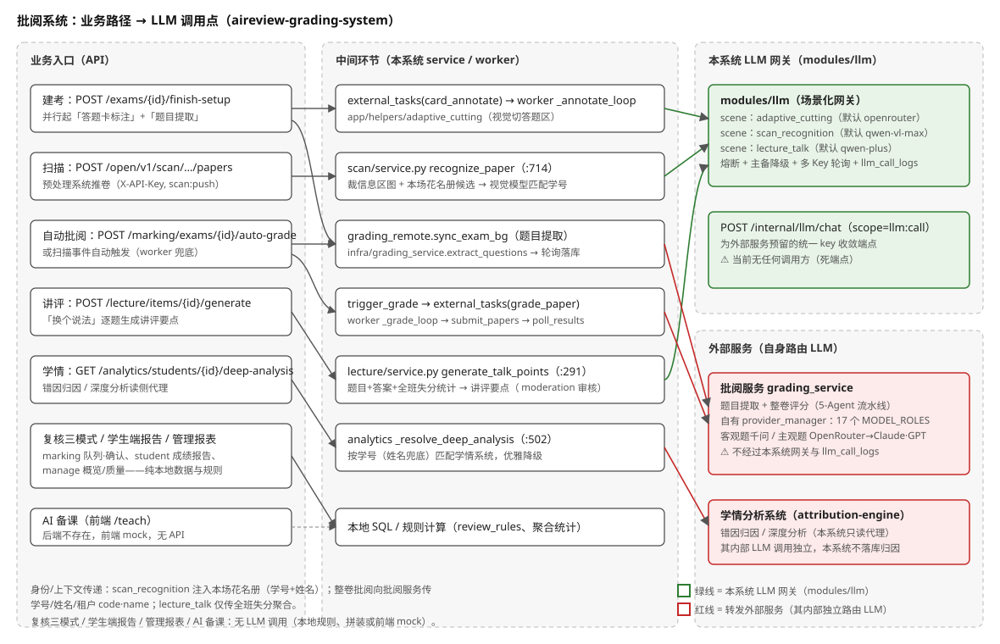

# 批阅系统 API 清单与核心业务流程（含 LLM 调用追踪）

> 调研对象：`~/src/indievolve/aireview-grading-system`（main 分支，2026-08）。
> 与[软件架构](./architecture-grading-system.md)的分工：架构文档回答「代码内部怎么分层/依赖」，本文回答「对外暴露哪些 API、每条业务路径端到端怎么走、在哪一环碰到 LLM」。所有结论均直接读源码得出（`backend/modules/*/routes.py`、`open_routes.py`、各 `service.py`、`modules/llm/`、`app/infra/`），关键论断附文件路径。

## 1. 完整 API 清单

鉴权方式只有三种（`modules/iam/deps.py` / `modules/platform/deps.py` / `modules/platform/open_auth.py`）：

- **JWT（菜单码）**：`require_menu("<code>")`，租户用户 Bearer JWT，菜单码已 ∩ 烧进 JWT；
- **JWT（登录态）**：`require_tenant_user`，只要求合法租户 JWT，不判菜单；
- **API-Key**：`require_open_scope("<scope>")`，X-API-Key（前缀→argon2 哈希→status→scopes），机器凭证；
- **平台管理员**：`require_platform_admin`，运营后台 JWT（platform 域独立登录）。

### 1.1 内部接口（JWT，按域分组）

| 域·前缀 | 鉴权 | Method + Path | 用途 |
|---|---|---|---|
| iam（无前缀） | 公开 | GET /tenant/by-host | 按 Host 域名解析租户（登录前） |
| | 公开 | GET /auth/schools | 学校列表（登录页） |
| | 公开 | POST /auth/login | 密码登录 |
| | 公开 | POST /auth/sms/send · /auth/sms/login | 短信验证码发送/登录 |
| | 公开 | POST /auth/wx/login · /wx/bind · /wx/login_app · /wx/bind_app | 微信小程序/App 登录与绑定 |
| | 公开 | GET /auth/wx/web/config · POST /auth/wx/login_web · /wx/bind_web | Web 扫码登录与绑定 |
| | JWT | POST /auth/wx/bind_student | 学生绑定微信 |
| | JWT | GET /auth/me · POST /auth/deactivate · /auth/change-password | 当前用户/注销/改密 |
| org /org | JWT（登录态+部分菜单） | POST /classes · /import/students · /import/teachers · /import/assignments · /upsert-class-roster | 班级创建、学生/教师/任课导入 |
| | | POST /students/{id}/transfer · POST /semesters | 学生转班、学期创建 |
| | | GET /semesters · /classes · /classes/{id}/roster · /classes/{id}/students · /teachers · /assignments | 组织数据查询 |
| | | POST/PUT/DELETE /classes/{id}/roster[/…] · GET /classes/{id}/roster/export | 花名册增改删/导出 |
| admin /admin | JWT(admin) | GET /roles · /classes · /members | 校内角色/班级/成员列表 |
| | | POST /members · PUT /members/{id} · /members/{id}/roles | 成员创建/修改/角色分配 |
| exam /exams | JWT(exam:list/create) | GET/POST /exams · GET/DELETE /exams/{id} | 考试列表/建考/详情/删除 |
| | | POST /exams/{id}/classes · /files · /questions · /import-exam-no | 选班、挂材料（试卷/答案 PDF）、题目确认、考号导入 |
| | | GET /exams/{id}/classes · /questions · /files · /card · /card/regions · /card/preview · /exam-no-template · /review-mode | 建考过程数据查询 |
| | | POST /exams/{id}/card · /card/adaptive-cut · /card/confirm · /finish-setup | 答题卡标注、自适应切割（VLM）、确认、完成设置 |
| exam /exam-batches | JWT(exam:list) | GET /exam-batches | 考试批次列表 |
| scan /scan | JWT（登录态） | GET /scan/progress · /exams/{id}/papers · /batches · /roster · /attendance · /feed | 扫描进度/卷列表/批次/花名册/缺考/实时动态 |
| | | POST /exams/{id}/students · /attendance · /upload-cards | 手动加学生、缺考登记、本地上传答题卡 |
| | | GET /papers/{id}/image · POST /papers/{id}/claim · /dup-resolve · /ignore · /restore · /recognize | 取图、认领、重卷处理、忽略/恢复、重新识别 |
| marking /marking | JWT（登录态+服务端复核授权） | GET /grade-progress · /exams/{id}/grade-progress · /extract-status · /papers · /runtime-flags | 批阅进度/提取状态/卷列表/运行开关 |
| | | POST /exams/{id}/auto-grade · /prepare-manual · /grade-poll · /extract-retry | 发起 AI 批阅、人工批阅准备、轮询推进、提取重试 |
| | | GET /papers/{id} · /papers/{id}/review · /papers/{id}/images · /manual-permission | 卷详情/复核视图/卷图/本人人工批阅权限 |
| | | GET /exams/{id}/questions/{qid}/manual-queue · /exams/{id}/objective-queue | 人工批阅按题队列、客观题确认队列 |
| | | POST /papers/{id}/objective-score · /answers/{id}/score | 客观题确认改分、逐题人工评分 |
| | | POST /papers/{id}/confirm · /exams/{id}/confirm-all | 单卷/全场确认 |
| | | GET /exams/{id}/audits · POST /exams/{id}/completions/{cid}/undo | 评分留痕、完成撤销 |
| | | POST /papers/{id}/flags · GET /exams/{id}/flags · /papers/{id}/flags · POST /flags/{id}/resolve | 疑点标记/列表/解决 |
| | | POST /papers/{id}/rebatch | 重批（supersede 旧任务） |
| analytics /analytics | JWT(analytics:view) | POST /exams/{id}/analyze · GET /analyze-status · /summary · /ranking · /export | 触发学情、状态、汇总、排名、成绩导出 |
| | | GET /students/{id}/trend · /classes/{id}/trend | 学生/班级成绩趋势 |
| | | GET /exams/{id}/attention-students · /class-kp-mastery · /teach-priority | 临界生预警、班级考点掌握、教学优先级 |
| | | GET /exams/{id}/students/{sid}/report · /students/{sid}/deep-analysis · /students/{sid}/fail-reasons/{key}/questions | 单生报告、深度分析（外部学情代理）、错因题目 |
| lecture /lecture | JWT(lecture) | POST/GET /exams/{id}/note · POST /exams/{id}/auto-populate | 讲评单创建、AI 挑重灾题（本地统计） |
| | | GET /exams/{id}/items · POST /notes/{id}/items · PATCH/DELETE /items/{id} | 讲评条目增改删查 |
| | | POST /items/{id}/generate | LLM 生成讲评要点（「换个说法」） |
| | | POST /exams/{id}/export-pptx | 导出讲评 PPTX |
| | | GET /exams/{id}/questions/{qid}/score-buckets · /students/{sid} | 讲评页题目分段/单生作答下钻 |
| printing /printing | JWT(printing) | GET/POST /exams/{id}/print-jobs · GET /print-jobs/{id} · GET /exams/{id}/annotated-preview | 留痕批改卷 PDF 打印任务与预览 |
| manage /manage | JWT(admin) | GET /overview · /quality · /teacher-development | 全校概览、教学质量、教师发展 |
| | | GET/PUT /review-mode · GET /review-settings · PUT /exams/{id}/review-setting | 阅卷模式（AI 辅助/人工）与全校锁定 |
| | | GET/PUT /manual-permissions | 人工批阅权限矩阵 |
| kb /kb | JWT（登录态） | GET/POST /resources · DELETE /resources/{id} | 校本库资源上传/列表/删除 |
| | | GET/POST/DELETE /custom-libraries[/{id}] · POST /custom-libraries/{id}/share · /review | 自定义库管理与分享/审核 |
| | | GET /can-review · /review-summary · /review-config · PUT /review-config | 审核权限/摘要/两级审核配置 |
| | | POST /resources/{id}/review · GET /resources/{id}/review-records · /custom-libraries/{id}/review-records | 初审/终审与留痕 |
| tiku /tiku | JWT(exam:create) | GET /questions · /facets · /knowledge/tree · /knowledge/counts · /knowledge/versions · /knowledge/modules | 校本题库检索与知识树 |
| | | POST/PUT/DELETE /questions[/{id}] · POST /questions/import | 题目增改删/导入 |
| | | POST /papers/preview · /papers · /papers/from-questions · GET /papers · /papers/{id} | 组卷预览/创建/列表/详情 |
| | | POST /papers/{id}/pdf · PUT /papers/{id}/regenerate · DELETE /papers/{id} · PATCH /papers/{id}/size · GET/POST /papers/{id}/layout | 试卷 PDF（playwright 渲染）/重排/版面 |
| | | GET/POST /paper-templates | 试卷模板 |
| qbank /platform/question-bank | 平台管理员 | GET /subjects · /source-types · /questions · POST/PUT/DELETE /questions[/{id}] | 平台级题库维护 |
| knowledge /knowledge | 平台管理员 | GET /subjects · /versions · /modules · /tree · /points/{id} | 知识点图谱查询 |
| | | POST /points · PATCH /points/{id} · POST /points/{id}/move · /archive | 知识点签发/修改/移动/归档 |
| student /student | JWT（登录态，限学生） | GET /exams · /exams/{id}/report · /deep-analysis | 我的成绩列表、单场报告、深度分析 |
| | | GET/POST /checkin · GET /achievements · /class-forest | 打卡、成就徽章、班级森林 |
| files /files | JWT（登录态） | POST /upload · /presign · /{id}/upload · /{id}/confirm · GET /{id}/download-url · /{id}/raw | OSS 直传（预签名/分片/确认/下载） |
| prefs /me | JWT（登录态） | GET/PUT /nav-prefs | 用户导航自定义偏好 |
| feedback /feedback | JWT（登录态） | POST /feedback | 用户反馈提交 |
| | 平台管理员 | GET /platform/feedback · PATCH /platform/feedback/{id}/status | 运营端反馈列表/处理 |
| platform /platform | 平台管理员 | POST /auth/login · GET /auth/me | 运营后台登录 |
| | | POST/GET/PATCH /tenants[/{id}] · POST /tenants/{id}/disable · /enable · GET/POST /tenants/{id}/admins | 租户开通/启停/管理员 |
| | | POST/GET /api-keys · POST /api-keys/{id}/revoke · GET /api-keys/calls | 开放 API Key 管理与调用审计 |
| | | GET/PUT /system-config | 系统设置（含 scene.* 场景模型配置） |
| | | POST/GET/PATCH/DELETE /app-versions[/…] · POST /app-versions/apk | App 版本/更新清单（Ed25519 签名） |
| | | GET /tenant-stats · GET/PUT /backup/policies[/{tid}] · POST /backup/run/{tid} · GET /backup/history · /backup/download/{task_id} | 租户统计与备份 |
| syslog /platform | 平台管理员 | GET /platform/api-logs | API 调用日志查询 |
| device /platform/devices | 平台管理员 | POST /platform/devices · GET /platform/devices · POST/GET /{id}/credentials · POST /credentials/{cid}/revoke | 一体机设备注册与设备凭证 |
| llm /platform/llm | 平台管理员 | GET/POST/PATCH /providers[/{id}] · GET /providers/{id}/balance · GET /models | LLM 运营商管理与余额查询 |
| | | GET/POST /keys · POST /keys/{id}/revoke | LLM API Key 管理（Fernet 密文存储） |
| | | GET /usage · /usage/calls | LLM 调用统计与逐条明细 |

### 1.2 开放接口（X-API-Key，`require_open_scope`）

| 前缀 | scope | Method + Path | 用途 |
|---|---|---|---|
| /open/v1/scan | scan:push | POST /exams/{exam_id}/papers | 预处理系统推送整份学生扫描卷（幂等键去重） |
| /open/v1/exams | exam:read | GET / · /{exam_id}/students · /{exam_id}/classes · /{exam_id}/card/regions | 考试/学生/班级/答题卡区域读取 |
| /open/v1/knowledge | kp:read | GET /subjects · /versions · /modules · /tree · /points | 知识点图谱对外读取 |
| /open/v1/qbank | qbank:read | GET /questions · /questions/{id} · /facets | 平台题库对外读取 |
| /open/v1 | report:read | GET /exams/{exam_id}/students/{student_no}/report | 逐生评阅报告与回打件 URL（打印终端用） |
| /open/v1/device | （设备注册） | POST /register | 一体机设备注册 |
| /open/v1/app · /open/v2/app | app:version | GET /version/check | App 更新检查（v2 为签名清单） |
| /internal/llm | llm:call | POST /chat | LLM 网关 OpenAI 兼容透传（供其他服务调用，**当前仓内无实际调用方**，见 §4） |

## 2. 核心业务流程（端到端）

以下 7 条路径的每一步均给出代码落点。LLM 触点在步骤内以 **⟶LLM** 标注。

### 2.1 建考·题目提取/入库

1. `POST /exams`（exam/routes.py:31）→ `exam/service.py:create_exam`：建 ExamBatch+Exam（status=draft），组卷来源时本地拷题（question_source=composed，本地为权威源）；阅卷模式经 `manage.service.resolve_grade_mode` 判定（可被全校锁定）。
2. `POST /exams/{id}/files` 挂试卷/答案 PDF（OSS 直传后 attach）。
3. `POST /exams/{id}/finish-setup`（exam/service.py:204）：并行起两条异步——
   - **答题卡自适应标注**：`exam/annotate_tasks.enqueue` 入 `external_tasks`(kind=card_annotate) → worker `_annotate_loop` → `app/helpers/adaptive_cutting/__init__.py:cut_answer_regions_with_system_openrouter` **⟶LLM（本系统网关）**：视觉模型按 PDF 页切答题区（scene=adaptive_cutting，默认 openrouter，可配 review_enabled 二次 VLM 质检）。组卷/无空白答题卡的场次跳过。
   - **题目提取**：`extract_status=syncing` 占位 → 路由 BackgroundTasks 推 `grading_remote.sync_exam_bg` → `app/infra/grading_service.py:extract_questions`（POST /exam/extract-questions）→ **外部批阅服务**（其内部 5-Agent 流水线做题目提取，本系统不直接调 LLM）；组卷场次走 `create_exam_with_questions` 本地题目直接下推。
4. worker `_extract_loop` 轮询 `exam_detail` 至 ready → `pull_exam_questions` 落 `exam_questions`（extract_raw JSON 留原始结构）→ extract_status=ready。
5. 老师卷面确认（`POST /exams/{id}/questions`、`/card/confirm`）→ `maybe_finish_preparing` 收敛：标注 settled + 提取 ready/failed → status=pending（待扫描）。

### 2.2 扫描件接收·自动批阅

1. 预处理系统 `POST /open/v1/scan/exams/{exam_id}/papers`（scan/open_routes.py:17，scope=scan:push，幂等键）→ `scan/service.py:push_paper_to_exam`：落 ScanPaper + 认人比对花名册。
2. 认不出时人工/自动重识别：`POST /scan/papers/{id}/recognize` → `scan/service.py:recognize_paper`（:682）：裁学生信息区图 → **⟶LLM（本系统网关，scene=scan_recognition，默认 qwen/qwen-vl-max）**：视觉模型从花名册候选 JSON 中匹配学号（prompt 携带本场花名册：学号+姓名）。失败不抛错，转入「待认领」。
3. 名单全匹配 → `_maybe_mark_exam_ready` → `_auto_grade_hooks` 按运营配置 `grading.auto_grade_mode` 触发 `marking/service.py:maybe_auto_grade_on_event`（也可由教师 `POST /marking/exams/{id}/auto-grade` 手动触发；worker `_retry_dropped_auto_grade` 兜底漏触发）。
4. `trigger_grade`（marking/service.py:163）：dedup_key 防重，建 `external_tasks`(kind=grade_paper, per student_paper)。
5. worker `_grade_loop`：`submit_papers` → `grading_remote._submit_one_paper`（:645）→ `gs.submit_precut_paper`（预切区域图，优先）或 `gs.submit_paper`（原图+区域坐标兜底）→ **外部批阅服务**（全部评分 LLM 调用在此服务内）。提交载荷含 `student_no/student_name/tenant_code/tenant_name/exam_name/subject/grade`（grading_remote.py:686-706）——**学生身份与租户身份会传给外部服务**。
6. `poll_results` 回拉 → 结果映射落 `student_answers`（ai_* 列 + review_rules 快扫分级）→ 卷状态 ai_done。

### 2.3 人工复核·三模式

共用「学生 × 题」工作台（marking/routes.py），全程**无 LLM 调用**，是对 AI 结果的人工裁决：

- **客观题确认**：`GET /exams/{id}/objective-queue` → `POST /papers/{id}/objective-score` 确认/改分；
- **AI 疑点（快扫）**：`GET /papers/{id}/review`，疑点分级由 `marking/review_rules.py` 本地规则（置信度校准 + 风险码 collect_risks + 分项一致性 evidence_consistent）产出，非 LLM；
- **人工批阅**：`GET /exams/{id}/questions/{qid}/manual-queue` → `POST /answers/{id}/score`（写 manual_* 列 + score_audits 只追加留痕）。入口强制 `manage.service.resolve_manual_permission` 服务端授权。
- 完成：`POST /papers/{id}/confirm` / `/confirm-all` → 写 `review_completions` 快照（可撤销，撤销使打印产物失效）→ 触发 `analytics.run_analyze_bg` 本地汇总 + `printing.generate_default_job_bg` 预生成留痕 PDF。

### 2.4 AI 备课

**代码事实：后端不存在。** 前端 `frontend/src/modules/teach/`（TeachView/AiPrepView）文件头注释自述「P2 · 视觉 1:1 外壳，mock，无后端」；后端 25 个域模块中无 teach/lesson 模块，`modules/llm` 也无对应 scene。角色清单中「AI 生成教学设计与课件」在当前代码库中是纯前端原型。⚠️ 与[角色功能清单](./roles-and-features.md)「备课：AI 生成教学设计与课件」不一致——那是 demo 前端表现，非后端能力。

### 2.5 讲评生成（AI 重灾题/讲解 PPTX）

1. `POST /lecture/exams/{id}/auto-populate`（lecture/service.py:93）：**本地统计**（confirmed 卷逐题失分率排序取 top N）挑重灾题，不调 LLM；共性错因取自 `exam_score_summaries.common_issues`。
2. `POST /lecture/items/{id}/generate` → `generate_talk_points`（lecture/service.py:261）**⟶LLM（本系统网关，scene=lecture_talk，默认 qwen/qwen-plus，temperature=0.6 支持「换个说法」）**：prompt = 固定角色模板 + 考点 + 题目 + 标准答案 + 全班失分统计（失分率/失分人数）。返回经 `modules/moderation`（阿里云内容安全）审核后写 `talk_points`。
3. `POST /lecture/exams/{id}/export-pptx`：python-pptx 本地组装 + OSS 上传，无 LLM。

### 2.6 学情分析/提分（考点掌握、班级排名）

- `POST /analytics/exams/{id}/analyze` → 实际只触发**本地汇总** `compute_local_summary`（均分/及格率/分段/班级年级排名，纯 SQL+Python 聚合，无 LLM）；另有 `external_tasks`(kind=analysis) 状态兼容旧外部任务。
- `GET /exams/{id}/class-kp-mastery` → `_local_kp_rates` 本地按题目 tag 聚合考点得分率（零外部依赖）。
- `GET /students/{id}/deep-analysis`、`/fail-reasons/{key}/questions` → `_resolve_deep_analysis`（analytics/service.py:502）代理**外部学情分析系统**（`app/infra/analytics_service.py:deep_analysis`），按学号匹配、全局唯一同名兜底；本系统不直接调 LLM，学情系统内部的归因 LLM 调用在其自身代码库。
- `GET /manage/quality`、`/teacher-development`、`/overview` → `manage/overview_service.py` 多域 JOIN 本地报表，无 LLM（角色清单中「AI 最该投入排序」实为本地规则计算）。

### 2.7 学生端成长报告生成

- `GET /student/exams`、`/exams/{id}/report` → 本地 `student_papers`（confirmed）+ `analytics.get_student_report`（考点掌握本地实算；错因归因/复习任务透传外部学情系统，无数据优雅降级）。
- 打卡/成就/班级森林（student/service.py：连续打卡阶梯、成绩连涨/新高徽章）为纯本地规则，无 LLM。
- **结论：学生端不存在 LLM 生成式「成长报告」**——报告是结构化数据拼装 + 外部学情系统的预生成归因，本系统没有任何一个 scene 用 LLM 为学生写自然语言报告。

## 3. 业务路径 → LLM 调用点总表

| 业务入口 | 中间环节 | LLM 调用点 | 方式 | scene / 默认模型 | prompt 中传递的身份/上下文 |
|---|---|---|---|---|---|
| 建考·答题卡自适应标注 | finish-setup → external_tasks(card_annotate) → worker `_annotate_loop` | `app/helpers/adaptive_cutting`（:284）| **本系统 LLM 网关**（run_with_failover） | adaptive_cutting / openrouter（可配） | 答题卡 PDF 页图像；无用户/学生身份信息 |
| 建考·题目提取 | sync_exam_bg → `infra/grading_service.extract_questions` | **外部批阅服务**（5-Agent 流水线） | 转发外部服务 | 由 grading_service 的 MODEL_ROLES 决定 | 试卷/答案 PDF（OSS key）；考试名/学科 |
| 扫描·学生身份识别 | push_paper → recognize_paper | `scan/service.py:714` | **本系统 LLM 网关**（llm.service.chat） | scan_recognition / qwen-vl-max | 答题卡顶部信息区图像 + **本场花名册（学号+姓名）** |
| 自动批阅·整卷评分 | trigger_grade → external_tasks(grade_paper) → worker `_grade_loop` → submit/poll | **外部批阅服务** | 转发外部服务 | 由 grading_service 决定（客观题千问/主观题 OpenRouter） | 卷面图/预切区域图 + **学号、姓名、考试名、学科、年级、租户 code/name** |
| 讲评·讲评要点生成 | auto-populate（本地）→ items/{id}/generate | `lecture/service.py:291` | **本系统 LLM 网关**（llm.service.chat） | lecture_talk / qwen-plus | 考点、题目、标准答案、全班失分统计（聚合值，**无个体学生/教师身份**） |
| 学情·错因归因/深度分析 | analytics deep-analysis 读侧代理 | **外部学情分析系统** | 转发外部服务（只读） | 学情系统内部决定 | 学生学号（或姓名兜底匹配） |
| 学生端成长报告 | student report 拼装 | 无（结构化数据 + 外部学情预生成归因） | — | — | — |
| 人工复核三模式 | 队列 → 评分 → 确认 | 无（AI 疑点=本地规则 review_rules） | — | — | — |
| AI 备课 | 无后端 | 无（前端 mock） | — | — | — |
| 运维脚本 | scripts/tag_smartedu_knowledge_llm.py | llm.service.chat | 本系统 LLM 网关 | 按脚本参数 | 题库知识点打标（离线批处理） |

## 4. modules/llm 网关设计（与 grading_service provider_manager 的关系）

### 4.1 自身能力（`backend/modules/llm/`，共约 520 行）

- **运营商与 Key 管理（平台级）**：`llm_providers`（OpenAI 兼容端点）+ `llm_api_keys`（Fernet 加密存储，尾 4 位提示，可吊销），全平台共用一套、无 tenant_id（models.py:8 注释）。运营后台 `/platform/llm/*` CRUD + 余额查询（OpenRouter credits）+ 模型列表拉取。
- **统一调用入口**：`service.chat()`（OpenAI 兼容 messages 透传）与通用执行器 `run_with_failover()`（service.py:188）：
  - **两级降级**：候选链 = 请求的 (provider, model) → 系统设置 `scene.<scene>.fallback_provider/fallback_model` 配的备用（`_resolve_candidates`，:122）；
  - **多 Key 轮询容灾**：每个候选遍历该运营商全部活跃 Key；
  - **熔断**：接入 `app/infra/circuit_breaker`（Redis 计数，鉴权错误硬熔断，cooldown 半开），熔断中的 Key 跳过；
  - **场景化配置**：主模型也可由运营后台 `scene.<scene>.provider/model` 配置（`app/infra/app_config.py` 读 system_config 表，DB 缓存、改即生效）。当前全库只有三个 scene：`scan_recognition`、`lecture_talk`、`adaptive_cutting`。
- **调用记录**：每次调用落 `llm_call_logs`（场景/运营商/模型/token/耗时/成败/成本字段预留，成本列「暂留空」models.py:54），独立 session 写入、失败不影响主调用；`/platform/llm/usage[/calls]` 提供按 场景×运营商×模型 的聚合与逐条明细。
- **对外 HTTP 网关**：`POST /internal/llm/chat`（scope=llm:call），设计意图是「其他服务（grading_service 等）经平台统一管 key」（routes.py:14 注释）。
- **不具备的能力**：无 prompt 模板管理（prompt 全部硬编码在调用方 service 里）；无流式输出；无 token 配额/限流；无按租户计费（tenant_id 仅作统计维度）。

### 4.2 与 grading_service `core/provider_manager.py` 的关系：**两套独立实现**

实际读代码确认（`aireview-grading-service/core/provider_manager.py`，1068 行）：

| 维度 | 本系统 modules/llm | grading_service provider_manager |
|---|---|---|
| 配置存储 | MySQL `llm_providers`/`llm_api_keys` 表 | Redis（config:providers/config:models）+ MySQL config_overrides 双写 |
| 路由模型 | scene（业务场景）→ 主备 provider/model，两级降级 | 17 个 MODEL_ROLES（主批阅/视觉/验证/客观题等）× 学科三级 fallback + 学科级思考开关 |
| Key 管理 | Fernet 加密落库，熔断跳过 | key_pool 请求轮询分摊配额 |
| 调用记录 | llm_call_logs（token/耗时/成本预留） | contextvars 隔离账本 → 整卷/批次成本聚合（CNY 阶梯价表） |
| 使用方 | 本系统 3 个 scene + 网关端点 | 批阅服务全部 5-Agent 流水线 |

**两者不共享任何代码或数据**。且 `/internal/llm/chat` 网关在 grading_service 仓内**无任何调用方**（全仓 grep `internal/llm` 无命中）——网关是为「未来外部服务统一收敛 key 管理」预留的，当前是死端点。这构成一个治理风险：LLM 配置与成本观察被撕裂在两套系统里，批阅主链路的模型调用完全不经过本系统的 llm_call_logs 账本。

## 5. 用户上下文/个人化数据现状（记忆系统前置排查）

逐项排查代码中「用户画像/偏好/历史行为/记忆」机制的存在性与 LLM prompt 复用度：

| 数据 | 表/位置 | 性质 | 是否进 LLM prompt |
|---|---|---|---|
| 学生错题/逐题作答历史 | `student_answers`（ai_*/manual_* 双列）、`student_papers` | 业务事实数据，终身累积（学生按 student_no upsert 终身一条） | ❌ 仅作为评分输入材料交外部批阅服务；本系统 3 个 LLM scene 均不读 |
| 学生成绩趋势/成就/打卡 | `student_checkins`、student/service.py 徽章规则 | 行为记录（游戏化） | ❌ 无 LLM 触点 |
| 考点掌握 | analytics `_local_kp_rates` 读时实算（不落个性化表）、`exam_score_summaries` | 班级/场次级聚合，**非学生个人画像** | ❌ lecture_talk 只用「全班失分率」聚合值 |
| 教师常用评语/讲评风格 | `lecture_items.talk_points`（教师可改写 LLM 产出） | 教师编辑产物，**未回流为偏好** | ❌ 「换个说法」每次全新生成，不学习教师历史修改 |
| 教师导航偏好 | `user_nav_prefs`（prefs 模块，nav_order JSON） | 唯一的显式「用户偏好」表，仅 UI 层 | ❌ 与 LLM 无关 |
| 阅卷模式/复核授权 | `review_modes`、`manual_marking_permissions`、`delegations` | 权限配置 | ❌ |
| 身份上下文 | JWT claims（tid/sub/menus/scopes） | 请求期上下文 | ⚠️ 部分：scan_recognition prompt 带花名册（学号+姓名）；整卷批阅把学号/姓名/租户传给外部服务；llm_call_logs 只记 tenant_id 不记 operator |
| 错因归因/行动计划 | 外部学情系统（本系统只读代理，不落库） | 学生级归因数据 | ⚠️ 归因在外部系统生成；本系统 prompt 不消费它 |

**总结论**：本系统**不存在任何形式的「用户画像/记忆」机制**——没有偏好学习、没有历史行为进 prompt、没有个性化上下文注入。现有的唯一"偏好"表（user_nav_prefs）是纯 UI 导航排序。LLM prompt 全部是「固定模板 + 当场业务数据」（题目/答案/失分聚合/花名册），最接近个性化的两处是 scan_recognition（注入本场花名册）与 lecture_talk（注入本场失分统计），均为**场次级而非用户级**上下文。沉淀最厚的个人历史数据（student_answers 逐题双列留痕、score_audits、打卡/成就）目前完全不参与任何 LLM 调用——这是后续设计记忆系统时最现成的数据源，也是最大的空白点。

## 6. 与既有文档的一致性标注

- ✅ 与[软件架构](./architecture-grading-system.md)：本文 §3 的三条「本系统网关」scene 即其 §1 横切机制之外的出站调用面；external_tasks 骨架细节以架构文档 §4 为准，本文不重复。
- ⚠️ 与[角色功能清单](./roles-and-features.md)：「备课（AI 生成教学设计与课件）」实测为前端 mock，无后端 API 与 LLM 调用（本文 §2.4）；「AI 最该投入排序」（教学质量）为本地规则而非 LLM（§2.6）。
- ⚠️ 与[部署架构](./deployment.md)：「多模型路由」在批阅主链路上成立（grading_service 侧），但本系统自建了第二套独立 LLM 网关（§4.2），部署文档未提及这层；两系统的模型配置/成本账本不互通。
- 与[代码调研报告](./codebase-grading-system.md)：报告 §2 技术栈中「LLM：openai SDK 经 modules/llm 网关路由多模型」的准确口径是——网关实际用纯 HTTP（`app/infra/llm_client.py`），openai SDK 仅在 grading_service 及脚本中使用；网关当前只服务 3 个 scene，批阅主链路不经过它。

相关：[代码调研报告](./codebase-grading-system.md) · [软件架构](./architecture-grading-system.md) · [角色功能清单](./roles-and-features.md)
