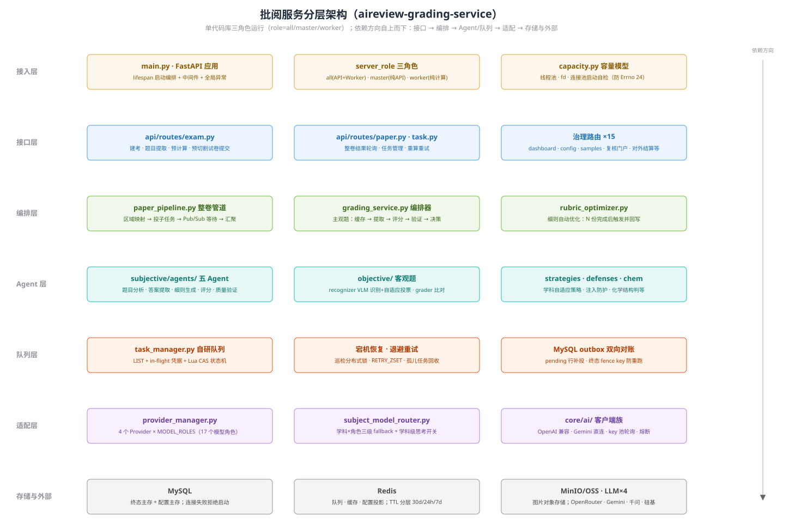
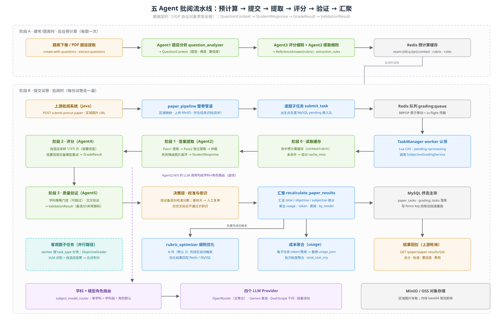

# 批阅服务软件架构（aireview-grading-service）

> 本文是[代码调研报告](./codebase-grading-service.md)的架构深化版：后者回答「仓库里有什么」，本文回答「代码内部怎么分层、模块怎么依赖、数据怎么流动、关键子系统怎么设计」。所有结论均来自对 `~/src/indievolve/aireview-grading-service`（main 分支，2026-08，提交 `f3dddc8`）源码的直接阅读，关键论断附文件路径。与既有文档不一致处在文中以 ⚠️ 标注。

## 1. 分层架构与依赖方向

系统是**单代码库、三角色运行**的 FastAPI 应用：`server_role = all / master / worker`（`config/settings.py`），all 模式 API 与 Worker 同进程，split 模式下 master 纯 API、worker 纯计算，共享同一 Redis 队列与对象存储。代码组织是「按技术层横向切分」（与姐妹系统 aireview-grading-system 的「按业务域纵向切分」恰好相反）：

```
main.py            # 接入：FastAPI 应用 + lifespan 启动编排 + 角色判定
api/routes/        # 接口：19 个路由文件 + api/schemas（Pydantic v2）
core/scheduler/    # 编排：paper_pipeline.py 整卷管道
core/subjective/   # 编排：grading_service.py 主观题编排器 + rubric_optimizer
core/subjective/agents/  core/objective/   # Agent：五 Agent + 客观题识别/判分
core/queue/        # 队列：task_manager.py 自研 Redis 队列引擎
core/provider_manager.py  core/subject_model_router.py  core/prompt_manager.py  # 适配
core/ai/  core/cache/  core/db/  core/file/   # 客户端与存储适配
```



### 各层职责与依赖方向（实测结论）

| 层 | 代码落点 | 职责 | 依赖 |
|---|---|---|---|
| 接入层 | `main.py`（1026 行） | lifespan 内按固定顺序初始化：线程池扩容 → Redis → MySQL（失败拒绝启动，`_init_mysql_or_fail`）→ MinIO/OSS → 各 routes 的 `init_services()` → TaskManager →（master/all）AutoscaleManager 与预计算恢复巡检 | 全部下层 |
| 接口层 | `api/routes/`（19 个文件）+ `api/schemas/` | exam（建考/题目提取/预计算/预切割提交）、paper（整卷轮询/重算）、task（任务管理）、grading（直评）、+ 15 个治理路由（dashboard/config/samples/review_portal/spotcheck_portal/fails_*/external_api/learning/report/deploy/logs/auth） | 编排层、队列层、`core/db` 查询模块 |
| 编排层 | `core/scheduler/paper_pipeline.py`（2703 行）、`core/subjective/grading_service.py`（1560 行）、`core/subjective/rubric_optimizer.py` | 整卷：区域映射→逐题投子任务→Pub/Sub 等待→汇聚落库；单题：缓存→提取→评分→验证→决策 | Agent 层、队列层、适配层 |
| Agent 层 | `core/subjective/agents/`（5 个 Agent）、`core/objective/`（recognizer/grader）、`core/strategies/`、`core/defenses/`、`core/chem/` | 五 Agent 流水线 + 客观题 VLM 识别/判分 + 学科策略 + 注入防护 + 化学结构判等 | 适配层（模型路由、Prompt 注册中心、LLM 客户端）、`core/protocols` |
| 队列层 | `core/queue/task_manager.py`（5726 行）、`core/queue/progress.py` | 任务状态机、投递/认领、宕机恢复、退避重试、双向对账、节点注册/心跳、内存看门狗 | `core/db`（outbox）、`core/cache`（Redis）、编排层（回调 recalculate） |
| 适配层 | `core/provider_manager.py`、`core/subject_model_router.py`、`core/prompt_manager.py`、`core/config_manager.py`、`core/ai/`、`core/file/minio_client.py` | Provider/模型角色配置、学科路由、Prompt 注册中心、动态配置、LLM/对象存储客户端 | `core/db`（配置主存）、Redis（配置投影） |
| 存储与外部 | `core/db/`（SQLAlchemy 2 + aiomysql）、`core/cache/redis_client.py`、MinIO/OSS、4 个 LLM Provider | MySQL 终态主存、Redis 队列+缓存+投影、图片对象存储、模型 API | — |

**依赖方向的实测结论是「自上而下、但编排层与队列层互相回调」**：routes → paper_pipeline/grading_service → agents → 适配层，未观察到反向 import；但 `task_manager.py` 与 `paper_pipeline.py` 之间存在**双向函数级调用**——worker 完成子任务后回调 `_try_recalculate_paper` 触发整卷汇聚（`task_manager.py:4210`），paper_pipeline 又通过 `notify_task_done`/`RedisLock` 等被 TaskManager 引用（`task_manager.py:54`、`paper_pipeline.py:540`）。两文件靠「运行期函数内 import」（如 `from core.scheduler.paper_pipeline import ...` 写在函数体里）规避模块级循环 import，这是全仓库最粗的一处耦合。

启动期的另一个硬约束值得记录：**MySQL 是唯一的启动强依赖**——连接失败直接 `RuntimeError` 拒绝启动（`main.py:37-46`），注释原话「禁止 Redis-only 降级产生未落库数据」；而 Redis 连接失败只告警降级（预计算不可用但服务可起），worker 在 MySQL 未就绪时禁止启动（`main.py:229-235`）。

## 2. 五 Agent 流水线的软件设计

### 2.1 接口契约：Universal Grading Protocol（UGP）

五个 Agent 之间不直接互相调用，全部通过 `core/protocols/universal_grading_protocol.py` 定义的 Pydantic 模型传递数据——文件头注释称其为「使系统学科无关的核心抽象」。契约链：

| 契约对象 | 产出者 | 关键字段 |
|---|---|---|
| `QuestionContext` | Agent1 题目分析（预计算） | `subject` / `question_type` / `difficulty` / `extracted_question` / `rubric_criteria` / `confidence` |
| `ReferenceAnswer` | Agent3 评分细则（预计算） | `ideal_answer` / `rubric{采分点:分值}` / `scoring_levels`（给分档位，实验开关）/ `answer_equivalence`（exact/narrow/functional 等价强度）/ `rubric_quality_flags` |
| `extraction_rules`（纯文本） | Agent2 的 `generate_extraction_rules`（预计算） | 逐题提取细则，由 GPT-5.2 Pro 生成 |
| `StudentResponse` | Agent2 答案提取（批阅时） | `extracted_answer` / `confidence` / `modifications`（删改记录）/ `injection_guard`（注入检测结果）/ `extraction_passes`（Pass 历史留痕）/ `structure_data`（化学结构式，灰度） |
| `GradeResult` | Agent4 评分（批阅时） | `score` / `step_scores` / `reasoning_trace` / `feedback` / `feedback_detail` / `confidence` |
| `ValidationResult` | Agent5 质量验证（批阅时） | `is_valid` / `agreement_score` / `alternative_score` / `anomaly_flags` / `reasoning` |

输入侧还有两道清洗织入契约本身：`StudentResponse.extracted_answer` 的 `field_validator` 强制走 `sanitize_student_answer_text`（LaTeX/不可见字符清洗）；`GradeResult.feedback_detail` 的 validator 把 LLM 可能返回的 dict/list/字面量字符串统一归一化成 markdown 文本（`universal_grading_protocol.py:143-205`）——即「模型输出不可信」的防御直接写进数据契约层。

编排器 `SubjectiveGradingService`（`core/subjective/grading_service.py`）持有一个 `UniversalGradingProtocol` 实例作为**贯穿全程的上下文对象**，逐阶段挂载 `question_context / student_response / reference_answer / grade_result / validation_result`，外加下划线前缀的运行期附件（`_usage_stats`、`_extraction_rules`、`_sample_scores`、`_fallback_extraction`、`_fallback_grading`、`_extraction_error`）供 TaskManager 持久化到 `grading_task_details.agent_details_json`。

### 2.2 编排器调度流程（grading_service.py 实测）

`grade_subjective()` 的调度顺序（`_grade_subjective_inner`，`grading_service.py:164` 起）：

0. **并发闸门**：进入动态信号量（`max_concurrent_subjective`，支持热更新时加锁重建信号量，`:96-103`）。
1. **阶段 0 · 读取缓存**：并发 `asyncio.gather` 读 `exam:{exam_id}:q:{qn}:context|rubric|rules` 三个键；缺 exam_id/question_number → 拒识 `missing_precompute`；缓存未命中 → 拒识 `cache_miss`（引导调用方先跑预计算）。`enable_extraction_rules` / `enable_grading_rubric` 两个全局开关可分别摘掉提取细则与评分细则（细则关闭时 rubric 退化为 `{"总分": max_score}`）。
2. **快速通道分流**（在阶段 1 之前）：填空题（非默写）且学科组开关 `enable_fill_blank_direct_grading` 开 → `_grade_fill_blank_direct`（提取+评分合并为一次调用）；非填空且 `enable_subjective_direct_grading` 开 → `_grade_subjective_direct`。开关经 `resolve_feature_flag` 按学科组解析。
3. **阶段 1 · 答案提取（Agent2）**：重试续跑时若上次提取置信度 ≥ 学科阈值则直接复用（`cached_extraction_result`）。否则调 `answer_extractor.extract`，超时预算按题型分档（长文本题 600s，其余 300s），失败后重试 2 次，3 次全败则**降级为图片直评**（`extracted_answer="[提取失败...]"`、`has_diagrams=True`、confidence=0.3，并记 `_extraction_error`）。提取后还有一道**低置信度后备模型重试**：读 `answer_extraction_model` 角色的 `confidence_threshold` + `fallback_provider/fallback_model`，后备结果置信度更高才采用，全程留痕 `_fallback_extraction`。
4. **阶段 2 · 评分（Agent4）**：进入评分前**立即释放内存中的 base64 图片**（`minio_url` 存在时置 None，grader 按需从 MinIO 重下，`:637-640`——高并发下的内存纪律）。`use_multi_sampling` 学科策略优先、全局配置兜底：开 → `grade_with_adaptive_sampling`（见 2.3），关 → 单次 `grade()`。评分超时 300s 直接抛 `TimeoutError` 让上层判 failed 重试（不降级）。随后两道后处理：**置信度校准**（提取置信度 <0.75 时压低评分置信度：`ext_conf*0.4 + grade_conf*0.6`，防「垃圾进垃圾出」的虚高置信）与**低置信度后备模型重试**（同提取阶段机制，留痕 `_fallback_grading`）。
5. **阶段 3 · 质量验证（Agent5）**：`enable_validation and subject_strategy.require_validation` 双门控，学科策略可整体跳过。验证器失败时自身降级为保守通过（`validator.py:202-211`：`is_valid=True` + anomaly_flag 标注，不阻塞主流程）。
6. **决策层**：先用验证器 `alternative_score` 校准分数（`_calibrate_score`，差异过大置 `requires_human_review=True`）；**拒识条件只有一个**——交叉验证执行且 `is_valid=False`（`grading_service.py:940-944`，注释「仅当交叉验证执行且明确不通过时才拒识」），其余低置信度只告警不拒识。系统异常不转拒识、直接上抛由 TaskManager 标 failed。
7. **收尾**：`protocol.cost_usd` 取自客户端 usage 统计，`_collect_merged_usage_stats` 合并 OpenAI 兼容客户端与 Gemini 直连客户端两边的用量（含 by_model 分项、各 Agent 耗时、内存/CPU 快照）。

进度与详情通过两条回调链增量上报：`ProgressCallback`（`AgentProgress`：stage/stage_index/grading_calls_done/total，`core/queue/progress.py`）与 `DetailCallback`（每阶段完成后增量写 `agent_details`），TaskManager 的 `on_progress`/`on_detail` 把进度写回 Redis hash 供前端轮询。

### 2.3 Agent 内部设计要点

- **Agent2 答案提取（`agents/answer_extractor.py`，2383 行）**：Pass1 提取 → `_should_skip_audit` 判定（作文/长文本或 Pass1 结果 >1500 字符跳过）→ Pass2 **独立二次提取**（D+E 模式，180s 独立超时）→ 差异仲裁（`_arbitrate`，60s 超时，差异点截断 200 字符×最多 15 条入 prompt）；Pass2/仲裁任何异常都静默回退 Pass1 结果。三次 Pass 全部记录在 `extraction_passes` 供 UI 对比展示。化学结构题灰度追加 `extract_structure`（键线式 → SMILES/InChIKey，失败绝不影响文本结果）。
- **Agent4 评分（`agents/grader.py`，4549 行，全仓库第二大文件）**：`grade_with_adaptive_sampling`（`:4356`）按首次评分置信度决定追加采样数——`confidence ≥ adaptive_high_confidence` → 0 次追加（共 1 次调用）；`≥ medium` → 追加 2 次；更低 → 追加至 `indecisiveness_samples` 次。追加采样 temperature>0 并行执行、复用预构建 messages（图片只嵌一次），最终计算 indecisiveness score（IS）。作文类走分档评分（内容/表达/发展维度 + 档内 1 分精度），非作文按 rubric 采分点逐项评分；还有大量学科护栏（英语填空二元判定 `_apply_english_fill_blank_binary_guardrail`、数学填空的 sympy/Fraction 等价 `_math_fill_answer_score`、化学等价格式恢复等）——**「模型判完、代码兜底」是 grader 的基本形态**。
- **Agent5 质量验证（`agents/validator.py`）**：独立 prompt 交叉验证，XML 优先解析（`_request_validation_result_xml_first`），解析失败降级为保守通过。模型角色走 `validator_model`（默认 Claude Opus 4.6）。
- **Agent1/3（预计算侧）**：`question_analyzer.analyze/analyze_text` 与 `reference_generator.generate_rubric` 只在建考/预计算路径调用，批阅主链路只读它们的缓存产物；`reference_generator` 还承担 `scoring_levels` 生成、`audit_rubric_quality` 质量审计与 `optimize_rubric_background`（配合 `rubric_optimizer.py` 的 N 份后自动优化）。



## 3. 任务队列引擎（core/queue/task_manager.py）

自研 Redis 队列（5726 行，全仓库最大文件），不用 Celery/ARQ。核心数据结构（`task_manager.py:33-54`）：

| Redis 键 | 类型 | 用途 |
|---|---|---|
| `grading:queue` | LIST | 单题任务待处理队列 |
| `grading:queue:inflight` | LIST | 出队未认领的投递凭据（崩溃恢复依据） |
| `grading:task:{id}` | HASH | 任务运行态（status/request/progress/result），TTL=24h 活动续期 |
| `grading:task_zindex` / `grading:task_index` | ZSET/SET | 全量任务索引（按 created_at） |
| `grading:retry_zset` + `grading:retry_count:{id}` | ZSET/String | 失败退避重试（score=就绪 epoch） |
| `grading:status_counts` / `grading:paper_status_counts` | HASH | 增量维护的状态计数器（O(1) 仪表盘） |
| `paper_task:{id}` / `paper_task:index` 等 | String/ZSET/SET | 整卷任务投影与多维索引 |
| `grading:paper_terminal:{id}` | String | **终态 fence key**（详见 3.3） |
| `grading:nodes` / `grading:node_heartbeat:*` / `grading:node_stats` | HASH/SETEX | 集群节点注册表、心跳（TTL 自动离线）、节点级完成/失败计数 |

### 3.1 任务状态机与投递协议

单题状态机：`pending → processing → completed / failed / cancelled`（completed 可带 `is_rejected` 拒识标记；整卷 paper_task 另有 `queued / grading / needs_review` 等状态）。一次投递分两步原子化：

1. **出队**：`brpoplpush grading:queue → grading:queue:inflight`（`_take_next_task`，`:3702`）——任务在认领前崩溃时仍躺在 inflight 里，重启可恢复。
2. **认领**：Lua 脚本原子完成 `pending→processing` + 从 inflight 移除 + 写 worker_id/started_at（`_claim_task_delivery`，`:3711`）；返回 0 表示已被别的 worker 认领（队列中重复 id 时跳过），-1 表示 hash 不存在。

Worker 主循环（`_worker_loop`，`:3965`）在取任务前做四重自我抑制：缩容退出标记 → 排水模式（draining 不接新任务）→ 过载降速（CPU>90/内存>90 sleep 2s）→ **master 谦让**（role=all 时若专用 worker 节点还有空闲槽则完全不抢，把批阅让给 worker，自己只做切割/汇聚；空闲槽统计排除 draining/过载节点防「人人互让无人干活」的死锁，`:268-336`）。单任务总超时 `max(request_timeout*2.5, 600s)`，超时取消后按指数退避重排。

失败重试（`_schedule_retry`，`:5071`）：计数存独立 key（终态 hash 会被驱逐所以不能放 hash 里），延迟写 `RETRY_ZSET`，`_retry_drain_loop` 每 5s 用 Lua 把到期任务的 score 推后 120s（可见性超时领取），restart 成功才 zrem——领取后崩溃不丢任务。超过 `task_max_retries` 上限保持 failed 并放飞书告警。

### 3.2 宕机恢复

- **启动恢复**：多节点只让抢到 `grading:recover:lock`（TTL 600s，compare-and-del 释放）的 leader 节点跑（`recover_as_leader`，`:5367`），避免 N 节点全表扫描打爆 Redis。恢复内容：inflight 凭据重入队 + 扫描 `processing` 任务（排除本节点未超 grace 的在跑任务）CAS 重置为 pending 重新入队。
- **周期巡检**：`_orphan_check_loop` 每 5 分钟持分布式锁跑一轮，内含：孤儿 pending 回收、`_reconcile_mysql_inflight`（正向对账）、`_reconcile_redis_from_mysql`（反向对账）、`_reconcile_stuck_paper_tasks`（整卷收敛补偿）等。启动后 20s 先补跑一次整卷补偿（发版后存量自愈不必等满一个周期）。

### 3.3 MySQL outbox 与终态 fence：一致性设计

这是整个队列引擎的设计重心，规则可以概括为「**MySQL 是唯一业务真值，Redis 只是可重建的投影**」：

1. **出生点持久化**：`submit_task`（`:822`）先把 pending 行 + request 落 MySQL（`INSERT ... ON DUPLICATE KEY UPDATE` upsert，`exam_persistence.py:486`），**写失败直接拒绝入队**——inputs 永不只存在于易失的 Redis。
2. **终态落库 + Redis 驱逐**：任务进终态后 `_persist_and_evict_terminal_task`（`:376`）先落 MySQL，确认成功才删 Redis hash/索引；MySQL 写失败则保留 Redis 等下轮。Redis 只留在途任务，历史查询主读 MySQL。反向退回（重试/重启）时不硬删 MySQL 行，而是标记在途（`mark_grading_task_inflight`），防试卷详情统计漂移。
3. **正向对账**（`_reconcile_mysql_inflight`，`:612`）：Redis 在途但 MySQL 有终态行的漂移 → 删 MySQL 行（删前复查 Redis 状态防误删刚完成的）。
4. **反向对账**（`_reconcile_redis_from_mysql`，`:658` + 整卷版 `_reconcile_papers_from_mysql`，`:2981`）：MySQL pending 行就是 durable outbox——Redis 投影缺失 → 从 MySQL 补水（`_rehydrate_task_from_mysql`：重建 hash+zindex+索引+计数，图片从 minio_url 重下）并 CAS 重投；Redis 已终态而 MySQL 在途 → 以 Redis 为新值回写 MySQL；Redis pending 但漏入队 → CAS 补投。只处理超过 600s grace 的行，避开正常在途竞态。
5. **终态 fence key 防重跑**（整卷级）：paper_task 落终态后，`_evict_paper_task_from_redis`（`paper_pipeline.py:531`）用一段 10-key Lua 脚本**原子地**「写 `grading:paper_terminal:{id}` fence（TTL=投影 TTL 7 天）+ 删除全部 Redis 投影与队列残留」。之后任何来自 MySQL pending 快照的恢复投递，在 `_RESTORE_PAPER_IF_ABSENT_LUA`（`:2912`）里遇到 fence 即拒绝重建（返回 -1）；只有用户显式重试（`reopen_paper_delivery`）才带 `allow_terminal_reopen=1` 撤销 fence。 fence 过期但有陈旧投递漏网时，worker 处理前还有最后一道安全门：`_paper_claim_is_current`（`:2860`）直接查 MySQL 严格状态，已是终态就丢弃投递并把投影同步驱逐。对账循环里 fence 阻止恢复时会**复核 MySQL 当前状态**——确认真是 pending（例如手动重试刚把 MySQL 改回 pending）才撤销 fence 重投（`:3024-3038`）。
6. **整卷收敛补偿**（`_reconcile_stuck_paper_tasks`，`:541`）：专治「子任务全终态、整卷卡在 grading」——代码注释记录了 2026-08-13 实测一批 90 份里 11 份（12%）中招的成因（防抖窗口 + trailing 任务未跑成 + 进程重启的叠加）。数据源刻意用 MySQL 而非 Redis 索引（卡单卷的 Redis 索引已被清理，照 Redis 扫会空转），判定交给幂等的 `recalculate_paper_results`，每轮最多修 50 张。

## 4. 多 Provider 路由设计

### 4.1 MODEL_ROLES 抽象（core/provider_manager.py）

`PROVIDER_DEFINITIONS` 定义四个 provider：openrouter / gemini / qwen（DashScope 兼容模式）/ siliconflow，各家 api_keys 字段都是 `password_list`（可配多 key 轮询）。`MODEL_ROLES` 把「模型选择」抽象成 **17 个模型角色**（⚠️ [代码调研报告](./codebase-grading-service.md) §3 写「19 个角色」，按当前 main 分支源码计数实为 17 个，以本文为准）：

- 主观题链路：`question_analysis_model`、`extraction_rules_model`、`rubric_generation_model`、`answer_extraction_model`、`answer_extraction_audit_model`（Pass2/仲裁）、`arbiter_model`、`grading_model`、`fill_blank_direct_model`、`subjective_direct_model`、`validator_model`、`rubric_optimization_model`、`extraction_optimization_model`
- 客观题/其他：`objective_vision_model`、`answer_vote_model`、`student_info_model`、`student_info_vote_model`、`paper_report_model`

每个角色的配置项：`provider / model / temperature` + `reasoning_enabled / reasoning_effort / reasoning_max_tokens / reasoning_exclude`（思考模式四元组）+ `confidence_threshold / fallback_provider / fallback_model`（低置信度后备三元组，即 §2.2 各阶段后备重试的数据源）。配置读写走「MySQL `config_overrides` 主存 + Redis `config:models` 投影」双写：`_dual_write` 先写 MySQL，失败则禁止更新 Redis 投影；另有 `config:test:*` 隔离命名空间供回归测试叠加（contextvar 切换 scope，不泄漏到生产请求）。

### 4.2 学科×角色三级路由（core/subject_model_router.py）

`resolve_model_config(role, subject)`（`:582`）是路由总入口，fallback 优先级：

```
单学科覆盖  {role}:subject:{学科}   （Redis HASH config:model_subject_overrides）
  > 学科组覆盖  {role}:group:{组名}   （组定义在 config:subject_group_definitions，可自定义）
  > 角色默认   ProviderManager.get_model_config(role)
```

存储是 Redis HASH + MySQL `config_overrides` 双写（Redis 未命中回退 MySQL 镜像，换/空 Redis 也能拿到学科覆盖）。返回配置附加 `_source` 字段标注命中层级。**学科级思考开关**（2026-08-17 `feat/subject-level-thinking-config` 上线）挂在同一套覆盖值里——同一模型在不同学科可分别下发 `reasoning_enabled`（OpenRouter 走 `reasoning` 字段；DashScope 走 `enable_thinking`/`thinking_budget`，且关闭必须显式传 `false`，因为 qwen3.x-plus 默认开思考，`openai_compatible_client.py` `build_thinking_payload`）。功能开关（如填空直评）也走同级的 `resolve_feature_flag`（`:477`），刻意**不**merge 角色默认配置，避免误判导致每次请求强制下发 thinking 参数改变未配置模型的既有行为（`:557-559` 注释）。

### 4.3 四个 Provider 的客户端抽象

- **OpenAI 兼容客户端**（`core/ai/openai_compatible_client.py`，1555 行）：一个类通吃 openrouter/qwen/siliconflow 三家。`get_openai_compatible_client(provider)` 工厂（`provider_manager.py:1028`）：openrouter 返回全局单例，qwen/siliconflow 按 provider 缓存实例（配置变更 `invalidate_compat_client` 清除）；gemini 非 OpenAI 兼容、调用即报错，须先 `is_gemini_provider` 判断。
- **Gemini 直连客户端**（`core/ai/gemini_client.py`）：独立封装 + 熔断器（`get_circuit_breaker`），`core/ai/llm_router.py` 在 round_robin 策略下熔断时自动跳过 Gemini 降级 OpenRouter。
- **key 池轮询**（`core/ai/key_pool.py`）：每 provider 一个池，round-robin 分摊配额；401/402/429 的 key 打 60s 冷却标记；全冷却时退化为返回第一个 key 继续尝试。Gemini 在 executor 线程里调用，取 key 加锁。
- **结构化输出容错**：`structured_completion`（response_model=Pydantic）+ XML 优先解析 + `json_repair` 兜底（`core/ai/json_repair.py`），与 UGP 契约层的 validator 清洗构成「模型输出不可信」的双保险。

## 5. 数据模型与存储分工

### 5.1 三存储分工

| 存储 | 角色 | 关键内容 | 一致性机制 |
|---|---|---|---|
| **MySQL** | 终态主存 + 配置主存（唯一业务真值） | `exams/exam_questions`、`paper_tasks(+details)`、`grading_tasks(+details)`、`config_overrides`、`samples/bench_runs/spotcheck_*/fails_settlement_*` 等治理表 | 出生点先写 MySQL 再入队；终态先落 MySQL 再驱 Redis；连接失败拒绝启动 |
| **Redis** | 队列 + 缓存 + 配置/查询投影（全部可重建） | 任务队列与在途 hash、预计算缓存（`exam:{id}:q:{qn}:*`）、配置投影（`config:*`）、节点注册 | 分层 TTL：缓存 30d / 在途 24h（活动续期）/ 投影 7d（`settings.py:197-199`）；缺失时从 MySQL 补水/对账 |
| **MinIO/OSS** | 图片对象存储 | 试卷区域图片（`paper_cut_key` 按租户/考试归置） | `storage_backend` 切换写后端；双读并存（`minio_client.py:22-47`）；内存 base64 用完即弃、按需重下 |

### 5.2 MySQL 表设计要点（core/db/exam_models.py + models.py）

- **轻/重拆表**：`paper_tasks`（轻量，列表查询）与 `paper_task_details`（`sub_tasks_json`/`results_json`/`usage_json`/`request_json` 大字段）拆开；`grading_tasks` 与 `grading_task_details` 同理——列表页不被 MEDIUMTEXT/LONGTEXT 拖慢。
- **内容寻址去重**：`request_blobs`（班级名册/答题区域 JSON 按 MD5 去重，`{"$blob": md5}` 占位）与 `question_config_snapshots`（agent_details 的题目分析/评分细则快照，实测 38.6k 任务 → ~1k distinct，37:1 压缩比）——两处注释都明记**已知取舍：无 GC**（内容被多卷共享，删考试不回收，含名册 PII 留存）。
- **多租户后补**：`tenant_code/tenant_name` 从 exams 冗余下放到 paper_tasks/grading_tasks（避免按租户查询每次 JOIN），存量行 NULL 读时按 `default` 兜底；`school_* → tenant_*` 的列改名用幂等 `CHANGE COLUMN` 迁移（`engine.py` 的 `_TENANT_COLUMN_RENAMES`）。
- **schema 演进靠启动时幂等补丁**：不用 Alembic，`init_db()` 里 `_PERFORMANCE_COLUMNS`（ADD COLUMN IF NOT EXISTS 式）+ `_PERFORMANCE_INDEXES` + 列宽升级清单，启动时逐条检查元数据后执行。

### 5.3 一致性保证的总账

「Redis 丢任何东西都能从 MySQL 恢复，MySQL 丢任何东西都是事故」——配置（provider/模型角色/学科覆盖/Prompt 覆盖）双写 MySQL 主存、Redis 只做投影与热加载；任务（单题/整卷）出生点与终态都在 MySQL；预计算产物（context/rubric/rules）Redis 缓存 30 天，同时 `exam_questions` 表有持久副本（`clear_exam_question_precompute` 同步清两边）。

## 6. Prompt 管理引擎（core/prompt_manager.py）

注册中心模式，470 行：

- **三级数据源**：`register_default(key, text)`（Agent 模块加载时注册硬编码默认值）→ `set_prompt`（API 写入覆盖，内存 `_prompt_overrides` + Redis `config:prompts` 持久）→ `get_prompt`（覆盖 > 默认）。热重载无需重启；`remove_prompt` 恢复默认。跨节点靠配置重放同步（`get_override_keys` 用于清理已 reset 的覆盖）。
- **命名空间约定**：`{agent}:{scope}:{name}`——`grader:common:evaluation_instructions`、`grader:subject:{学科}`、`grader:writing:英语_15/英语_25/语文`、`extractor:common:system|base|adjudication|layout|fill_blank`、`extractor:subject:{学科}`、`objective:common:*`，外加 `shared:*` 共享块。
- **`shared:*` 复用机制**：注入防护（`shared:injection_defense`）、LaTeX 规范（`shared:latex_rules`）、删改规则（`shared:modification_rules`）、数值等价（`shared:numeric_equivalence`）、版式保持、化学结构提取/比对，以及一组 **OCR 纠错子块**（`shared:ocr:hallucination` 总则 + digits_operators/relation_symbols/english_letters/chinese_terms/punctuation 五个按学科取用的子块）。`build_ocr_corrections(subject)`（`:298`）按学科组装——理科挂数字/运算符/关系符号，英语挂字母大小写，文科挂中文术语守恒——「数学卷不再吃英文大小写规则的无关 token」。
- **三层叠加的拼接实现**（以提取 system prompt 为例，`answer_extractor.py:_build_system_prompt`，`:281`）：`extractor:common:system` 骨架（铁律）里留 `{{shared_modification}} / {{shared_latex}} / {{shared_ocr}} / {{shared_injection}} / {{extractor_adjudication}} / {{extractor_layout}}` 六个占位符，运行时逐块 `get_prompt` 替换；理科保留 §LaTeX 段、文科连段头一起删掉；末尾追加 `═══ §{学科}专项 ═══` + `extractor:subject:{学科}`。user prompt 侧（`_construct_extraction_prompt`）再叠 `extractor:common:base` + 题号锁定 + 逐题 `extraction_rules` + 填空铁律（`extractor:common:fill_blank`）。评分侧同理：`grader:common:evaluation_instructions` + `grader:subject:{学科}` + 作文类的 `grader:writing:*`/`grader:builtin:*` 分档指导。

## 7. 成本与用量追踪设计

- **采集**：`OpenAICompatibleClient._track_usage`（`openai_compatible_client.py:1427`）在每次响应里记 prompt/completion/cached token 与费用。费用优先级：CNY 阶梯价模型（qwen 系）按内置 `MODEL_PRICING_CNY` 表精算（输入/输出/缓存命中分别计价，登记的是百炼控制台**原价**，注释明记 2026-08-13 核对、不含限时折扣以免低估）→ USD 模型优先用 OpenRouter 返回的 `usage.cost`（实际扣费）→ 未返回时按内置 `MODEL_PRICING` 美元价表回退估算（精确模型名匹配优先，系列名兜底会打 WARNING 防代际价格混用）。汇率经 `core/exchange_rate.py` 换算，USD/CNY 双币种同时记。
- **并发隔离**：usage 统计存 `contextvars.ContextVar`（`:29-31`）——每个异步任务独立账本，并发任务互不污染；`reset_usage_stats()` 在每次单题批阅开始时清零。
- **聚合链**：单题 → `protocol._usage_stats`（合并 OpenAI 兼容 + Gemini 直连两客户端，含 by_model 分项与场景标记）→ TaskManager 持久化到 `grading_task_details` → 整卷汇聚时 `paper_pipeline` 逐子任务累加 `total_cost_usd/total_cost_cny/total_tokens/calls` 与 `by_model`（含 scenes 场景维：学生信息识别/客观题/主观填空/作文等，`paper_pipeline.py:1818-2057`）→ 落 `paper_task_details.usage_json` → `GET /paper/paper-results/{id}` 返回 `usage.total_cost_cny`，批次粒度再由列表/结算接口聚合（`external_api.py` 对外结算即读这套数据）。
- **价格表维护**：硬编码在客户端类常量里，配套 `scripts/update_model_cost_md.py` 生成成本文档；测试侧有 `test_qwen_cost_accounting.py` 锁定千问计费口径。

## 8. 关键设计取舍与技术债

### 设计取舍（代码与注释中可佐证的）

1. **自研 Redis 队列而非 Celery/ARQ**：换来的是队列语义与业务深度咬合——inflight 投递凭据、Lua CAS 认领、终态 fence、与 MySQL outbox 的双向对账、master/worker 谦让调度，这些在通用队列上都要自己再造；代价是 5726 行的单文件巨兽与「所有边界情况都要自己想到」（代码里大量注释记录历次事故：brpop 启动尖峰、计数器漂移、expire(None) 打挂主循环等）。
2. **MySQL 唯一真值 + Redis 全投影可弃**：以「Redis 随时可换可空」为前提设计（所有投影带 TTL、所有缺失都有 MySQL 补水路径），换来 Redis 运维自由度；代价是双写/对账逻辑遍布队列层，且 MySQL 成为硬性单点（启动强依赖）。
3. **预计算 + 缓存命中制**：题目分析/评分细则/提取细则在建考时预算好，批阅主链路只读缓存（未命中直接拒识 `cache_miss` 并引导先跑预计算）——把 2-3 次 LLM 调用从批阅热路径上摘掉；代价是「细则落库比任务开跑晚 10~15s」这类竞态要靠 `CACHE_MISS_RETRY_BASE_DELAY` 退避重试吸收（`paper_pipeline.py:40-41`）。
4. **「模型判完、代码兜底」而非纯模型终裁**：grader 里大量学科护栏（二元填空、sympy 等价、分数上限钳制），validator 失败降级保守通过，决策层只认交叉验证拒识——把确定性留给代码、把模糊性留给模型；代价是 grader.py 涨到 4549 行，学科特化逻辑重新向 Agent 层回流（与 UGP「学科无关」初衷形成张力）。
5. **运维哲学偏「自愈」**：watchdog 退避重启 + 启动/周期双巡检 + outbox 对账 + fence 防重 + 整卷收敛补偿，层层兜底「进程随时可能死（OOM）」的假设（`main.py:106-111` 启动日志明示内存保护阈值）。这在姐妹系统 grading-system 是「DB 表轮询 + worker 兜底循环」的同构思路。
6. **容量单点定义**：`core/capacity.py` 把「目标并发 → Redis 池/HTTP 池/线程池/fd」四个数集中一次算（文件头注释记录了 2026-08-12 因四个文件各算各的导致的连环故障），启动自检 nofile 并给出 65535 建议。

### 技术债（仅列实际观察到的）

| 项 | 事实 | 位置 |
|---|---|---|
| 巨型文件 | `task_manager.py` 5726 行、`grader.py` 4549 行、`question_extractor.py` 3280 行、`paper_pipeline.py` 2703 行、`answer_extractor.py` 2383 行、`exam.py`（路由）2429 行 | `core/`、`api/routes/` |
| 编排↔队列双向调用 | `task_manager.py` ↔ `paper_pipeline.py` 函数级互调，靠函数内 import 规避模块级循环 | `core/queue/task_manager.py:4210` 等 |
| 无 CI | `.github/` 仅 issue 模板，pytest（140+ 文件）与回归框架不进流水线 | `.github/` |
| schema 无迁移工具 | 无 Alembic，`init_db()` 启动时幂等补丁加列加索引，补丁清单持续变长 | `core/db/engine.py` |
| 内容寻址表无 GC | `request_blobs` / `question_config_snapshots` 注释自承无回收（含名册 PII 留存），跟进项挂 issue | `core/db/exam_models.py:207-256` |
| 价格表硬编码 | 模型定价写死在客户端类常量，改价需发版（虽有配置中心但价格不在其内） | `core/ai/openai_compatible_client.py:1230+` |
| 文档滞后 | README 模型配置表与 `provider_manager.py` 当前默认值不一致（调研报告 §11 已记） | `README.md` |

## 9. 与既有文档的关系与差异标注

- 本文与[代码调研报告](./codebase-grading-service.md)的分工：调研报告覆盖「有什么/怎么部署/成本/Prompt 方法论」，本文覆盖「分层/依赖/接口契约/队列与一致性/路由/存储分工」。技术债部分只保留架构相关项，安全与运维项以调研报告为准。
- ⚠️ 修正调研报告一处口径：MODEL_ROLES 数量报告写「19 个角色」，按 main 分支 `provider_manager.py` 实测为 **17 个**（§4.1 已列全）。
- 与[批阅系统架构](./architecture-grading-system.md)的对照：两系统任务骨架设计哲学同构（grading-system 用 `external_tasks` 表 + DB 轮询 worker，本服务用 Redis 队列 + MySQL outbox），都是「状态持久化优先、可 SQL 排查、防重复付费/重跑」；差异在于本服务把在途热数据放 Redis 换吞吐，grading-system 全量走 MySQL 换简单。两系统的「自愈」运维哲学一致（watchdog/巡检/对账）。
- 与[部署架构](./deployment.md)：本文 §3 的 worker 集群（注册表+心跳+谦让调度）即部署架构「批阅 Worker×3」的内部展开；「多模型路由」在本文 §4 落到 MODEL_ROLES + 三级学科路由的具体机制。

相关：[代码调研报告](./codebase-grading-service.md) · [部署架构](./deployment.md) · [批阅系统架构](./architecture-grading-system.md)
