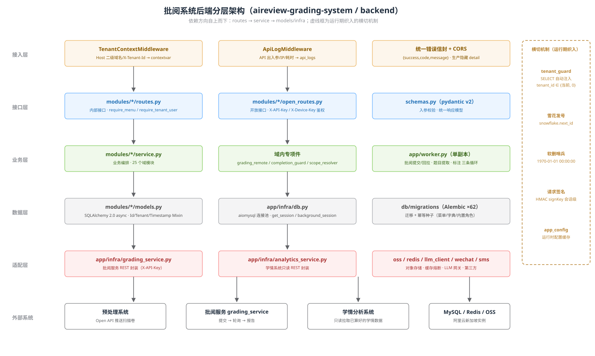
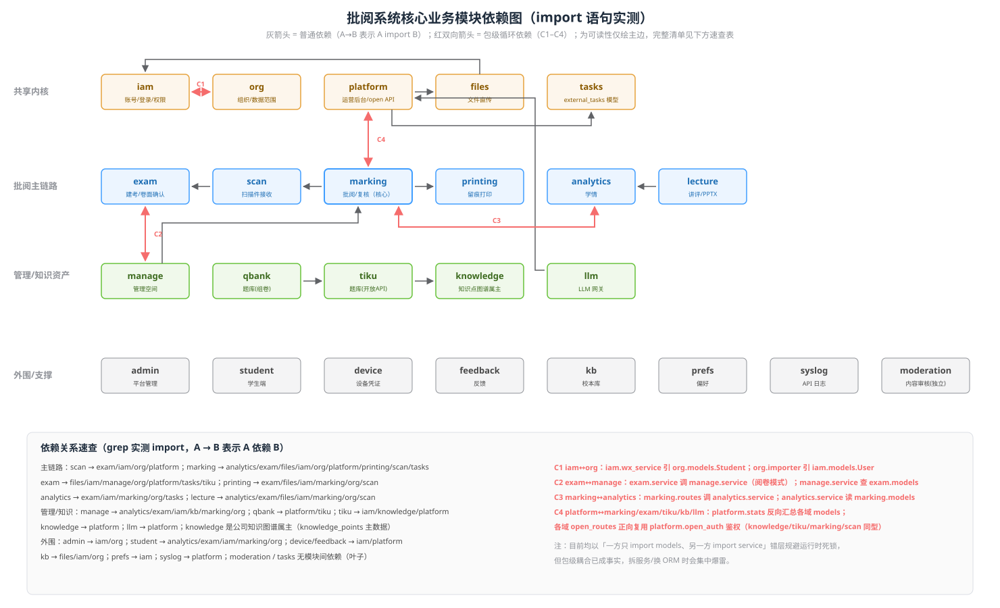

# 批阅系统软件架构（aireview-grading-system）

> 本文是[代码调研报告](./codebase-grading-system.md)的架构深化版：后者回答「仓库里有什么」，本文回答「代码内部怎么分层、模块怎么依赖、数据怎么流动」。所有结论均来自对 `~/src/indievolve/aireview-grading-system`（main 分支，2026-08）源码的直接阅读，关键论断附文件路径。与既有文档不一致处在文中以 ⚠️ 标注。

## 1. 架构形态与依赖方向

系统是**模块化单体**（单 FastAPI 进程挂载 25 个域模块路由）+ 独立 worker 进程（`backend/app/worker.py`）。代码组织是「按业务域纵向切分」，每个域模块内部再按 `routes / service / models / schemas` 横向分层：

```
backend/
├── app/            # 与业务无关的基建层
│   ├── config/     # settings（pydantic-settings，含生产环境密钥守卫）
│   ├── common/     # Base/Mixin、错误信封、分页、雪花发号
│   ├── infra/      # DB/Redis/OSS/外部服务适配（详见 §5）
│   └── main.py     # create_app()：中间件链 + 逐一挂载 25 个模块路由
│   └── worker.py   # 异步 worker 进程（三条独立轮询循环）
├── modules/<域>/   # 25 个业务域，域内统一结构：
│   │               #   routes.py      内部接口（JWT 鉴权）
│   │               #   open_routes.py 开放接口（X-API-Key 鉴权，仅 7 个域有）
│   │               #   service.py     业务编排
│   │               #   models.py      SQLAlchemy 2.0 声明式模型
│   │               #   schemas.py     pydantic v2 入参/出参
│   └── db/migrations/versions/  # Alembic 62 个迁移版本
```

### 分层与依赖方向（实测结论）



| 层 | 代码落点 | 职责 | 允许依赖 |
|---|---|---|---|
| 接入层 | `app/main.py` 中间件链 | CORS → `TenantContextMiddleware` → `ApiLogMiddleware` → 全局错误信封 | 无 |
| 接口层 | `modules/*/routes.py`、`open_routes.py` | 鉴权依赖注入、入参校验、调用 service、组装响应 | service、schemas、infra |
| 业务层 | `modules/*/service.py` + 域内专项件 | 业务编排、事务边界、状态机推进 | 其他模块的 models/service、infra、common |
| 数据层 | `modules/*/models.py`、`app/infra/db.py` | ORM 模型、连接池、会话工厂 | common（Mixin）、infra |
| 适配层 | `app/infra/` | 外部系统与中间件的客户端封装 | config、common |

**依赖方向的实测结论是「单向但有破例」**：层级间严格自上而下（routes→service→models/infra），未观察到反向；但**模块（域）之间存在 4 组包级循环依赖**（见 §2）。典型模式是「A 的 service 调 B 的 service，B 的 service 只 import A 的 models」——靠「一方只碰 models、不碰 service」错层规避 Python 运行时循环 import，包级耦合已成事实。

三个值得注意的横切机制（运行期织入，不出现在调用链上）：

1. **租户守卫**（`app/infra/tenant_guard.py`）：SQLAlchemy `Session` 的 `do_orm_execute` 事件上挂 `with_loader_criteria`，对所有带 `TenantMixin` 的模型的 SELECT 自动注入 `tenant_id IN (当前租户, 0)`——service 漏写 `tenant_id` 过滤也不会越权读。`tenant_id=0` 是平台共享层（内置角色/菜单/知识点）。
2. **雪花发号**（`app/common/snowflake.py`）：`IdMixin.id` 的 Python 侧 default，41bit 毫秒 + 5bit 机器 + 6bit 序列，上限不超过 JS `MAX_SAFE_INTEGER`（前端 number 安全）。
3. **软删哨兵**（`app/common/base.py`）：`deleted_at` 非空，活跃行 = `'1970-01-01 00:00:00'`，规避 MySQL 唯一索引中多 NULL 不冲突的坑；活跃过滤统一走 `is_active()`，禁止 `IS NULL`。

## 2. 核心模块与依赖关系（import 实测）

对 25 个域模块逐一 grep `from modules.*` 得到的依赖图如下（A→B 表示 A import B）：



### 共享内核

- **iam**（账号/登录/RBAC）与 **org**（组织/数据范围）是最底层的业务内核，几乎所有模块都依赖它们；**tasks**（`external_tasks` 模型，`modules/tasks/models.py`）与 **files**（文件直传）是无模块间依赖的叶子，被上层广泛复用。
- **platform**（运营后台 + 开放 API 基建）是另一种内核：它的 `open_auth.py`（X-API-Key 前缀→哈希→status→scopes 鉴权）被 knowledge/tiku/marking/scan 等所有对外域的 `open_routes` 复用；同时 `platform/stats.py` 反向 import exam/marking/llm/tiku/kb 的 models 做运营统计——构成 **C4 循环**。

### 四组包级循环依赖（实测，均已错层规避运行时死锁）

| 编号 | 环 | 证据 |
|---|---|---|
| C1 | iam ↔ org | `modules/iam/wx_service.py:18` 引 `org.models.Student`；`modules/org/importer.py:9` 引 `iam.models.User` |
| C2 | exam ↔ manage | `modules/exam/service.py:21` 调 `manage.service`（阅卷模式判定）；`modules/manage/service.py:7` 读 `exam.models` |
| C3 | marking ↔ analytics | `modules/marking/routes.py:12` 调 `analytics.service`；`modules/analytics/service.py:6` 读 `marking.models` |
| C4 | platform ↔ exam/marking/tiku/kb/llm | `modules/platform/stats.py:24-29` 反向汇总各域 models；各域 `open_routes` 正向复用 `platform.open_auth` |

这四组环说明：当前的「模块」边界是**目录级约定**而非可独立部署的单元；若未来拆服务，C2/C3/C4 是第一批要解的结。

### 主链路模块的扇入扇出

- **marking 是扇出最大的业务模块**（依赖 analytics/exam/files/iam/org/platform/printing/scan/tasks 共 9 个域），是整个系统的编排中心；其 `grading_remote.py`（1548 行）承载了全部与批阅服务的交互细节（见 §4）。
- **manage**（管理空间）是聚合读模型：`overview_service.py` 直接 JOIN exam/analytics/marking/org/kb 五个域的表出报表——它是「模块化单体」红利（跨域 JOIN 零成本）的最大受益者，也是未来拆库时成本最高的点。
- **moderation**（内容审核）是唯一零依赖且无人依赖的业务模块（仅被 main.py 挂路由 + 调用 `app/infra/aliyun_green.py`）。

## 3. 数据模型与 ORM 设计

### 模型基座（`app/common/base.py`）

所有表由三个 Mixin 组合而成：`IdMixin`（BIGINT UNSIGNED 雪花主键）、`TenantMixin`（`tenant_id` 非空 + 索引）、`TimestampMixin`（created_at/updated_at UTC naive + 软删哨兵 deleted_at）。数据库铁律：不建 DB 外键（一致性由 service 层保证）、索引一律 `tenant_id` 打头、唯一索引把 `deleted_at` 纳入以支持软删后重建（如 `users` 表 `uk_tenant_phone(tenant_id, phone, deleted_at)`，`modules/iam/models.py:11`）。

### 关键表设计（以批阅主链路为例）

- **`exams`**（`modules/exam/models.py:34`）：一场单科考试。三个独立状态机字段是其设计核心：`status`（draft→pending→grading→reviewing→done）、`extract_status`（none/syncing/ready/failed，题目提取）、`annotate_status`（答题卡标注，迁移 `ann01` 加入）——三者正交，分别由不同异步流程推进，worker 的 `_extract_loop` 只盯 `extract_status=syncing` 的场次。`grade_mode`/`grade_locked`/`marking_identity` 承载管理端的阅卷模式与实名/匿名控制（锁定后教师端不可改）。
- **`exam_questions`**（`modules/exam/models.py:100`）：本场题目，`extract_raw` JSON 保留批阅服务提取的原始结构，`scoring_points` JSON 存采分点——本地组卷（`question_source=composed`）时本地是权威源，直接下推批阅服务；人工上传时以远端提取为准。
- **`student_papers`**（`modules/marking/models.py:11`）：学生整卷，状态机 `pending→queued→grading→ai_done→reviewing→confirmed`（+failed）。`objective_score/subjective_score/total_score`（AI 原始）与 `final_score`（复核后）分列，AI 分与人工分永不同列——这是「三模式复核」能留痕的基础。
- **`student_answers`**（`modules/marking/models.py:39`）：逐题作答。`ai_*`（ai_score/ai_feedback/ai_confidence/confidence_level）与 `manual_*`（manual_score/manual_scoring_points/override_reason）双列并存；`review_level`（required/quick/auto 三档）+ `reason_codes` + `calibrated_confidence` 是「快扫判定规则 V1」的落库形态（`modules/marking/review_rules.py`）；`evidence_consistent` 记录分项之和与总分是否一致（无分项明细时为 NULL 而非假装一致）。
- **`score_audits`**（`modules/marking/models.py:92`）：评分操作只追加留痕表——注意它**刻意不带 TimestampMixin**（无 updated_at/deleted_at），从模型层面保证不可改不可删。
- **`review_completions`**（`modules/marking/models.py:108`）：「完成批阅」的可撤销快照，`audit_cursor` 记录创建时 `score_audits` 最大 id，用于「有后续评分操作则拒绝撤销」；撤销只更新 status 并恢复快照，同时使既有打印产物失效。
- **`external_tasks`**（`modules/tasks/models.py`）：外部系统任务统一表，详见 §4。

### SQLAlchemy 2.0 async 使用模式

- 全链路 async：`create_async_engine` + aiomysql，`expire_on_commit=False`，`pool_pre_ping=True`（`app/infra/db.py`）。
- 两条会话入口严格区分：`get_session()` 是 FastAPI 依赖（请求路径）；`background_session()` 是 worker/中间件等非请求路径的显式入口（调用方自负租户上下文与 commit）——注释明确这是为了「取代各模块伸手拿私有 `_default_factory` 的重复样板」。
- 事务风格：service 层统一在函数末尾 `session.commit()`，跨步骤失败回滚；`grading_remote.py` 中有大量「先落本地任务事实并 commit，再调远端」的写法，防止远端失败时 rollback 把本地任务记录一起回滚掉（`grading_remote.py:159` 注释）。
- 并发写纪律：worker 提交整卷时「每卷各用独立 session」，外层 session 只读共用信息并提前 commit 释放连接（`grading_remote.py:735-744`），避免一批并发 HTTP 全程占着连接。
- `app/infra/db.py:36` 预留了 `get_engine_for_tenant(tenant_id)` 分片路由钩子：当前单库忽略 tenant_id，未来按租户分片时只改这一个函数。

## 4. 异步任务骨架与外部系统适配

### external_tasks 任务骨架（`modules/tasks/models.py` + `app/worker.py` + `modules/marking/grading_remote.py`）

设计文档写 ARQ，实现是**自研的 DB 表轮询**（代码调研报告已指出此漂移，此处给实现细节）：

- **表结构**：`external_tasks` 一张表承载全部外部任务（kind 区分：`grade_paper` 整卷批阅 / `grade_extract` 建考提取 / `card_annotate` 答题卡标注 / `tenant_backup` 租户备份）。关键字段：`status`（pending→submitting→submitted→completed/failed/superseded）、`remote_task_id`（远端句柄）、`retry_count`、`cost_cny`、`request_snapshot/response_snapshot`（JSON 留痕）、`superseded_by`（重批取代链）。
- **去重（防重复付费的核心）**：`dedup_key` 活跃时 = `{kind}:{paper_id|exam_id}`，配合 `uk_active_dedup(tenant_id, dedup_key)` 唯一索引；进终态时置 NULL 释放（`grading_remote.py:1127`）。`trigger_grade`（`marking/service.py:163`）先查后插：活跃 dedup 键**或**未被 supersede 的 failed 任务任一存在都跳过——因为「failed 即使没有 remote_task_id，也可能是提交响应丢失」，自动路径一律不重提，只有显式 `rebatch_paper` 先 supersede 旧任务才允许新建。
- **状态流转**：worker 单副本跑三条独立循环（`_grade_loop` / `_extract_loop` / `_annotate_loop`，`app/worker.py:166-194`），每 5 秒一轮（`GRADE_WORKER_INTERVAL`）：
  1. **回收孤儿**：`reclaim_stale_submitting` 把认领后进程中断遗留的超龄 submitting 任务转 failed 并释放 dedup_key；
  2. **提交**：`_scan_targets` 跨租户聚合 pending 任务 → `submit_papers` 按 `grade_submit_concurrency` 信号量限流并发提交（每卷独立 session），存 `remote_task_id` 转 submitted；
  3. **轮询**：submitted（含带 remote_task_id 且未完成的 failed）→ `poll_results` → 结果映射落 `student_answers` → completed；
  4. **兜底**：`_retry_dropped_auto_grade` 重触发「识别时被吞掉的自动批阅」（修复「扫描完但没人开着前端页面 → 永久漏批」这类把推进逻辑寄生在前端轮询上的缺陷）；`_extract_loop` 同理把题目提取的状态推进从前端轮询搬到服务端（`_EXTRACT_STALL_GIVEUP=24h`，长期卡死不再花钱问远端）。
- **失败策略**：单卷失败 retry_count+1，≥3 转 failed（`grading_remote.py:715-720`）；单 exam 失败不影响同轮其余 exam（`_run` 隔离 + 租户 contextvar 逐协程设置）。

### 三个外部系统的接口契约（`app/infra/`）

| 外部系统 | 适配模块 | 方向 | 契约要点 |
|---|---|---|---|
| 预处理系统 | `modules/scan/open_routes.py`（入站）+ `platform/open_auth.py` | 它推我 | `/open/v1/scan/*`，X-API-Key + 幂等键；每次调用落 `open_api_call_log` 审计 |
| 批阅服务 grading_service | `app/infra/grading_service.py`（出站 REST 封装） | 我调它 | `X-API-Key` 头，base_url 后统一 `/api/v1`；提交类立即返回 ID，调用方轮询至终态；网络/5xx/429 指数退避重试 ≤3 次，401/403 快速失败 |
| 学情分析系统（小树助教 attribution-engine） | `app/infra/analytics_service.py` | 我调它（只读） | 默认无鉴权（可选网关 key）；`analysis/{subject}` 无数据时返回 200 + `{"error": "No data..."}`——适配层原样透传由调用方判断 |

适配层与业务层之间还有一层「事实表」纪律：批阅服务的材料传输走**共享 OSS bucket 按 key 自取**（`_material_urls`，`grading_remote.py:104`——传裸 object key 而非签名 URL）；批阅结果只经 `student_answers` 落库，confirmed 后才回流数据底座，任何模块不可直连批阅服务取数。另有 `app/infra/circuit_breaker.py` 提供 Redis 熔断器（按 target 连续失败计数，cooldown 后半开试探，Redis 不可达时 fail-open 绝不阻断真实调用），供 LLM 网关等出站调用复用。

## 5. 权限与多租户设计

### 租户隔离：三层防线

1. **识别**：登录期按访问域名解析租户（`app/infra/tenant_resolver.py`：custom_domain 精确匹配 → 二级域名前缀；注释明确「请求期租户仍以 JWT 为准，本解析不参与数据隔离，不可被 Host 越权」）。⚠️ 与[代码调研报告](./codebase-grading-system.md)的口径差异：报告称「`TenantContextMiddleware` 按 Host 二级域名解析租户」，实际代码（`app/infra/tenant_context.py`）只读 `X-Tenant-Id` 请求头写 contextvar，Host 解析在 `tenant_resolver.py` 且仅服务登录/品牌；鉴权后的租户上下文由 `modules/iam/deps.py:require_tenant_user` 从 JWT 的 `tid` claim 设置。
2. **隔离**：`tenant_guard` 在 ORM 层对全部 SELECT 强制 `tenant_id IN (当前租户, 0)`（见 §1）——service 漏写过滤也不越权；写入由 service 显式带 tenant_id（guard 注释承认「flush 期断言」这道纵深防御尚未加）。
3. **运维面**：OSS 对象 key 按租户 code 归置（`reload_tenant_codes` 缓存 id→code 映射）；机器凭证（`open_api_keys` 系统级 / `device_credentials` 设备级）走「前缀→哈希(argon2)→status→scopes」鉴权，支持即时吊销。

### 权限模型：RBAC + 数据范围 + 委派（ADR-002）

有效权限 = 三个**正交**维度的叠加，全部服务端判定：

- **功能权限（菜单码 ∩）**：`role_menus ∩ tenant_menus`——平台运营给租户分配功能上限（`tenant_menus`），学校管理员在校内二次分配（`role_menus`）。登录时求交集后**直接写进 JWT 的 `menus` claim**，接口层用 `require_menu(code)` 判定（`modules/iam/deps.py:93`）——每次请求零 DB 查询，代价是权限变更要重新登录才生效。
- **数据范围（`roles.data_scope`）**：`school/grade/subject/grade_subject/class/self` 六档 + `user_roles` 上的 grade/subject/class_ids 参数。`modules/org/scope_resolver.py` 把 scope 声明解析为可见 class_id 集合（多职位取并集）：`school` → 不限；`grade` → 该年级全部班级；`subject/grade_subject` → 按任课表（TeachingAssignment）推导（支持显式 class_ids 覆盖）；`class` → 任课 ∪ 班主任班级；`self` → 无班级维度。
- **临时授权**：`delegations` 表（资源级、带起止时间）。

与[角色功能清单](./roles-and-features.md)的交叉验证：

- 角色清单的「阅卷模式设置 + 全校锁定」「人工批阅权限矩阵」对应 `modules/manage/service.py:187 resolve_manual_permission`——阅卷队列入口必须调它做服务端判定，不是前端显隐；「锁定后教师端不可改」由 `exams.grade_locked` 列承载（§3）。✅ 机制吻合。
- 角色清单实测的「教务主任被路由守卫重定向」在前端对应 `frontend/src/app/router/guards.ts` + `ForbiddenView.vue`：服务端菜单 ∩ 机制本身支持任意细粒度配置，demo 表现是配置问题而非代码缺陷。➡️ 维持原结论。
- demo 固定验证码 `250528` 对应 `login.whitelist_phones/whitelist_password` 白名单机制（`modules/iam/service.py:72`），属运营后台可配项，代码层面 prod 无强制禁用（已在调研报告技术债 §2 标记）。

## 6. 前端架构

`frontend/`（Vue 3.5 + TS + Vite 5，96 个 .vue + 89 个 .ts）：

- **目录与后端同域**：`src/modules/<域>/`（auth/exam/scan/marking/analytics/lecture/manage/campus/kb/student/admin/platform/teach/compose 等），每个域内含 `api.ts / types.ts / views / components`，公共部分在 `src/shared/`（api client、UI 组件、latex/markdown 等工具）与 `src/app/`（router、layouts、menu/space 元数据）。
- **状态管理分工明确**：Pinia 只管**会话态**（`src/stores/auth.ts` 是唯一 store：token/user/menu_codes/space_codes），服务端数据全部走 **@tanstack/vue-query**（`src/main.ts` 配置了全局重试策略：仅 5xx/网络错误重试且 ≤2 次，4xx 不重试——注释注明是为了避免轮询点故障时请求量放大 4 倍）。典型用法如 `src/modules/marking/use-list-grade-progress.ts` 的轮询查批阅进度。
- **多空间导航**：`src/app/space.ts` 定义 teach/headteacher/manage/student/campus 五个空间，路由守卫（`router/guards.ts` + `modules/platform/guard.ts`）按 `menu_codes/space_codes` 判定，无权访问跳 `ForbiddenView.vue`——即角色清单中三端界面完全隔离的前端实现。
- **请求签名**：`src/shared/api/client.ts` 用 Web Crypto 实现与后端逐字节一致的 HMAC 签名（规范串 `method\npath\n原始query\nsha256(body)\nts\nnonce`）；`crypto.subtle` 仅在安全上下文可用，plain HTTP 部署下整套签名**降级为不签**（会话无 sid → 后端不强制），避免 web 整体不可用。
- **多端出包**：同一份 Vue 代码，桌面端 Tauri 2（`src-tauri/`，Windows exe）、移动端 Capacitor 8（`android/`）。后端 CORS 中间件显式放行 `tauri://localhost`、`capacitor://localhost` 等 scheme（`app/main.py:42-51`），鉴权走 Bearer 而非 cookie，因此多端共用同一套 API 无需 cookie 域处理。

## 7. 安全设计

- **认证**：JWT（HS256，PyJWT——requirements 注释明确替代有 CVE-2024-33663/33664 的 python-jose）。租户 token claims：`typ=tenant`、`tid`、`sub`、`menus`（∩后菜单码）、`scopes`（数据范围）、App/Web 会话额外带 `sid/cli`（`app/infra/security.py:96 issue_session`）。
- **请求签名（防伪造/盗刷）**：仅对带 sid 的已签名会话启用。`signKey = HMAC(sign_secret, sid)`——sign_secret 只在服务端，前端登录时按会话拿到派生 signKey，逆向客户端拿不到长期密钥；验签后按 sid 隔离判 nonce 重放（Redis `SET NX EX`）。三档模式 `off/shadow/enforce` 支持灰度（`modules/iam/deps.py:_verify_signature`）。
- **密码与凭证哈希**：argon2-cffi（密码 + open_api_keys 共用 `verify_password`）。开放 API 高频入口有 60s 验证结果缓存（`platform/open_auth.py:39-50`）——因为 argon2 单次 50-100ms 同步 CPU 会堵 event loop；权衡是吊销后最长 60s 仍可命中缓存，故吊销路径显式调 `invalidate_api_key_cache` 即时清除，TTL 只兜「直接改库」旁路。
- **敏感数据加密（Fernet）**：`modules/llm/crypto.py`——LLM 供应商 API Key 落库前用 `settings.llm_enc_key` 做 Fernet 对称加密，读取时解密；密钥本身由生产环境守卫强制非默认（`app/config/settings.py`：`APP_ENV=production` 时 JWT_SECRET ≥32 字节、LLM_ENC_KEY、签名密钥均非默认，否则启动失败）。
- **其他**：初始密码服务端强随机、仅创建时返回一次；登录限流（`iam/login_throttle.py`）；内部 Swagger 与开放接口 ReDoc 均默认关闭（secure-by-default，`main.py:32-36`）；App 更新清单 Ed25519 签名 fail-closed + 证书 SHA-256 钉扎（`platform/update_manifest.py`）；全局异常兜底统一错误信封、生产隐藏 detail。

## 8. 关键设计取舍与技术债

### 设计取舍（代码与注释中可佐证的）

1. **模块化单体而非微服务**：`docs/DESIGN.md` 明确「团队规模与一期周期不支持微服务」。红利在 manage/overview_service 这类跨域 JOIN 报表上兑现；代价是 §2 的四组包级循环依赖，模块边界只有目录约定没有物理约束。
2. **DB 表轮询 worker 而非消息队列**：用 `external_tasks` 表 + 单副本 worker 轮询替代 ARQ/Redis 队列。换来的是任务状态天然持久化、可 SQL 排查、dedup 唯一索引防重；代价是 5 秒级延迟、单副本（注释自承「勿多开 worker 副本」）、以及「自动批阅触发曾寄生在前端轮询上」这类缺陷要靠 worker 兜底循环事后修补。
3. **权限菜单码烧进 JWT**：零查询判定换「权限变更需重新登录」——对考试季稳定性是可接受的取舍。
4. **多状态机正交字段而非单一状态**：`exams` 的 status/extract_status/annotate_status 各自独立推进，避免了巨型状态机的组合爆炸，代价是状态间收敛逻辑散落（如 `maybe_finish_preparing`）。
5. **副本数按压测实测而非弹性**：2 副本是 2026-08-13 压测结论（`docker-compose.scale.yml` 注释「4 副本纯浪费，且进程内缓存一致性变差」）。

### 技术债（仅列实际观察到的）

| 项 | 事实 | 位置 |
|---|---|---|
| 巨型文件 | `grading_remote.py` 1548 行、`exam/service.py` 1214 行、`marking/service.py` 1139 行、`manage/service.py` 1079 行、`scan/service.py` 889 行 | `backend/modules/` |
| vendored 巨无霸 | `app/helpers/adaptive_cutting/vendor/annotator_vlm.py` 单文件 5402 行 | `backend/app/helpers/` |
| 包级循环依赖 ×4 | iam↔org / exam↔manage / marking↔analytics / platform↔多域（目前靠「一方只 import models」错层规避） | 见 §2 |
| 双测试目录职责不清 | `backend/tests/`（166 文件）与 `backend/tests_unit/`（仅 1 文件）并存 | `backend/` |
| 无 CI 测试流水线 | 唯一 workflow 只构建桌面/移动包；pytest/vitest 不进流水线 | `.github/workflows/build-apps.yml` |
| 设计文档漂移 | DESIGN/SPEC 写 ARQ 队列、ECharts、uv/ruff/pnpm，实际是 DB 轮询 worker、无 ECharts、pip/npm | `docs/DESIGN.md` |
| 安全遗留 | nginx 配置明文提交预处理系统 API Key；demo 白名单固定密码机制 prod 无强制禁用（调研报告已详述，本文不重复） | `deploy/nginx-grade.indievolve.com.conf` |

## 9. 与既有文档的关系与差异标注

- 本文与[代码调研报告](./codebase-grading-system.md)的分工：调研报告覆盖「有什么/怎么部署/质量观察」，本文覆盖「分层/依赖/数据流/接口契约」。技术债部分只保留架构相关的（巨型文件、循环依赖、测试目录），安全项以调研报告为准。
- ⚠️ 已修正调研报告的一处口径：租户识别（见 §5 第 1 条）——`TenantContextMiddleware` 实际只读 `X-Tenant-Id` 头，Host 二级域名解析在 `tenant_resolver.py` 且仅用于登录期/品牌，数据隔离以 JWT `tid` 为准。
- 与[数据架构](./data-architecture.md)：代码事实继续支持「本系统是知识点图谱权威源」（knowledge 模块 + `knowledge_points` 主数据）；分析型查询目前全部走 MySQL（manage/overview_service 的多域 JOIN），ClickHouse/向量检索仍无踪迹。
- 与[部署架构](./deployment.md)：本文 §4 的 worker 三循环结构即部署架构「同步 Worker ×1」的内部展开；「后端 ×2」对应 `docker-compose.scale.yml` 的 2 副本（各自独立 `SNOWFLAKE_WORKER_ID` 防雪花撞号）。

相关：[代码调研报告](./codebase-grading-system.md) · [部署架构](./deployment.md) · [数据架构](./data-architecture.md)
