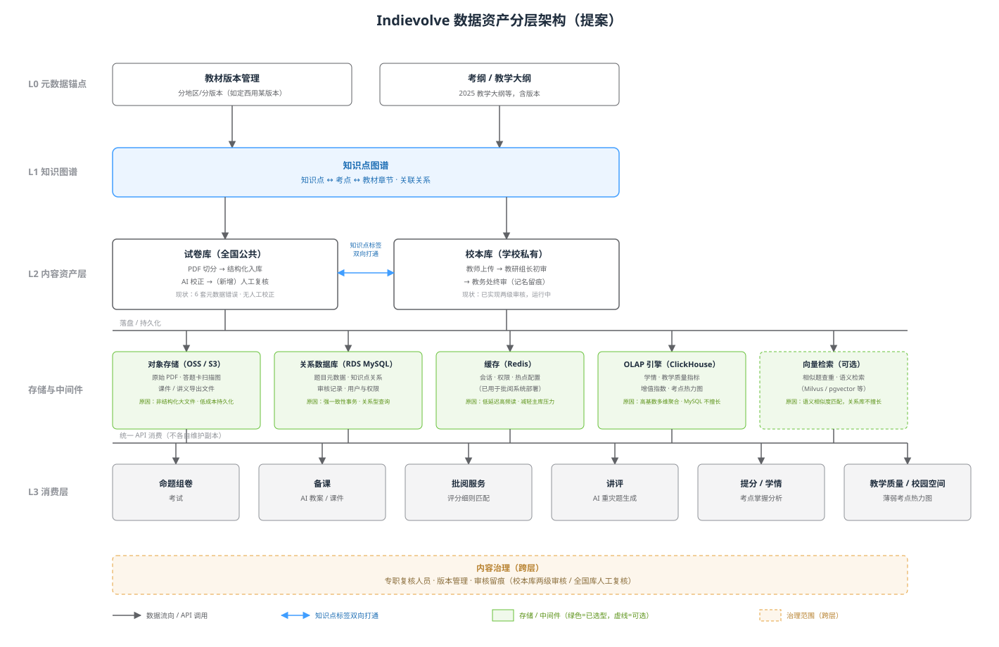

# 数据架构提案（试卷库 / 知识点库 / 教材考纲）

背景：2026-08-17 周会中王国平明确提出"公司有两个事要干：试卷库要搞起来，知识点库也要维护起来……教材、考纲、知识点要做关联，这是个架构问题的点"，并要求近期与旭东、峰崧、江宁、张红专项讨论。本提案基于已入库的[产品待办](./roadmap.md)、[部署架构](./deployment.md)整理，供该讨论使用。

## 1. 现状盘点

| 资产 | 现状 | 来源 |
|---|---|---|
| 试卷库 | 说话人1 自建 PDF 切分入库 MySQL 脚本；仅 AI/脚本校正，无人工复核；已发现 6 套高考真题元数据错误（有答案无原题） | 转录 §说话人1 报告 |
| 校本库 | 已上线，教师上传 → 教研组长初审 → 教务处终审，两级/单级可配置，记名留痕 | [roles-and-features.md](./roles-and-features.md) |
| 知识点 / 考纲 / 教材 | 王国平提出需关联，尚未架构化；教材需按地区/版本区分（如定西一中的教材版本） | 转录 §王国平 |
| 消费方 | 命题组卷、备课、批阅服务（评分细则）、讲评、提分/学情、教学质量热力图 等均隐式依赖题目与知识点数据 | [roles-and-features.md](./roles-and-features.md) |

## 2. 核心问题

1. **无统一数据模型**：试卷库是"自建脚本+MySQL"的孤立产出，校本库是另一套体系，两者与知识点/教材/考纲之间没有显式关联——各消费方（命题、批阅、学情分析）目前很可能各自维护知识点标签的本地副本，长期会分叉、不一致。
2. **可靠性无保障**：试卷入库全靠 AI/脚本校正，"不能 100% 可靠"（说话人1 原话），却没有人工复核机制兜底，已产生 6 套错误数据仍在被使用的风险。
3. **教材版本是强变量**：不同学校用不同教材版本（例：定西一中的版本 ≠ 默认版本），若知识点/考点不按教材版本挂载，命题、学情分析都会产生不对齐的错误结论。
4. **组织权责未定**：现两级审核流程存在于校本库，但公共试卷库、知识点库都还没有对应的人工复核角色和 SLA。

## 3. 提案：五层数据资产架构

### L0 元数据锚点
- **教材版本管理**：教材 × 版本 × 适用地区/学校的映射表（如：定西一中 → 某版本）。
- **考纲 / 教学大纲**：按年度版本管理（如 2025 教学大纲）。

### L1 知识图谱（新建，核心）
- **知识点图谱**：知识点 ↔ 考点 ↔ 教材章节的显式关联表，是全公司唯一的知识点权威源（single source of truth）。
- 教材版本变化时，知识点图谱通过版本号追溯，不重写历史数据。

### L2 内容资产层
- **试卷库（全国公共）**：PDF 切分 → 结构化入库（现有）+ **新增人工复核环节**（参考校本库模式或菁优网模式，安排专职人员）。
- **校本库（学校私有）**：维持现有两级审核（教研组长初审 → 教务处终审），补充与 L1 知识图谱的知识点标签双向打通，避免校本库自建标签体系。

### 存储与中间件层（新增，落实 L1/L2 的物理承载）

数据资产不能只停留在逻辑分层，必须落到具体存储上。基于当前已知的部署现状（[deployment.md](./deployment.md) 中已用阿里云 RDS MySQL + Redis）及各消费场景的访问模式，提案如下选型：

| 组件 | 承载内容 | 选型原因 |
|---|---|---|
| **对象存储（阿里云 OSS，S3 协议兼容）** | 原始 PDF、答题卡扫描图、课件/讲义导出文件 | 非结构化大文件，按量计费成本低；已有华为云 OBS 迁移先例（华汉云历史数据），沿用同类对象存储降低迁移成本 |
| **关系数据库（RDS MySQL）** | 题目元数据、知识点关系表、审核记录、用户与权限 | 需要强一致性事务（如审核状态流转）与关系型查询（多表 JOIN）；复用现有部署的 RDS MySQL，不引入新组件 |
| **缓存（Redis）** | 会话、权限、热点配置 | 低延迟高频读场景，减轻主库压力；[部署架构](./deployment.md)中已用于批阅系统，直接复用 |
| **OLAP 引擎（ClickHouse，新增）** | 学情分析、教学质量指标（增值指数、达成率）、考点×班级热力图 | 这类查询是高基数多维聚合（按学科×班级×考点×时间切片），MySQL 在此类分析型查询上性能和写入模型都不合适；ClickHouse 列式存储+向量化执行专为此设计，避免拖垮承载事务的主库 |
| **向量检索（可选，Milvus / pgvector）** | 相似题查重、语义检索 | 试卷库规模变大后，"6 套元数据错误"这类问题可通过语义相似度匹配辅助发现重复/近似题目；关系数据库不擅长语义相似度计算，属于按需引入项，非首期必须 |

选型原则：**优先复用已部署组件**（MySQL、Redis 已在生产），**按访问模式而非"能不能用同一个库"决定新增组件**——分析型查询与事务型查询混用同一个 MySQL 实例，长期会互相拖累性能，这也是本提案把 ClickHouse 单独列出的原因。

### L3 消费层
命题组卷、备课、批阅服务、讲评、提分/学情、教学质量/校园空间等，一律通过**统一 API** 消费上述存储层，不再各自维护数据副本——这是本提案最关键的约束，直接决定后续能否做到"改一处、全链路生效"。

### 跨层：内容治理
- 试卷库、校本库均需要专职复核人员、版本管理机制、审核留痕；全国公共库建议参照校本库审核链路（初审/终审两级）设计，而非继续依赖纯脚本规则。

## 3.5 数据资产盘点总览（2026-08-19，代码实测）

本节汇总对两个仓库（[批阅系统盘点](./data-assets-grading-system.md)、[批阅服务盘点](./data-assets-grading-service.md)）逐表逐字段实测的结果，回答"我们已经有什么数据、哪些非结构化数据能被结构化、缺口在哪"，是 §1-§2 周会纪要设想与代码现实之间的对照基线。

### 3.5.1 结构化数据全景

两仓库合计 **90 张表**（grading-system 64 张 + grading-service 26 张），按数据资产视角归纳为五类：

| 类别 | 代表表 | 归属仓库 | 对本提案的意义 |
|---|---|---|---|
| 组织与人 | `students`（学籍号终身锚点）、`classes`、`teaching_assignments` | grading-system | 是 L1 知识图谱之外，另一个必须存在的"人"权威源 |
| 考试与题目 | `exams`、`exam_questions`（题目+预计算三件套）、`tiku.questions`（含教材版本/册次/章节）、`knowledge_points` | grading-system | `knowledge_points` 已是租户 0 共享表，是 L1 知识图谱最现实的落地起点，而不用从零新建 |
| 批阅任务与结果 | `student_answers`/`score_audits`（grading-system，`modules/marking`）、`grading_tasks`/`grading_task_details.result_json`（grading-service） | 两仓库分工：grading-system 存最终留痕，grading-service 存 AI 产出的中间结果 | 个体数据沉淀最厚的两张表，此前误标归属已修正（见 §3.5.4） |
| 校本库/试卷库 | `kb_resources`/`kb_review_records`（grading-system）、`samples`/`fails_settlement_records`（grading-service，样本库与问题裁定） | 分列两仓库 | `kb_resources` 目前**无知识点标签字段**，是 L2 校本库与 L1 知识图谱"双向打通"的具体缺口（不是抽象问题，是缺一列或一张关联表） |
| 成本与配置 | `usage_json`/`llm_call_logs`、`optimization_history` | 两仓库均有 | 与本提案关系较弱，供财务/运营场景使用 |

**对 §3 提案的直接修正**：
- L1 知识图谱不需要完全新建——`knowledge_points`（tenant_id=0 平台共享表）已经是事实上的雏形，提案应改为"扩展 `knowledge_points` 的关联维度（考点/教材章节）"而非另起炉灶。
- L2 校本库的"双向打通"，最小可行方案是给 `kb_resources` 加一个 `knowledge_point_ids` 关联列/关联表，工作量远小于原提案设想的"体系打通"。
- `exam_questions.knowledge_points_json` 目前只是 AI 提取的**知识点名称字符串数组，没有图谱 ID**——这是命题组卷、学情分析等 L3 消费方与 L1 知识图谱之间实际存在的断链点，建议列为 P0 修复项（把字符串数组换成图谱 ID 数组，需要一次性人工/半自动对齐）。

### 3.5.2 非结构化数据全景与可结构化性判断

| 数据类型 | 存储位置 | 能否走清晰流水线结构化 | 现状 |
|---|---|---|---|
| 原始文件（扫描件/PDF/校本库资源） | 共享 OSS/MinIO 桶，`{tenant}/exam/{id}/{域}/` 统一命名空间 | ✅ 能，且**已有 4 条流水线在跑**（预处理切分回传、VLM 自适应标注、花名册识别、整卷评分提取） | 校本库资源本身缺一条"内容抽取+知识点打标"流水线，是新增机会 |
| AI 评语/反馈文本（`result_json.feedback`） | grading-service MySQL 大字段 | ✅ 能：评语 → LLM 抽取失分短语/错误模式 → 结构化标签表，与现有五 Agent 同技术栈，零新增基础设施 | 尚无此流水线；但已有 `samples.error_pattern`（人工标注错误模式枚举）、`fails_settlement_records.fail_class` 两套现成的错误归因码表，可直接作为结构化输出的对齐标准，不用从零设计标签体系 |
| 细则优化样本摘要（含 `### {student_name}` 标题） | **仅存在于内存中的 LLM 请求 prompt，从不落库**（`rubric_optimizer.py` 调用 `format_grading_summary`/`format_extraction_samples` 后即弃） | ✅ 能，且改造成本极低：`step_scores[].criterion+feedback` 本身不含姓名，可聚类为错误模式标签；把拼接模板里的 `### {student_name}` 改成 `### 样本{i}` 是一行代码改动 | 这是本次盘点发现的**最高性价比修复项**：零持久化的 PII 暴露面，改一行代码即可消除，建议列为记忆系统 P0 |
| 操作日志/事件流 | `api_logs`/`llm_call_logs`/`exam_events`（已结构化落库）；grading-service 的 `log_collector` 仅内存 2000 条环形缓冲无落盘 | 部分已结构化；内存日志无持久化价值不高，不建议投入 | 前端零埋点（无 sentry/posthog 等），若要做用户行为类记忆需先补埋点 |
| JSON 配置字段 | `exam_cards.regions`、`scoring_point_results`、预计算三件套（Redis+MySQL 双写） | 视字段而定：强结构 JSON（如 `regions`）价值高；`snapshot`/`raw_payload` 类留痕字段价值低，不参与 SQL 聚合是"schema 铁律" | 已按此原则设计，无需改动 |

### 3.5.3 三档可复用性判断（与[记忆系统提案](./memory-system-proposal.md) §6 口径一致）

- **现成可用**：`knowledge_points` 表（L1 雏形）、`GET /api/v1/learning/grading-results?student_id=`（按学生聚合读接口）、`score_audits`（AI vs 人工判分差异日志）。
- **需要蒸馏**：`student_answers` 逐题双列 → 错误类型频次；AI 评语文本 → 失分短语标签（可复用 `error_pattern`/`fail_class` 码表）；细则优化样本 → 去 PII 后的错误模式聚类。
- **需要新建或修复**：`exam_questions.knowledge_points_json` 的图谱 ID 打通、`kb_resources` 的知识点标签列、`knowledge_mastery`/`error_attributions`/`student_tasks` 三张已有 schema 但无写入方的学情表（见[批阅系统数据资产盘点](./data-assets-grading-system.md) §0，需先排查其写入链路归属再决定是本仓库补写还是接外部系统）。

### 3.5.4 对既有文档的勘误记录

- [记忆系统提案](./memory-system-proposal.md) 此前将 `student_answers`/`score_audits` 归属误标为 grading-service，实测两表定义于 grading-system 的 `modules/marking/models.py`，已修正。
- [批阅服务 API 与业务流程](./api-and-process-grading-service.md) 关于细则优化"学生姓名进 prompt"的描述需要补充精度：姓名仅存在于内存态的 LLM 请求体，从不写入任何持久化存储（Redis/MySQL 均不落姓名）。
- 此前[数据架构提案](#3-提案五层数据资产架构)（本文件 §3）对 L1/L2 的"从零新建"表述已被 §3.5.1 修正为"扩展现有表"，改造成本比原设想更低。

## 4. 建议的讨论议题（供旭东/峰崧/江宁/张红会议使用）

1. 知识点图谱由谁承建、用什么存储（图数据库 vs 关系表 + 邻接关系）？——已知 `knowledge_points` 表现成可扩展，讨论重点应收窄为"新增哪些关联维度/表"而非"从零选型"。
2. 试卷库人工复核的人力来源与流程——是否复用校本库审核链路的技术方案？
3. 教材版本管理的最小可行数据模型：先支持"学校 → 教材版本"一对一，还是需要支持一校多版本（分科目/分年级）？
4. 迁移策略：现有 MySQL 试卷库如何在不停机的情况下补齐知识点关联，是否需要一次性人工标注项目？
5. L3 消费方改造顺序：建议优先改造**批阅服务**（评分细则强依赖知识点/考点匹配准确性）与**命题组卷**（试题筛选强依赖知识点树），[部署架构](./deployment.md)中批阅服务已是独立内部系统，改造边界清晰。
6. ClickHouse 引入时机与数据同步方式：是否需要 CDC（如 MySQL binlog → ClickHouse）实时同步，还是接受 T+1 离线同步；向量检索是否首期就做，还是等试卷库规模扩大到出现明显重复/查重痛点后再补。

## 5. 与现有待办的关系

对应 [product/roadmap.md](./roadmap.md) 中王国平待办："组织与旭东、峰崧、江宁、张红讨论公司数据架构（试卷库、知识点库资产化）"——本提案可作为该讨论的初始输入；说话人1 待办"排查并替换 6 套元数据错误的高考真题"是 L2 试卷库人工复核环节的第一批具体任务。

相关：[部署架构](./deployment.md) · [产品待办](./roadmap.md) · [角色功能清单](./roles-and-features.md) · [批阅系统数据资产盘点](./data-assets-grading-system.md) · [批阅服务数据资产盘点](./data-assets-grading-service.md) · [记忆系统提案](./memory-system-proposal.md)
