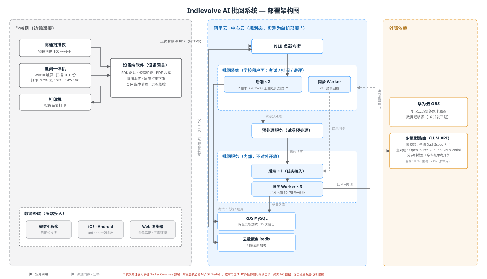

# IndieVolve 主要产品 · 部署架构

IndieVolve 的主要产品是一套 **AI 批阅系统（PA 系统）**，采用"学校侧边缘设备 + 云端批阅"的两层部署形态。本图依据 2026-08-17 周度复盘会议内容整理。

## 学校侧（边缘部署）

- **高速扫描仪**：物理扫描 100 份/分钟，是答题卡数据采集的主入口（一体机扫描上限仅 50 份）。
- **批阅一体机**：Win10 触屏终端，集扫描、留痕打印（单次放纸 ≤350 张）、NFC、GPS、4G/Wi-Fi 于一体；可通过触屏适配的 Web 端完成成绩查看、批阅确认等轻操作。
- **设备端软件**：基于厂商/官方 SDK 驱动硬件，负责扫描姿态矫正、PDF 合成、上传，以及 OTA 版本管理（测试版与正式版两套隔离）与设备远程监控。
- **教师终端**：微信小程序（已发版）、iOS/Android（uni-app 一端多出）、Web（三套环境）多端接入。

## 阿里云 · 中心云（双可用区）

- **ALB 负载均衡** → 多台 ECS（16C32G），配合弹性伸缩实现单机宕机快速接管。
- **批阅系统**（学校租户面：建考试 / 批阅 / 讲评）：后端 ×2 负载 + 同步 Worker ×1（从批阅服务回拉结果）。
- **预处理服务**：试卷预处理。
- **批阅服务**（内部，不对外开放）：承载全部批阅逻辑，后端 ×1 + 批阅 Worker ×3，调用千问大模型完成批阅。
- **RDS MySQL / 云 Redis**：双可用区，保留最近 15 天备份。

## 外部依赖

- **千问 3.7 Plus 大模型**：分学科自定义模型与评分细则，语文/数学开启思考模式（客观题约 1–2 分钱/份）。
- **华为云 OBS**：华汉云历史答题卡原图的迁移源（约 60 万张 / 34 万份，16 并发下载）。

## 关键性能指标（2026-08 压测）

| 环节 | 指标 |
|------|------|
| 高速扫描仪 | 100 份最快 100 秒扫完；矫正 + PDF 合成 38 秒；上传 86 秒；全程 224 秒 |
| AI 批阅 | 100 份并发 ≤90 秒；500 份 ≤17.8 分钟；入库 50–60 份/分钟，峰值 75 份/分钟 |
| 准确率（样本库） | 客观题 100%（903 份答题卡 / 1.6 万题）；主观题 95.4%（5586 题）；作文 89.67% |

## 主链路

答题卡 → 高速扫描仪/一体机 → 设备端软件（矫正 + PDF 合成）→ HTTPS 上传 → ALB → 批阅系统 → 预处理服务 → 批阅服务（Worker 调千问）→ 结果入 MySQL → 同步 Worker 回拉 → 教师多端确认 / 一体机留痕打印。

相关：[IndieVolve 主要产品](./indievolve-product.md)
