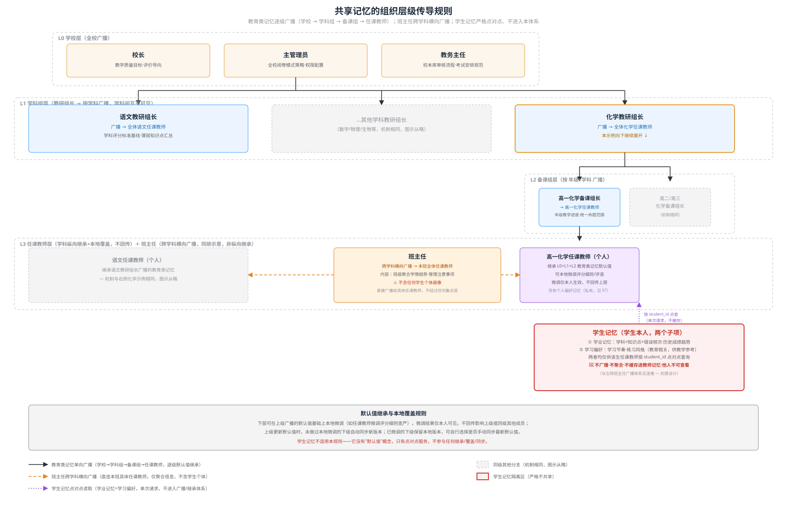
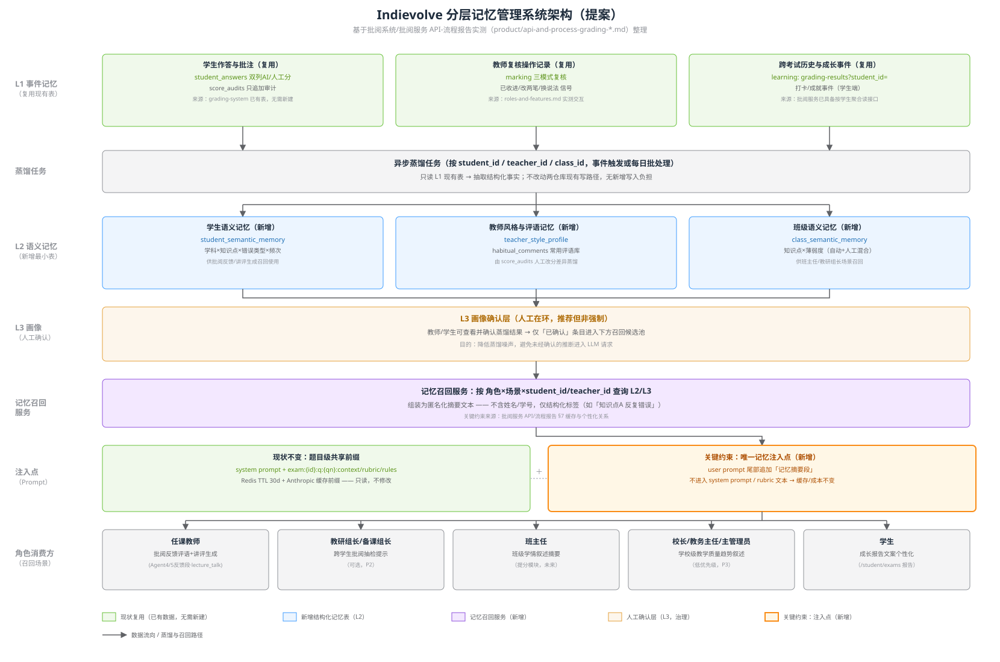

# 分层记忆管理系统提案（跨批阅系统 / 批阅服务）

本提案回答两个具体问题：**①每个角色各自应该拥有哪些记忆点，怎么分组？②哪些记忆可以在组织内共享/传导，传导规则是什么，学生记忆为什么必须严格隔离在外？**

角色体系与权限边界完全对齐 [角色功能清单](./roles-and-features.md) 的实测结果（任课教师 / 教研组长 / 备课组长 / 班主任 / 校长 / 主管理员 / 教务主任 / 学生）。技术约束依据 [批阅系统 API 与业务流程](./api-and-process-grading-system.md) §5、[批阅服务 API 与业务流程](./api-and-process-grading-service.md) §6-7。

## 1. 现状结论（决定了本提案为什么这样设计）

1. **两个系统目前都没有任何用户画像/记忆机制**。批阅系统唯一的"偏好"表 `user_nav_prefs` 只管 UI 导航排序；批阅服务五个 Agent 的 prompt 构造函数无一携带学生历史成绩/历史错题/学习特征。
2. **但个人历史数据其实已经很厚**，只是没人复用：`student_answers`（逐题双列留痕）、`score_audits`（只追加审计）、`marking` 复核交互信号、`GET /api/v1/learning/grading-results?student_id=`（跨考试按学生聚合）、学生端打卡/成就事件。
3. **关键技术约束**（[批阅服务报告](./api-and-process-grading-service.md) §7）：题目级预计算缓存 `exam:{exam_id}:q:{qn}:{context|rubric|rules}`（Redis TTL 30 天）与 Anthropic 缓存前缀是现有成本结构核心，个性化内容拼进 system prompt/rubric 文本会破坏缓存命中率；**必须走 user prompt 尾部追加段**。
4. **组织架构已经天然分层**（[角色功能清单](./roles-and-features.md) 实测）：校长/主管理员/教务主任（校级）→ 教研组长（学科级）→ 备课组长（年级×学科级）→ 任课教师（个人）；另有班主任的跨学科横向广播通道。这个既有科层结构，直接决定了教育类记忆的传导路径。

## 2. 记忆分类模型（每个角色至少两组）

所有角色的记忆统一分成以下几类，**分类本身就是共享边界**：

| 分类 | 定义 | 是否可共享 | 典型内容 |
|---|---|---|---|
| **教育类记忆**（Education） | 客观的教学内容与规范：课标、知识点结构、评分标准基线、教学进度、考试范围 | ✅ 可共享，可在教师之间按组织层级广播，**也可以下发给学生**（如学习目标、薄弱知识点提示） | 学科评分标准、知识点薄弱度汇总、教学进度安排 |
| **个人偏好类记忆**（Personal Preference） | 主观的、个体专属的工作习惯/风格，与教学内容无关 | ❌ 不共享，仅本人可见，不广播、不继承、不被查询 | 评语措辞习惯、UI 排序偏好、常用模板 |
| **学生个人学业记忆**（Student Profile，仅学生角色适用） | 某个具体学生的错题、成绩趋势、学习行为等个体数据 | 🚫 **绝不共享**——不广播给任何人、不聚合进教师记忆、不被其他学生查看；只能由该生本人或正在批阅该生答卷/生成该生报告的老师**按 student_id 点对点查询**，单次请求，不缓存进任何人的长期记忆 | 学科×知识点×错误类型×频次、历史成绩趋势、打卡/成就 |

**这三类的关系**：教育类记忆是"客观知识"，个人偏好类是"主观习惯"，学生个人学业记忆是"需要强隐私保护的个体数据"。前两类的边界是"是否涉及个人主观风格"，第三类单独拎出来是因为它涉及未成年人个体数据，保护要求高于普通的"个人偏好不共享"，必须做到点对点、不缓存、不聚合。

## 3. 共享记忆的组织层级传导规则

传导范围仅适用于**教育类记忆**（个人偏好类从不传导；学生个人学业记忆从不进入此体系）：

- **L0 学校层**（校长 / 主管理员 / 教务主任）→ 广播给**全校任课教师**。例：校长设定的教学质量目标与评价导向、主管理员配置的全校阅卷模式策略、教务主任制定的校本库审核流程规范。
- **L1 学科组层**（教研组长）→ 广播给**本学科全体任课教师**，学科之间互不可见。例：化学教研组长确立的学科评分标准基线，只影响化学老师，不影响语文老师。
- **L2 备课组层**（备课组长，通常按"年级×学科"划分）→ 广播给**本年级本学科任课教师**。例：高一化学备课组长制定的教学进度和统一命题范围，只影响高一化学老师。
- **L3 任课教师层**（个人）→ **继承**上面三级的教育类记忆默认值，可以**本地微调**（如个人评分宽严尺度），但微调**只对本人生效，不回传影响上级或同级其他教师**。
- **班级横向广播**（班主任）→ 与上面的纵向学科层级正交：班主任把**班级聚合学情**（不含学生个体）广播给**本班全体任课教师**（跨学科）。例如某班主任发现全班对某类题目普遍薄弱，这条聚合信息可以同时触达该班的语文、数学、化学任课教师，但绝不包含具体是哪个学生薄弱。
- **学生个人学业记忆** → 不在上述任何广播/继承体系内。它是纯点对点的：该生的任课教师批阅该生答卷时按 `student_id` 精确查询，查完即用，不缓存进教师的长期记忆、不会因为"老师是化学教研组长"就被聚合广播出去。

**默认值继承与本地覆盖规则**：
- 下层可以在上级广播的默认值基础上本地微调，微调结果不回传、不影响其他人。
- 上级更新默认值时，未做过本地微调的下级自动同步新版本；已微调的下级保留本地版本，可自行选择是否手动同步。
- 该规则只适用于教育类记忆的层级传导，个人偏好类和学生个人学业记忆都不适用（它们根本没有"默认值"概念）。

## 4. 各角色记忆点清单

### 任课教师（普通，如王老师/陈敏）

| 分类 | 记忆点 | 来源/更新方 |
|---|---|---|
| 教育类（继承） | 学科评分标准基线 | 学科教研组长广播 |
| 教育类（继承） | 学科薄弱知识点汇总 | 学科教研组长广播 |
| 教育类（继承） | 年级教学进度、统一命题范围 | 备课组长广播 |
| 教育类（继承） | 全校阅卷模式策略（是否被锁定） | 校级（主管理员）广播 |
| 教育类（本人产出） | 该学科该班聚合薄弱点（供自己批阅参考，也可上传汇总给教研组长） | 本人批阅数据蒸馏 |
| 个人偏好类（私有） | 常用评语措辞/风格 | 由 `score_audits` 人工改分蒸馏，仅本人可见 |
| 个人偏好类（私有） | 个人评分宽严尺度微调 | 本人在继承的评分标准基线上本地调整 |
| 个人偏好类（私有） | 备课/批阅工作流偏好（常用模板、AI 讲评是否一键采纳） | 使用行为蒸馏 |

### 教研组长（如王建国）

| 分类 | 记忆点 | 来源/更新方 |
|---|---|---|
| 教育类（继承） | 校级教学质量目标 | 校长/教务主任广播 |
| 教育类（发起广播） | 学科评分标准基线（初审校本库时确立） | 本人校本库初审动作蒸馏，向下广播给本学科全体教师 |
| 教育类（发起广播） | 学科薄弱知识点汇总（跨班级/跨年级聚合） | 本学科批阅数据聚合，向下广播 |
| 个人偏好类（私有） | 个人评语风格（本人也是任课教师身份） | 同任课教师 |
| 个人偏好类（私有） | 校本库审核工作习惯（优先级排序方式） | 使用行为蒸馏 |

### 备课组长（如李秀兰，年级×学科）

| 分类 | 记忆点 | 来源/更新方 |
|---|---|---|
| 教育类（继承） | 学科评分标准基线 | 教研组长广播 |
| 教育类（发起广播） | 本年级教学进度安排 | 本人制定，向下广播给本年级本学科教师 |
| 教育类（发起广播） | 统一命题范围与题型规范 | 本人制定 |
| 教育类（发起广播） | 本年级本学科学情共识（普遍薄弱点） | 本年级批阅数据聚合 |
| 个人偏好类（私有） | 个人评语风格 | 同任课教师 |

### 班主任（如张伟，兼学科教师）

| 分类 | 记忆点 | 来源/更新方 |
|---|---|---|
| 教育类（横向广播） | 班级整体学情趋势（聚合，不含学生个体） | 本班多学科批阅数据聚合，广播给本班全体任课教师 |
| 教育类（横向广播） | 班级管理注意事项（纪律、集体活动安排） | 本人录入 |
| 个人偏好类（私有） | 班级管理个人风格、常用家校沟通模板 | 使用行为蒸馏 |
| （另有）教育类/个人偏好类 | 若同时是某学科任课教师，该身份下的记忆点独立记录，与班主任身份不混同 | 见"任课教师"行 |

### 校长

| 分类 | 记忆点 | 来源/更新方 |
|---|---|---|
| 教育类（发起广播，L0） | 全校教学质量目标与评价导向 | 本人设定，广播给全校教师（经学科组/备课组逐级传导） |
| 教育类（发起广播，L0） | 校级重点关注事项（如毕业班冲刺目标） | 本人设定 |
| 个人偏好类（私有） | 报表查看偏好、关注指标偏好 | 使用行为蒸馏（如常看哪几个教学质量指标） |

### 主管理员

| 分类 | 记忆点 | 来源/更新方 |
|---|---|---|
| 教育类（发起广播，L0） | 全校阅卷模式策略（AI 辅助 vs 人工，是否全校锁定） | 本人配置，广播给全校教师 |
| 教育类（发起广播，L0） | 全校权限与角色配置策略 | 本人配置 |
| 个人偏好类（私有） | 运营操作习惯 | 使用行为蒸馏 |

### 教务主任

| 分类 | 记忆点 | 来源/更新方 |
|---|---|---|
| 教育类（发起广播，L0） | 校本库审核流程规范（几级审核、终审标准） | 本人配置，广播给全校教师 |
| 教育类（发起广播，L0） | 考试安排规范、教务日程规则 | 本人制定 |
| 个人偏好类（私有） | 日常审核工作习惯 | 使用行为蒸馏 |

### 学生

学生角色的记忆**必须**区分"可与教师共享的教育类内容"和"绝不共享的个人学业记忆"：

| 分类 | 记忆点 | 共享范围 |
|---|---|---|
| 教育类（可与教师共享，来自 L0-L2 下发） | 课程大纲/学习目标 | 与本班/本学科教师看到同一份内容，非个体化 |
| 教育类（可与教师共享） | 本单元知识点结构（客观教学内容） | 同上 |
| **学生个人学业记忆**（🚫 绝不共享，仅点对点） | 学科×知识点×错误类型×频次 | 仅该生本人 + 正在批阅该生答卷的任课教师，单次查询 |
| **学生个人学业记忆**（🚫 绝不共享） | 历史成绩趋势、历史错题 | 同上 |
| **学生个人学业记忆**（🚫 绝不共享） | 学习行为记录（打卡/成就） | 仅该生本人 |
| 个人偏好类（私有） | 学习节奏/练习风格偏好 | 仅该生本人，不共享给任何教师或其他学生 |

## 5. 分层架构与技术实现

### L1 事件记忆（复用现有表，零新增写入）

| 数据源 | 表/接口 | 归属仓库 |
|---|---|---|
| 学生逐题作答与得分 | `student_answers`（AI 分/人工分双列，`modules/marking/models.py`） | grading-system ⚠️（此前误标为 grading-service，见[数据资产盘点](./data-assets-grading-system.md)勘误） |
| 人工改分审计 | `score_audits`（只追加，`modules/marking/models.py`） | grading-system ⚠️（同上） |
| 教师复核操作信号 | `marking` 三模式复核交互 | grading-system |
| 跨考试历史作答 | `GET /api/v1/learning/grading-results?student_id=` | grading-service |
| 学生成长事件 | 打卡/成就（学生端） | grading-system |

### 蒸馏任务（新增，异步、只读）

按 `student_id` / `teacher_id` / `subject_group_id` / `prep_group_id` / `class_id` 触发，只读 L1 表，抽取结构化事实写入 L2；不改动两仓库任何现有写路径。

### L2 语义记忆（新增最小表）

| 表 | 内容 | 对应角色 |
|---|---|---|
| `student_academic_memory` | 学科×知识点×错误类型×频次（学生个人学业记忆，强隔离） | 学生（点对点访问） |
| `teacher_style_profile` | 常用评语库、评分尺度微调（个人偏好类，私有） | 任课教师及各层级管理者的个人身份 |
| `subject_group_memory` | 学科评分标准基线、学科薄弱点汇总（教育类，L1 广播源） | 教研组长发起，全学科教师继承 |
| `prep_group_memory` | 年级×学科教学进度、命题范围（教育类，L2 广播源） | 备课组长发起，本年级本学科教师继承 |
| `class_aggregate_memory` | 班级聚合学情趋势（教育类，横向广播，不含学生个体） | 班主任发起，本班全体任课教师接收 |
| `school_policy_memory` | 全校教学质量目标、阅卷策略、审核规范（教育类，L0 广播源） | 校长/主管理员/教务主任发起，全校继承 |

### L3 画像确认层（人工在环，推荐但非强制）

教师可以查看并确认蒸馏出的教育类记忆默认值（如"是否采纳教研组长这次更新的评分标准基线"），只有确认过的条目才纳入个人生效版本——这一层保护"默认值自动同步"不会在教师毫无感知的情况下静默改变其批阅行为。**学生个人学业记忆不设人工确认层**，因为它不是"默认值"，是客观留痕数据的蒸馏，直接供点对点查询。

### 记忆召回服务（新增）

按"角色 × 场景 × 层级路径"查询：
- 教育类记忆：从任课教师自身出发，沿 L3→L2→L1→L0 向上查找最近生效的默认值（本地覆盖优先，否则用上级广播值）。
- 学生个人学业记忆：仅接受"student_id + 发起方为该生任课教师或该生本人"的点对点查询，组装为**不含姓名学号**的结构化标签摘要。
- 个人偏好类：仅接受"本人身份"的查询，不对外暴露。

### 注入点（唯一新增改造点）

沿用 [批阅服务报告](./api-and-process-grading-service.md) §7 的结论：system prompt + 题目级缓存三件套保持不动；记忆摘要段固定拼在 **user prompt 尾部**，不区分教育类/学生个人学业记忆/个人偏好类——三者只是"能不能召回、能被谁召回"的权限差异，注入方式统一。

## 6. 可复用数据盘点

**现成可用（零改造，直接查询即可）**
- 批阅服务 `learning.py` 按学生聚合读接口——现成的学生个人学业记忆数据源。
- `score_audits` 只追加表——天然的"AI 判分 vs 人工判分"差异日志，可直接蒸馏出教师个人偏好类的评分尺度微调。

**需要蒸馏（数据已存在，缺一层结构化抽取）**
- `student_answers` 逐题双列留痕 → 按学科/知识点聚合成错误类型频次（`student_academic_memory`）。
- `marking` 复核交互信号（已收进/改两笔/换说法）→ 归类为"AI 判分准确度"标签，同时供教师个人偏好类画像和学科教育类薄弱点汇总复用。

**需要新建（当前完全不存在，需新增最小表）**
- 6 张 L2 表（见 §5）+ 记忆召回服务（无状态查询层，不持久化）。
- ⚠️ [数据资产盘点](./data-assets-grading-system.md)发现：`knowledge_mastery`/`error_attributions`/`student_tasks` 三张学情个性化表在 grading-system 里**已有 schema 且被 student/manage 端读取，但没有任何写入方**（仅测试与 `dev_seed.py` 写过）。这意味着这三张表目前是"看得见摸不着"的空表，不能算作"现成可用"，其写入链路（可能指向外部学情分析系统，归属待核实）应作为 P0 阶段一并排查的前置项，否则本提案 §5 的蒸馏任务会面临无源数据可蒸馏的风险。

## 7. 分期建议

- **P0**：只接入"现成可用"数据（学情聚合读接口 + score_audits），验证 user prompt 尾部追加路径在任课教师批阅反馈场景跑通，且不影响缓存命中率。学生个人学业记忆的点对点查询在此阶段即可上线（风险最低、边界最清晰）。
- **P1**：`teacher_style_profile`（个人偏好类）+ `subject_group_memory`（教育类 L1），覆盖任课教师与教研组长场景。
- **P2**：`prep_group_memory`、`class_aggregate_memory`，接入备课组长/班主任场景；评估是否需要 L3 人工确认层。
- **P3**：`school_policy_memory` 全校广播 + 学生端"教育类记忆下发"（课程大纲/学习目标展示）——当前后端多为本地规则计算，优先级最低。

## 8. 风险与边界

- **不做的事**：不把姓名/学号等 PII 拼进 LLM 请求（沿用两份实测报告确认的现状：全系统仅 2 处历史性例外，本提案不增加第 3 处）。
- **不碰的东西**：system prompt、`exam:{id}:q:{qn}:*` 缓存三件套、Anthropic 缓存前缀——保持只读。
- **层级传导的失控风险**：教育类记忆默认值逐级继承，若上级频繁更新且下级未及时确认，可能出现"教师批阅时用的标准和教研组长以为已生效的标准不一致"——这是 §5 L3 画像确认层要解决的问题，建议 P1 阶段就明确"是否强制同步"的产品决策，不要留空。
- **学生个人学业记忆的隔离是硬约束，不是配置项**：不应设计成"可关闭的隐私开关"，应在代码层面（记忆召回服务）就不提供"批量导出学生个人学业记忆"或"聚合到教师/教研组长视图"的接口能力，从架构上杜绝误用。
- **潜在慢查询**：批阅服务报告已指出 `idx_task_exam_student`/`idx_paper_exam_student` 索引以 `exam_id` 为前导，跨考试按学生查询无前导索引；蒸馏任务量大后需评估是否要为 `learning` 接口单独加索引或走异步批处理规避线上查询压力。

相关：[批阅系统 API 与业务流程](./api-and-process-grading-system.md) · [批阅服务 API 与业务流程](./api-and-process-grading-service.md) · [角色功能清单](./roles-and-features.md) · [数据架构](./data-architecture.md)
