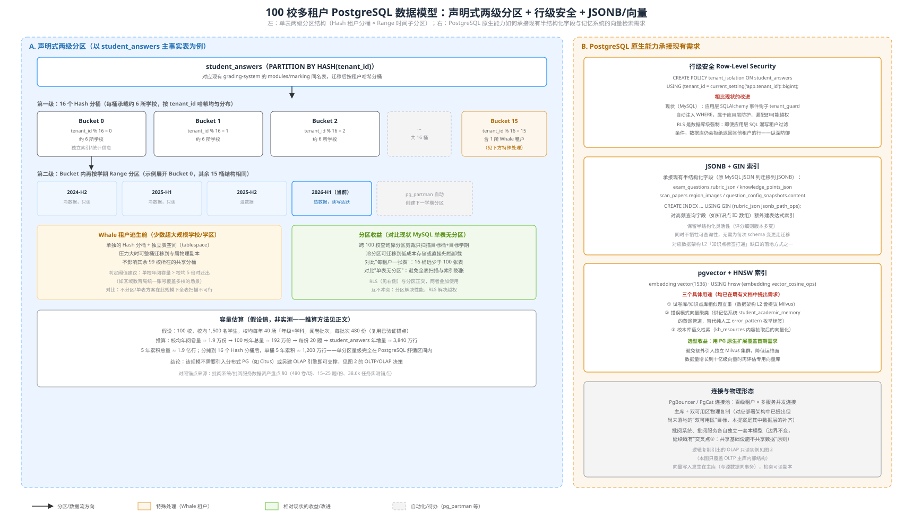
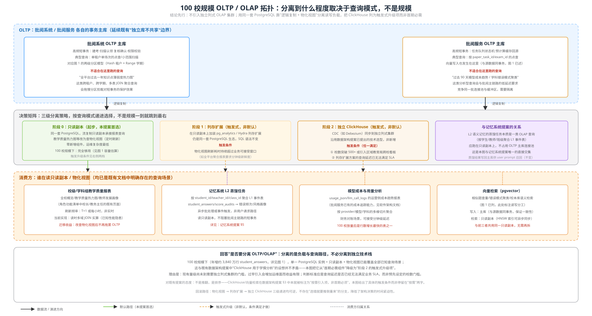

# 100 校规模多租户数据架构提案（PostgreSQL 优先）

本文回答一个假设性但具体的问题：**如果 Indievolve 从当前的单表/单库形态扩展到服务 100 所学校，数据架构应该长什么样，各类数据怎么按租户存放**。前提是采纳 PostgreSQL（而非继续沿用现有 MySQL），理由是其原生支持 JSONB、`pgvector` 与经典关系型场景三合一，能减少中间件种类。本文不是要立刻推翻[数据资产盘点](./data-assets-grading-system.md)确认的现有 MySQL 事实，而是回答"下一步往哪个方向演进"。

## 0. 前提与假设声明（先讲清楚，避免误当作实测结论）

以下容量估算全部基于**已在[批阅系统数据资产盘点](./data-assets-grading-system.md)、[批阅服务数据资产盘点](./data-assets-grading-service.md)中验证过的锚点**做外推，不是新的实测数据：

- 单场考试约 480 卷（8 班×60 人），单份 15–25 题（复用 TESTPLAN P2 基线与 `student_answers` 行数锚点）。
- 假设：100 校，校均在校生 1,500 人，校均每年 40 场"年级×学科"级阅卷批次（比 TESTPLAN 单日峰值场景更保守，按全年教学节奏估算）。
- 推算链路：校均年阅卷量 ≈ 480 卷/场 × 40 场 ≈ 1.9 万份 → 100 校年总量 ≈ 192 万份 → 每份 20 题 → `student_answers` 年增量 ≈ 3,840 万行 → 5 年累积 ≈ 1.9 亿行。
- **这是量级下限的粗估，不是压测数字**，实际取决于学校规模分布是否均匀（真实场景大概率是长尾分布，见下文"Whale 租户"处理）。



## 1. 租户隔离模型：Hash 分区 + 行级安全，双重防线

### 1.1 为什么不是"每租户一个 schema"或"每租户一张表"

100 校规模下常见的三种隔离方案对比：

| 方案 | 100 校下的问题 |
|---|---|
| 每租户一个数据库/schema | 100 个 schema 的迁移（migration）需要针对每个 schema 重复执行，运维复杂度线性增长；连接池也要按 schema 数量扩展 |
| 每租户一张表（表名带租户后缀） | 100 张 `student_answers_{tenant}` 表，跨租户查询（如平台运营看板）需要 UNION 100 张表，SQL 难以维护 |
| **单表 + 声明式分区 + RLS（本提案）** | 用 16 个 Hash 分桶而非 100 张表/schema，运维对象数量可控；跨租户查询是原生 SQL，不需要动态拼接 |

### 1.2 两级分区结构

以 `student_answers`（现有 grading-system 中沉淀最厚的个体数据表，见[记忆系统提案](./memory-system-proposal.md)）为例：

- **第一级：`PARTITION BY HASH(tenant_id)`，16 个分桶**。16 这个数字不是精确计算出来的最优值，而是"远小于 100 张表、又能把单桶数据量压到舒适区间"的经验取值——按 §0 的估算，16 桶承载 5 年 1.9 亿行，单桶约 1,200 万行，完全在 PostgreSQL 单分区的正常处理能力内。
- **第二级：桶内再按学期 `RANGE` 分区**。当前学期是"热分区"（读写活跃），历史学期是"冷分区"（只读，可迁移到低成本存储或直接归档卸载）。用 `pg_partman` 扩展自动创建下一学期分区，避免人工运维分区表的日常负担。

### 1.3 Whale 租户逃生舱

100 校的规模分布现实中大概率不均匀——如果某个租户实际是"区域教育局统一账号覆盖多所学校"，它的数据量可能是普通租户的数倍甚至数十倍，落进普通 Hash 分桶会造成该桶数据倾斜，拖累同桶内其他 5-6 所普通学校的查询性能。

处理方式：为这类 Whale 租户单独分配一个 Hash 分桶 + 独立表空间（tablespace），必要时可将该分桶整体迁移到独立的物理副本，不影响其余 99 校所在的共享分桶。判定阈值建议：单校年阅卷量超过校均 5 倍时触发迁出评估。

### 1.4 行级安全（RLS）：数据库级的第二道防线

现状（[批阅系统软件架构](./architecture-grading-system.md)已确认）：租户隔离靠 SQLAlchemy 的 `tenant_guard` 事件钩子在应用层自动注入 `WHERE tenant_id = ...`，这是应用层防护，一旦某处代码路径漏写租户过滤条件，理论上存在越权读取其他租户数据的风险。

PostgreSQL 的 RLS 提供的是数据库级强制：

```sql
CREATE POLICY tenant_isolation ON student_answers
  USING (tenant_id = current_setting('app.tenant_id')::bigint);
```

即便应用层某个查询忘记加租户过滤条件，数据库本身也会拒绝返回其他租户的行。这不是替代现有的应用层校验，而是叠加一层纵深防御——两者正交，互不冲突，分区解决的是性能问题，RLS 解决的是越权问题。

## 2. JSONB 与 pgvector：承接现有半结构化需求，而非新增需求

### 2.1 JSONB 替代 MySQL JSON 列

现有系统里已经大量使用 JSON 列存半结构化数据（`exam_questions.rubric_json`、`knowledge_points_json`，`scan_papers.region_images`，`question_config_snapshots.content` 等，详见两份数据资产盘点）。迁移到 PostgreSQL 后改用 JSONB + GIN 索引：

```sql
CREATE INDEX idx_rubric_gin ON exam_questions USING GIN (rubric_json jsonb_path_ops);
```

这保留了评分细则频繁变更、不同学科字段结构不一致的灵活性，同时不牺牲可查询性——对高频查询字段（如知识点 ID 数组）可以额外建表达式索引，不需要为每次 schema 变更走一次迁移脚本。这也是[数据架构提案](./data-architecture.md) L2 "知识点标签打通"缺口的一种具体落地方式：给 `kb_resources` 加一个 JSONB 的知识点关联字段，比新建一张关联表更灵活。

### 2.2 pgvector：用一个扩展覆盖三个已提出但未实现的需求

`pgvector` + HNSW 索引可以直接覆盖此前文档中提出、但一直没有具体技术选型落地的三个需求：

1. **试卷库/知识点库相似题查重**——[数据架构提案](./data-architecture.md) §3 曾提议引入 Milvus/pgvector 二选一，本提案明确选 pgvector，理由见下。
2. **错误模式向量聚类**——供[记忆系统提案](./memory-system-proposal.md)的 `student_academic_memory` 蒸馏管道使用，作为现有纯人工标注的 `error_pattern` 枚举（[批阅服务数据资产盘点](./data-assets-grading-service.md)确认的现状）的自动化补充，而非替代。
3. **校本库语义检索**——`kb_resources` 内容抽取后的向量化检索。

选型收益：三个需求共用同一个 PostgreSQL 扩展，不需要额外运维一个独立的 Milvus 集群。代价是查询性能在十亿级向量规模下不如专用向量数据库，但 100 校规模下向量数据量距离这个门槛还很远，属于"先用现有能力覆盖，等真正遇到瓶颈再评估专用方案"的务实选择。

### 2.3 连接与物理形态

- 用 PgBouncer/PgCat 做连接池，应对百级租户 × 多服务的并发连接数增长。
- 主库 + 双可用区物理复制，衔接[部署架构](./deployment.md)中已提出但尚未落地的"双可用区"目标——本提案是这个目标在数据层的具体补齐方案。
- 批阅系统、批阅服务各自独立一套本模型，边界不变，延续[全局软件架构总览](./overall-architecture.md)"交叉点②：共享基础设施不共享数据"的原则，不因为换了数据库就打破既有的系统边界。

## 3. OLTP / OLAP 是否要分离：分离负载，不必分离技术栈



### 3.1 结论先行

**不引入独立的列式 OLAP 集群作为首期方案**。用同一套 PostgreSQL，靠"流复制只读副本 + 定时刷新的物化视图"分离读写负载，把 ClickHouse（[数据架构提案](./data-architecture.md) §3 已提出的选型）列为触发式升级项，而不是与主库同批上线的必需组件。

这不是推翻已有提案，是重新排序——原提案在 §3 就已经把 ClickHouse 标注为"按需引入项，非首期必须"，本文把"按需"两个字具体化为可判断的触发条件（见下）。

### 3.2 为什么现在不需要独立 OLAP 集群

按 §0 的容量估算，100 校规模年增约 3,840 万行 `student_answers`，5 年累积约 1.9 亿行，分摊到 16 个分区后单分区约 1,200 万行——这个量级下，PostgreSQL 加一个只读副本，配合物化视图承接"全校教学质量热力图"这类周期性刷新的报表查询，性能是够用的。过早引入 ClickHouse 等独立列式集群，增加的运维复杂度（数据同步链路、双技术栈的团队能力要求）超过了当前规模下的实际收益。

### 3.3 三级递进的分离策略

| 阶段 | 做法 | 触发条件 |
|---|---|---|
| **阶段 0（本提案首选）** | 同一套 PostgreSQL，流复制只读副本承接报表查询；现有"读时多域 JOIN 实算"的教学质量热力图等（[批阅系统数据资产盘点](./data-assets-grading-system.md)已确认的性能隐患）改为定时刷新物化视图 | 100 校规模下默认起步方案，无需等待触发条件 |
| **阶段 1：列存扩展** | 在只读副本上加装 `pg_analytics`/Hydra 等列存扩展，仍是同一套 PostgreSQL 生态，SQL 语法不变 | 物化视图刷新耗时持续超过业务可接受窗口（如要求全平台聚合报表分钟级新鲜度） |
| **阶段 2：独立 ClickHouse** | CDC（如 Debezium）同步到独立列式集群，沿用[数据架构提案](./data-architecture.md)已提出的技术选型 | 校数突破 500+ 或引入跨校区域看板；或阶段 1 的列存扩展方案查询延迟已无法满足 SLA |

三级递进均可逆——物化视图、列存扩展、独立 ClickHouse 之间不存在"选错就要推倒重来"的分支，降低了架构决策的时间紧迫性，可以先上线阶段 0，观察真实查询模式再决定是否升级。

### 3.4 具体消费方（谁在读只读副本）

- **校级/学科组教学质量报表**：全校概览、教学质量热力图、教师发展画像——现有实现是读时多域 JOIN 实算，迁移到物化视图后不再拖累 OLTP 主库。
- **记忆系统 L2 蒸馏任务**：按 `student_id`/`teacher_id`/`class_id` 聚合 `student_answers`/`score_audits` 等 L1 事件表的过程，本质就是一类 OLAP 查询（详见[记忆系统提案](./memory-system-proposal.md) §5），应该跑在只读副本上，不占用 OLTP 主库的连接池，不阻塞批阅主链路的短事务。这是本文与记忆系统提案唯一的直接技术交集。
- **模型成本与用量分析**：`usage_json`/`llm_call_logs` 的运营侧成本趋势报表，按 provider/模型/学科多维切片，可接受分钟级延迟，是 100 校放量后行数增长最快的表之一。
- **向量检索**：与前三者共用同一只读副本即可，无需再单独拆分——写入发生在主库（与源数据同事务保证一致性），检索走只读副本（HNSW 索引异步同步）。

## 4. 与已有文档的关系

本提案是对既有架构设想的**排序细化**，而非推翻：

- [数据架构提案](./data-architecture.md) §3 的存储选型（对象存储、关系数据库、ClickHouse、向量检索）在本文中被具体化为 PostgreSQL 单一技术栈 + 触发式升级路径，不是引入新方案。
- [记忆系统提案](./memory-system-proposal.md)描述的 L1/L2 分层记忆结构，可以直接映射到本文的分区模型（L1 事件记忆是分区主表，L2 语义记忆的蒸馏是一类 OLAP 查询）。
- [全局软件架构总览](./overall-architecture.md)"交叉点②：共享基础设施不共享数据"的原则在本文中延续，两个团队自研系统各自独立一套本文描述的模型。

## 5. 尚待讨论的问题

1. 现有 MySQL → PostgreSQL 的迁移路径与停机窗口，本文未覆盖，需要单独评估（涉及 SQLAlchemy 方言切换、现有 JSON 列到 JSONB 的数据转换脚本）。
2. Whale 租户判定阈值（校均 5 倍）是经验值，需要结合真实的 100 校规模分布数据校准。
3. 物化视图的刷新频率与业务可接受的数据新鲜度窗口，需要产品侧明确各类报表的时效性要求，才能定出阶段 0 到阶段 1 的具体触发数值。

相关：[数据架构提案](./data-architecture.md) · [记忆系统提案](./memory-system-proposal.md) · [全局软件架构总览](./overall-architecture.md) · [批阅系统数据资产盘点](./data-assets-grading-system.md) · [批阅服务数据资产盘点](./data-assets-grading-service.md)
