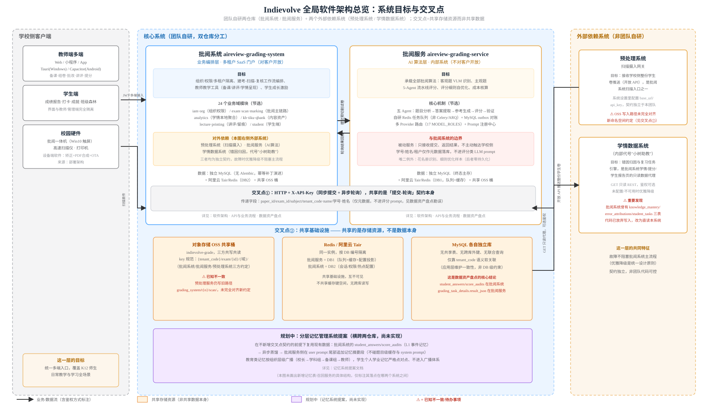

# Indievolve 全局软件架构总览：系统目标与交叉点

本文回答一个综合性问题：**Indievolve 由哪几个系统组成、每个系统的目标是什么、它们在哪些具体点上产生交叉（共享了什么、没共享什么）**。这是对已有的分仓库调研（[批阅系统软件架构](./architecture-grading-system.md)、[批阅服务软件架构](./architecture-grading-service.md)、[批阅系统 API 与业务流程](./api-and-process-grading-system.md)、[批阅服务 API 与业务流程](./api-and-process-grading-service.md)、[批阅系统数据资产盘点](./data-assets-grading-system.md)、[批阅服务数据资产盘点](./data-assets-grading-service.md)）的一次跨仓库综合，不重复其中的实现细节，只聚焦"全局怎么拼起来"。

## 1. 四个系统，一个产品

Indievolve 的 AI 批阅产品由 **2 个团队自研仓库 + 2 个外部依赖系统**组成，没有第五个系统：

| 系统 | 归属 | 对客户可见性 | 一句话目标 |
|---|---|---|---|
| **批阅系统**（aireview-grading-system） | 团队自研 | 对客户开放（SaaS 门户） | 业务编排层：组织与权限、多租户隔离、建考-扫描-复核工作流、教师教学工具、学生成长激励 |
| **批阅服务**（aireview-grading-service） | 团队自研 | 内部系统，不对客户开放 | AI 算法层：客观题识别、主观题 5-Agent 评分、评分细则自优化、成本核算 |
| **预处理系统** | 外部依赖 | 不可见（后台服务） | 扫描摄入网关：接收学校侧整份学生卷推送，是批阅系统的扫描入口之一 |
| **学情数据系统**（内部代号"小树助教"） | 外部依赖 | 不可见（后台服务） | 错因归因与复习任务引擎：批阅系统学情/提分/学生报告页的只读数据代理 |

这个"2+2"结构不是巧合，而是一条清晰的职责边界线：**团队自研的两个系统各自只做一件事**（业务编排 vs AI 算法），**外部依赖的两个系统各自也只做一件事**（扫描摄入 vs 错因分析），四者之间没有职责重叠。

## 2. 每个系统的目标详解

### 2.1 批阅系统——业务编排层

批阅系统是学校/教师/学生实际登录使用的产品本体，[角色功能清单](./roles-and-features.md)里描述的 7 个教师端模块（备课/考试/批改/讲评/提分/校本库/教务）、5 个管理端模块（全校概览/校本库/教学质量/阅卷管理/教师发展）、学生端成长报告，全部由它承载。它自己**不含任何 AI 批阅算法**——[批阅系统软件架构](./architecture-grading-system.md)已经确认这一点：24 个业务域模块里没有一个负责实际评分，AI 能力全部通过交叉点①转发给批阅服务。

它的核心价值在于"编排"：把一次考试从"建考"到"学生看到成绩报告"之间的十几个步骤（题目提取、扫描认领、去重、批阅提交、三模式复核、留痕打印、学情呈现）串成一条可靠的工作流，并叠加多租户数据隔离、RBAC 权限、审核链路等企业级能力。

### 2.2 批阅服务——AI 算法层

批阅服务是纯粹的算法引擎，[批阅服务软件架构](./architecture-grading-service.md)描述的五个 Agent（题目分析→答案提取→参考生成→评分→验证）、自研 Redis 任务队列、多 Provider 路由（17 个 MODEL_ROLES）、Prompt 注册中心，全部服务于一个目标：**把一张学生答卷转换成一个分数和一段评语**，并把这个过程的成本控制到最低（单卷成本优化案例：$0.47 → $0.25）。

它是**被动服务**：只接收批阅系统的提交请求、返回结果，从不主动联系学校侧或做任何业务决策（是否锁定阅卷模式、谁能看到哪些数据，这些决策权都在批阅系统）。这个"纯算法、不碰业务"的边界划分，是它能够独立于批阅系统迭代升级（换模型、调 Prompt、优化成本）而不影响业务稳定性的关键。

### 2.3 预处理系统——扫描摄入网关

从批阅系统的视角看，预处理系统是"另一个扫描来源"：学校侧的扫描硬件把整份学生卷推送给预处理系统，由它完成初步处理后再转推给批阅系统（`ScanBatch.source="preprocess"`，与手动上传 `"manual"` 并列，是[批阅系统数据资产盘点](./data-assets-grading-system.md)证实的两种扫描来源之一）。批阅系统对它的依赖是配置化的（系统设置里填 `base_url`/`api_key`），契约独立于团队自身的发布节奏。

### 2.4 学情数据系统——错因归因引擎

学情数据系统是一个纯只读的外部服务，批阅系统的学情/提分/学生报告页面在需要"错因归因"和"复习任务建议"时，通过 GET 请求代理调用它，自己不做这类计算。**这是一个值得记录的架构事实**：批阅系统数据库里其实预留了 `knowledge_mastery`/`error_attributions`/`student_tasks` 三张表用来存这类数据，但[批阅系统数据资产盘点](./data-assets-grading-system.md) §0 与代码注释（`analytics/service.py:414`：「错因归纳/复习任务改由学情系统驱动……此处不再产出 Mock」）证实，团队已经放弃了自己写这三张表，转而完全依赖外部系统的只读接口。这不是遗漏，是一次明确的架构决策迁移。

## 3. 两个交叉点：具体共享了什么

"交叉点"这个词容易被理解成"数据共享"，但 Indievolve 的实际情况恰恰相反——**两个团队自研系统之间没有共享数据库，没有共享表，没有联合查询**。真正的交叉只有两类：

### 交叉点①：批阅系统 ↔ 批阅服务的"提交-轮询"契约

批阅系统把预切割好的试卷图片、题目、租户信息通过 HTTP + `X-API-Key` 提交给批阅服务（`submit-precut-paper`），批阅服务处理完之后，批阅系统再轮询结果接口拿到分数和评语。这里共享的**不是数据本身，是一套接口契约**：字段名、鉴权方式、状态机语义（pending/processing/completed/failed）。

这条契约上传递的字段包含学号、姓名、租户 code/name，但[批阅服务 API 与业务流程](./api-and-process-grading-service.md)与[批阅服务数据资产盘点](./data-assets-grading-service.md)都已实测确认：这些字段在批阅服务侧**只做元数据落库和检索**，不会被拼进任何评分类 LLM prompt——这是理解整个系统隐私边界的关键前提。

### 交叉点②：共享基础设施，而非共享数据

两个团队自研系统各自拥有独立的 MySQL 数据库（无共享表、无跨库外键、无联合查询，仅靠 `tenant_code` 语义软关联，一致性由应用层维护而非数据库约束），但在两类基础设施上是"同一份物理资源，逻辑隔离"：

- **对象存储 OSS**：批阅系统、批阅服务、预处理系统三方共写共读同一个桶（`indievolve-grade`），遵循统一的 key 命名空间约定 `{tenant_code}/exam/{id}/{业务域}/`。⚠️ 已知的一处不一致：预处理系统目前仍在写旧路径 `grading_system/t{n}/scan/`，尚未完全对齐新约定，是一项待办的技术债。
- **Redis / 阿里云 Tair**：同一个实例，按 DB 编号隔离（批阅服务用 DB1 承载队列+缓存+配置投影，批阅系统用 DB2 承载会话/权限/热点配置），互相不可见，不存在跨库读写。

这个"共享基础设施但不共享数据"的模式，解释了为什么[数据资产盘点](./data-architecture.md) §3.5 会发现"两仓库合计 90 张表，但没有一张是共享表"——这不是设计疏漏，而是有意为之的隔离边界，代价是两侧字段命名/语义需要靠文档和约定对齐（例如学号字段在批阅系统叫 `student_no`，在批阅服务的提交载荷里也是同名字段，但物理上是两份独立数据）。

## 4. 规划中的第三种交叉：记忆系统

[分层记忆管理系统提案](./memory-system-proposal.md)描述的能力目前完全没有实现，但值得在全局架构图里标注它未来会落在哪两个系统之间，因为它会成为第三种交叉模式——**既不是接口契约（像交叉点①），也不是共享基础设施（像交叉点②），而是"异步蒸馏 + 单向只读召回"**：

1. 批阅系统侧的 `student_answers`/`score_audits`（个体数据留痕最厚的两张表）作为 L1 事件记忆源，不改动。
2. 一个新增的异步蒸馏任务只读这些表，产出结构化的 L2 语义记忆（学生学科错误频次、教师评语风格、班级薄弱知识点等）。
3. 批阅服务侧在生成评语/评分反馈时，通过新增的记忆召回服务查询这些记忆，**拼在 user prompt 尾部追加**，不碰 system prompt 与题目级缓存三件套——这个约束保证了记忆系统的引入不会破坏交叉点①已有的成本结构。

这意味着记忆系统不会新增"交叉点①类型"的双向接口契约，只会新增"批阅系统→蒸馏→批阅服务"方向的单向数据流，且流向的是脱敏后的结构化摘要而非原始数据。

## 5. 阅读指引

本文是入口级总览，具体机制请分别查阅：

- 各系统内部分层与模块依赖 → [批阅系统软件架构](./architecture-grading-system.md) · [批阅服务软件架构](./architecture-grading-service.md)
- 完整 API 清单与业务流程端到端追踪 → [批阅系统 API 与业务流程](./api-and-process-grading-system.md) · [批阅服务 API 与业务流程](./api-and-process-grading-service.md)
- 全量数据表盘点与可结构化性判断 → [批阅系统数据资产盘点](./data-assets-grading-system.md) · [批阅服务数据资产盘点](./data-assets-grading-service.md)
- 试卷库/知识点库的数据架构提案 → [数据架构](./data-architecture.md)
- 记忆系统详细设计（按角色的记忆点与组织层级传导规则）→ [记忆系统提案](./memory-system-proposal.md)
- 硬件与网络部署形态 → [部署架构](./deployment.md)
- 角色权限实测清单 → [角色功能清单](./roles-and-features.md)

相关：[部署架构](./deployment.md) · [数据架构](./data-architecture.md) · [记忆系统提案](./memory-system-proposal.md) · [批阅系统软件架构](./architecture-grading-system.md) · [批阅服务软件架构](./architecture-grading-service.md)
