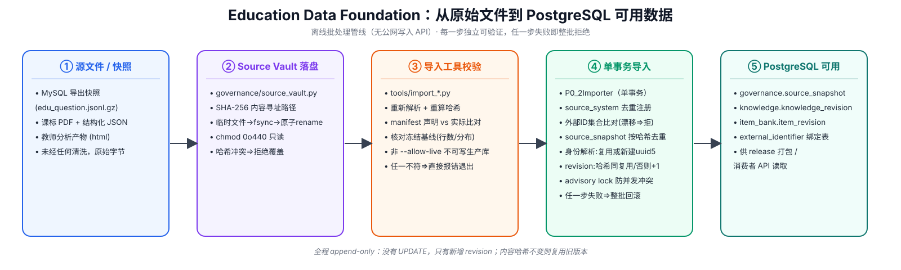
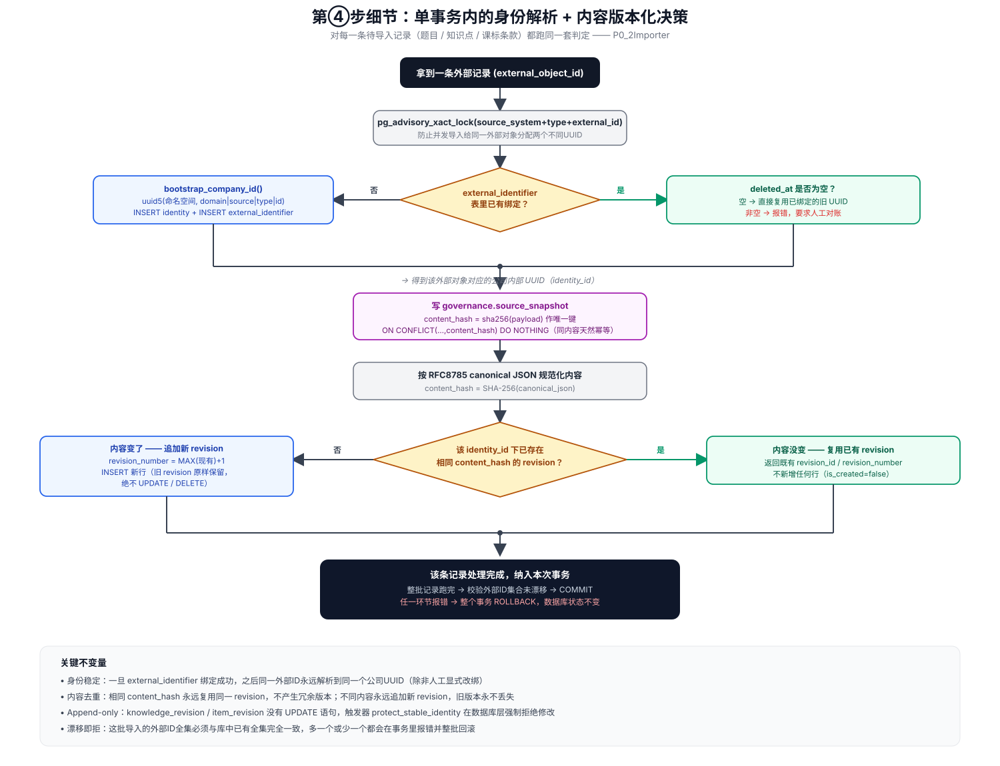

# platform-data-foundation-service 怎么处理新数据/文件（从原始文件到 PostgreSQL 可用数据）

> 本文补充 [adaptive-learning-engine.md](./adaptive-learning-engine.md) §3.3.6 未展开的一个细节：
> `platform-data-foundation-service`（公司数据底座）收到一份新的源系统文件/快照后，具体经过
> 哪几步才会变成 PostgreSQL 里可被消费者读取的数据。结论基于该仓库
> `src/education_data_foundation/governance/`、`integrations/`、`tools/import_*.py` 的代码实测，
> 而非设计文档推断。

## 一句话结论

**新数据永远走离线批处理，没有面向公网的写入 API。** 文件先进只读的内容寻址 vault 存证，再由
`tools/import_*.py` 工具严格重放校验内容契约（哈希、行数、冻结基线数量），再在单个数据库事务内
按外部 ID 做身份解析（已绑定必须复用、新绑定才分配新 UUID、任何漂移都拒绝），内容按哈希去重
（相同就复用旧 revision、不同就追加新 revision，旧版本永不覆盖）。整条链路上，"静默覆盖旧数据"
和"静默接受数量漂移"这两件事在设计上都被堵死——出现异常就整批报错/回滚，要求人工显式对账，
绝不自动吞掉。

## 五阶段总览

1. **源文件 / 快照**：MySQL 导出的题库快照（`.jsonl.gz`）、课标 PDF + 结构化 JSON、教师分析产物
   等，未经任何清洗的原始字节。
2. **Source Vault 落盘**（`governance/source_vault.py`）：按 SHA-256 内容寻址存放
   （`vault_root/sha256/<前2位>/<完整hash>`），临时文件写完 `fsync` 后原子 `rename`，落盘后
   `chmod 0o440` 只读；若目标路径已存在但内容哈希不同，直接拒绝（不允许覆盖）。大文件流走
   `governance/stream_receiver.py` 的 `receive_stream_atomically()`，逻辑同构。
3. **导入工具校验**（`tools/import_*.py`，如 `import_p1_3_legacy_qbank.py`）：重新解析文件、
   重算哈希、行数、质量标记/学科分布，与 manifest 里声明的值逐字比对，也与"冻结基线"（如
   main 626,040 行 / child 759,071 行）核对，任何不符直接报错退出；默认只允许对着带
   `_test`/`_integration` 后缀的库跑，显式传 `--allow-live` 才能碰生产库 `asset_foundation`。
4. **单事务导入**（`P0_2Importer` 及其子类，如 `CurriculumImporter`/`LegacyQbankImporter`）：
   见下一节详细展开——这是整条链路里判定逻辑最密集的一步。
5. **PostgreSQL 可用**：数据落在 `governance.source_snapshot`、`knowledge.knowledge_revision`、
   `item_bank.item_revision`、`*.external_identifier` 等表里，供后续 `release`（打包发布）与
   `consumer_api`（消费者读取）使用。

## 第④步细节：身份解析 + 内容版本化的判定逻辑

对每一条待导入记录（一道题、一个知识点、一条课标条款），`P0_2Importer` 都跑同一套判定：

要点提炼：

- **并发安全**：用 PostgreSQL advisory lock（`pg_advisory_xact_lock`）按
  `source_system + object_type + external_id` 加锁，防止并发导入把同一个外部对象分配成两个
  不同的公司内部 UUID。
- **身份稳定**：查 `external_identifier` 表——已经绑定过公司 UUID 就必须复用旧的（哪怕这次
  导入换了不同的候选 ID 也不采用）；绑定被标记 `deleted_at` 就报错要求人工介入，不允许自动
  复活；完全没绑定过才用 `bootstrap_company_id()`（`uuid5` 确定性分配）建新身份。
- **外部 ID 集合不可静默漂移**：这批要导入的外部 ID 全集，必须与数据库里该来源系统已有的
  全集完全一致（除非是首次导入该来源系统），多一个或少一个都会报错并要求显式对账——新增
  题目/知识点不能"悄悄地"发生。
- **内容去重**：内容按 RFC8785 canonical JSON 规范化后算 SHA-256；同一个身份下如果已经存在
  相同哈希的 revision，直接复用，不新增行；哈希不同才追加 `revision_number = MAX(现有)+1`
  的新版本行——`knowledge_revision`/`item_revision` 这类表**没有 UPDATE 语句**，数据库层面
  的触发器（`protect_stable_identity`）会强制拒绝除 `updated_at`/`deleted_at` 之外的任何字段
  修改，真正做到 append-only。
- **原子性**：一次调用（`import_corpus`/`import_bundle`）从注册来源系统到写完全部 revision
  都在一个数据库事务里；中途任何一步失败都整批 `ROLLBACK`，不会出现"部分知识点导入成功、
  部分题目导入失败"的半成品状态。

## 与本仓库其余内容的关系

本文是 [adaptive-learning-engine.md](./adaptive-learning-engine.md) §3.3.6
（platform-data-foundation-service 概览）的**细节展开**，专注回答"新数据是怎么流入 PostgreSQL
的"这一个具体问题；该服务的资产真源模型、发布治理四道 gate、消费者投影/SDK 等更宏观的设计，
仍以 §3.3.6 原文为准，本文不重复展开。
