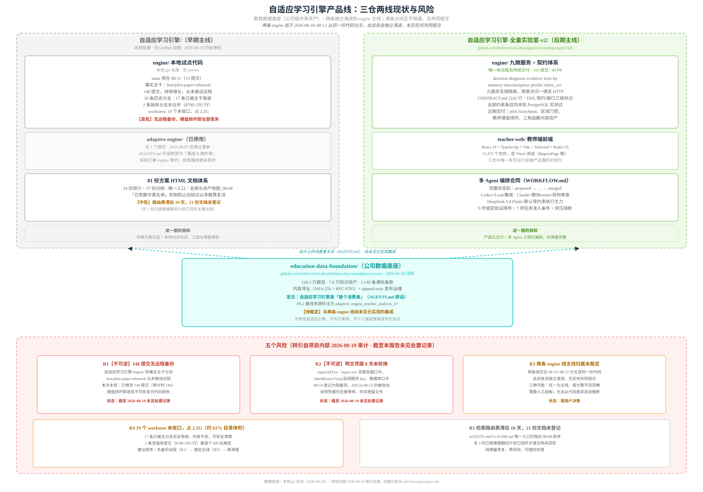

# 自适应学习引擎（Self-Learning Engine）产品线调研报告

本文分析 `~/src/indievolve/self-learning-engine/` 目录，这是 Indievolve 的**第二条产品线**——与
[批阅系统/批阅服务](./overall-architecture.md)（AI 阅卷）完全独立的**自适应学习/自适应推题引擎**，
目标是"高中全学科自适应教学系统"。目录下并存 3 个各自独立的本地代码/文档仓库，代表同一产品目标在不同
时间点、由不同协作模式产出的**三条并行演进线**，而非三个模块化组件——这一点是本报告最重要的发现，
详见 §6。



## 1. 三个子目录一览

| 目录 | git remote | 最后提交 | 定位 |
|---|---|---|---|
| `education-data-foundation/` | `github.com/IndievolveLabs/platform-data-foundation-service` | 2026-08-18（活跃） | 公司级知识点与题库资产底座，服务化 API，唯一"生产级"仓库 |
| `自适应学习引擎/` | 无 remote（本地仓 `engine/` 分支 `feat/pilot-paper-rehearsal`，另有已停用的 `adaptive-engine/`） | 2026-08-19（活跃，但**无远程备份**） | 早期主线：81+ 份方案 HTML + 本地 `engine/` 试点代码 |
| `自适应学习引擎-全量实验室-v2/` | `github.com/IndievolveLabs/adaptive-learning-engine-lab` | 2026-08-17（活跃，163 提交/68 PR） | 后期主线：多 Agent 编排体系 + 独立 `engine/`（含 teacher-web 前端） |

**关键澄清（易混淆点）**：`自适应学习引擎/` 目录内部也有一个名为 `engine/` 的子目录，与
`自适应学习引擎-全量实验室-v2/engine/` **是两套完全独立、无共同提交历史的代码**，只是在
2026-08-10~08-12 之间从同一份早期代码分叉。两者都在演进，都自称"engine"，阅读或分派任务时必须先确认
究竟指哪一个。

## 2. education-data-foundation ——公司数据底座（生产级）

**定位**（AGENTS.md 原话）：建设公司级知识点与题库资产底座；自适应学习引擎是其**首个消费者**，不是
本仓库的宿主。这是三个仓库里唯一明确走向"公司级共享资产"定位、而非单一产品内部模块的一个。

**技术栈**：Python 3.11+ FastAPI + Pydantic v2 + PostgreSQL（psycopg3），单体 API + 轻量 worker，
显式禁止提前拆微服务/Kafka/图数据库/向量数据库。仅监听 `127.0.0.1:8820`，公司 HTTPS 入口经
`foundation-api.indievolve.com`，跨机访问需私网反代或服务网关。

**代码结构**（`src/education_data_foundation/`，11 个子包）：`ai_ops`、`consumer_api`、
`consumer_sdk`、`core`、`governance`、`integrations`（18 文件，最大）、`item_bank`、`knowledge`、
`read_model`（11 文件）、`releases`、`semantics`（12 文件）。数据库 8 个 schema：governance /
knowledge / item_bank / semantic / release / ai_ops / read_model，全部落在单一 PostgreSQL 库
`asset_foundation`。26 个批次化迁移（`migrations/001`–`026`，每个 `_up` 强制配对 `_down`）。

**资产真源与治理模型**（`decisions/frozen.yaml` 契约版本 `p1.3-2026-08-14`）：
- AI 输出永远是**不可变 proposal/claim**，模型身份不能直接发布公司资产；`review_decision`/
  `rights_decision` 默认 `absent_pending`，决策只可追加不可覆盖（append-only）。
- 内容寻址：`SHA-256 + RFC 8785` JSON 规范化，禁止负零，`content_hash` 全链路可验证。
- 发布需要显式 gate 证据（`deterministic_validation_passed` / `rights_cleared` / `review_approved`
  / `release_role_granted`），无隐式"最新版本"语义——消费方必须显式传 catalog hash。
- 消费者 SDK（`consumer_sdk/catalogs.py`）支持鉴权、Range 断点续传、ETag/SHA-256 校验、原子安装，
  一次调用完成产品包三个 catalog（题库+知识库、质量标签、课标对齐）的哈希/数量/血缘联合验证。

**当前资产规模**（README.html 实测数字，产品包哈希 `b9af4106...`）：
- 题目 **1,282,727** 道、知识资产 **76,070** 个、课标条款 **1,140** 条；来源映射 522,211 条。
- 精确去重：890,386 个不同指纹、148,545 个重复簇；近似去重经隔离 HTTP 服务持续接入。
- 课标—知识候选对齐：5,411 候选中 5,139 已唯一解析，272 保留 unknown（不伪造归属）。
- DeepSeek V4 Flash（低成本首轮候选）+ V4 Pro（高价值复核）：225 条九科隐藏控制集上两模型均
  99.11% 准确率，双模型共识精度 100%；已形成 1,089 条学科共识候选，模型结论不能写成人工审核结论。
- **明确的 4 个非目标**：不修改自适应引擎/不写引擎库/不介入推题策略或学生状态；不修改任何原始题目
  /知识树/历史课标映射/旧 catalog；近似重复与模型标签保持候选语义，不升格为事实；unknown/unmapped
  /冲突/未唯一解析是正式数据状态，不用模型猜测补齐。

**Agent 编排合同**（AGENTS.md）：默认单个 Codex Lead 串行完成核心开发（契约/迁移/导入/鉴权/API/
安全/集成/验收状态不拆给其他模型）；里程碑结束可加一个非作者 Codex 只读审查；Claude/DeepSeek 仅在
任务强隔离、可机械验收、收益明显时作为可选 candidate worker，禁止接触真实题面/学生数据/生产秘密/
迁移/发布权限；越界 diff、秘密命中、连续两次同类首轮失败或主线回归红灯立即暂停扇出、回退单 Lead。

## 3. 自适应学习引擎（早期主线）——方案沉淀 + 本地试点代码

这是体量最大（1.4G，42,920 个文件）但**治理最薄弱**的一份：81 份顶层方案 HTML（24 份现行 + 37 份
归档 + 若干未登记），加一份本地 `engine/` 试点代码库。

### 3.1 文档体系

`AGENTS.md`/`CLAUDE.md`（内容相同）建立了一套"检索路由表"机制：**唯一入口**是
`自适应引擎_总纲与资产地图_2026-08-08.html`（40 条已裁定口径 + 81 份文档状态 + 18 项未决清单），
按主题分流到现行文档，并列出 6 条"支线"文档（利益相关者、租户与聚合轴、教育设计层、多层决策单位、
收口、并入清单）—— 支线纪律要求支线只改自己的文件，不改主线分层账本，需用户拍板才能并入。

**事实基线管理机制**（值得复用到其他项目的做法）：文档显式维护一份"**已死数字黑名单**"—— 列出曾经
写错、后来被实测纠正、但仍可能在旧文档里被重复引用的数字（如"教材树 75,427 节点"已被纠正为
"74,930（叶 53,959）"），命中黑名单即判错，防止旧数字通过"广泛取证"以多数票复活。2026-08-07 曾
实测发生过一次六处回归、五个域同错的真实事故。

### 3.2 本地 engine/ 试点代码

Git 仓库无 remote，当前 `main` 停在 08-11（13 提交），事实主干在分支 `feat/pilot-paper-rehearsal`
（截至 08-19 已 **148 个提交**，仍在增长，**全程未推送到任何远程**）。历史上有 20 条分支，其中 17
条已被 pilot 分支完全吸收，2 条独有分支（`feat/identity-v2-integrate` 领先 4 提交/8786 行、
`fix/teacher-home-data` 领先 2 提交/295 行）尚未合并。另有历史遗留的 `adaptive-engine/`（1 个提交，
2026-08-07 后已停用，被本 `engine/` 取代，但 AGENTS.md 检索路由表未同步更新，仍误称其为"基线 B 硬
约束、CI 强制"）与 `dedup-service/`（6 提交，2026-08-15，相似度去重服务，低频更新）。

**adaptive-engine/ 的设计**（历史参考价值）：选题决策引擎，"个性化程度"（全班同卷→组内同题→矩阵抽样
→全异题）被建模为 `policy` 表里的一个参数而非系统属性；四层单向依赖 `api → services → repos → core`
配三条 CI 铁律（单向依赖、在线路径禁止 import 进化/仿真代码、仿真数据与真实数据物理隔离禁止共表）和
四条不自暴露的 DDL 硬约束（曝光来源强制标记、propensity 非确定性排序禁止伪造、等级赋分零和不可当
疗效锚、仿真租户锁定）。MVP 实况：立体几何候选池 4,340 道，仍有 26% 考点池深 < 5（`POOL_EMPTY`
弃权是常态出口）；`item_tier`/`student_tier` 全库恒为最低档 `d0`（学情库题号与题库无可连接键、考试
通道结构性给不出 d1 级别归因）。

## 4. 自适应学习引擎/ 顶层方案文档主题分组

顶层现存 **45 份** HTML 方案文档（AGENTS.md 检索路由表统计口径"24 份现行"已滞后，实测数已增至 45），
按内容主题可分为以下 8 组；另有 `archived/` 子目录下 31 份已作废/被取代的历史版本（题目标注
v1–v5、知识点资产 v3/v4、技术架构 v1/v2、开源检索调研等）不计入本次分组。

### 4.1 唯一入口与总纲（3 份）—— 阅读优先级最高
- `自适应引擎_总纲与资产地图_2026-08-08.html` ← **唯一入口**，40 条已裁定口径 + 81 份文档状态 +
  18 项未决清单
- `自适应引擎_分层账本_2026-08-08.html` —— 七层决策账本（哲学/理念/产品/架构/数据/现实/约束）
- `自适应学习引擎_定稿与行动计划_2026-08-08.html`

### 4.2 核心架构与事实基线（5 份）
- `自适应学习引擎_完整系统架构_2026-08-08.html`（124K，六层内核，全局架构现行版）
- `自适应引擎_架构与PRD_主控整合_v2_2026-08-06.html`（**基线 A**：DB 实测事实数字来源）
- `自适应推题架构V1_第0步三方差分与裁定_2026-08-06.html`（**基线 B**：代码上位文档，硬约束）
- `自适应学习引擎_架构方案_v3_2026-08-07.html`
- `自适应推荐题目_完整架构设计_2026-08-08.html`（推题/出题架构，标记"待修订"）

### 4.3 PRD 与流程修复（3 份）
- `自适应引擎_九域PRD_排版稿_2026-08-07.html`（756K，全目录最大文件，草稿·无人消费）
- `PRD第三轮_根因反思与机制修复_2026-08-07.html`
- `记忆架构_设计方案_v1_2026-08-07.html`

### 4.4 知识点/题库资产（7 份）—— 数量最多的主题簇
- `知识点资产_九科课标锚定与分层修正_实测版_v5_2026-08-06.html`
- `知识点资产_事实基线与可复用资产_2026-08-06.html`
- `知识点与题库数据底座_五轮推演与目标架构_2026-08-13.html`（104K，最大非 PRD 文档）
- `知识资产全量盘点与回灌总账_2026-08-14.html`
- `题目标注_资产化框架与推题调用事实_v7_2026-08-06.html`
- `相似度系统_终版方案与全量验证_v3_2026-08-07.html`（去重系统）
- `资产同化层_设计方案_v1_2026-08-06.html` / `自进化推题系统_设计方案_v1_2026-08-06.html`

### 4.5 实测证据与试产报告（6 份）
- `P0探针实测与go-no-go判定_2026-08-07.html`
- `A0实测报告_同化层跑通定西批_2026-08-07.html`
- `立体几何标注器_A2判定与C落地_2026-08-07.html` / `_验证结果与no-go_2026-08-07.html`
- `试产报告_立体几何_2026-08-06.html`
- `系统验收测试报告_2026-08-10.html`

### 4.6 产品化/上线/试点（6 份）—— 日期最新，含推翻旧口径的关键文档
- `产品化全景规划与上线方案_2026-08-10.html` / `全量产品方案_v2_2026-08-10.html`
- `区域级自适应学习平台_目标回溯与全量交付计划_2026-08-15.html` ⚠️ 已推翻旧口径但未回写检索路由表
- `自适应学习平台_目标差距与下一纵切_2026-08-16.html` ⚠️ 同上，且明确"下一步应聚焦教师六页闭环，
  不再扩 dashboard"
- `学校试点_名册与答卷全真仿真及商业上线前测试计划_2026-08-16.html`
- `学校试点_非公网验收状态_2026-08-18.html`（最新，3732/3732 测试通过但**服务器 SSH 被阻断，不能
  宣称已上线**——止血信号，与 §6 审计文档时间点相近，指向同一段基础设施风险）

### 4.7 用户/市场/多层决策支线（6 份）—— AGENTS.md 明确"支线纪律"：不改主线，需拍板才并入
- `师生双主体用户画像_最终结论与行动方案_v1_2026-08-06.html`
- `利益相关者与市场结构_问题定义_2026-08-08.html`
- `支线_多层教育决策单位_七层重塑_2026-08-08.html`
- `支线_教育设计层_零和制度下的非零和设计_2026-08-08.html`
- `支线_租户与聚合轴_决策记录_2026-08-08.html`
- `支线_收口_主体准入与指标口径_2026-08-08.html` / `支线_并入清单_可粘贴条目_2026-08-08.html`
  （16 条 + E1–E7 待并入）

### 4.8 协作编排/技术选型/API/审计（9 份）
- `多CodingAgent高质量高速交付方案_2026-08-10.html`
- `数学MVP_优先级与多Agent分工_2026-08-13.html`
- `公司数据底座_最终开发与部署方案_对抗冻结版_2026-08-13.html`
- `API调用规则_统一入口_2026-08-04.html` / `知识点与题库开放API_调用速查_2026-08-04.html`
- `对外_产品理念介绍_教育局与县级领导_2026-08-08.html`（对外物料）
- `工作总账_两条线现状与五个风险_2026-08-18.html` ← 即 §6 引用的关键审计文档

## 5. 自适应学习引擎-全量实验室-v2 ——后期主线（当前唯一有远程且持续交付的 engine）

这是三者中**唯一走 GitHub PR 流程、有 CI/CD 心智、且当前仍每日交付**的仓库：8 天内 130+ 提交（
`main` 分支），另有 9 条功能分支在途（`chore/boot-*`、`feat/i01-claim-ledger`、`feat/o01-controller`
等）。真实作者 `Guoping-Wang`，与内部文档提到的"主项目上下文源"路径
`/Users/broadguoping/Desktop/Ai-imac/自适应学习引擎` 吻合，说明这是**跨机器协作**场景：本地这份是
在另一台机器主项目基础上拉出的"全量可信并行工厂"隔离沙盒。

### 4.1 隔离与编排纪律（AGENTS.md + WORKFLOW.md）

- **主项目边界**：`/Users/broadguoping/Desktop/Ai-imac/自适应学习引擎` 对本仓库所有 Agent **永久
  只读**，禁止新增/修改/移动/删除，禁止创建可写软链接；要进入主项目需经"设计批准→验收标准→隔离实现
  →自动验证→独立审查→用户确认"六步。
- **完整的任务状态机**：`proposed → specified → ready → leased → running → verifying →
  reviewing → accepted → integrating → merged → internal_released`，另有 `blocked` /
  `failed` / `cancelled` / `superseded` / `external_blocked` 五个异常态；Agent 自称完成不能直接
  置为 `accepted`。
- **任务进入 `ready` 的 7 个强制条件**：绑定不可变 `base_sha`+输入文件哈希、声明范围与禁止触碰项、
  声明可执行验收命令、声明风险等级/预算/最大尝试次数、声明回滚方式、共享 schema 已由唯一真源发布、
  验证命令用 `argv`+`shell=false` 执行。缺任一字段调度器必须拒绝派发。
- **模型路由**：Codex 任 Lead/Integrator（契约/迁移/安全/集成/发布裁定）；Claude Code 任独立模块
  owner 或异构 reviewer（教育产品/UX/前端/安全审查，不得审查自己的产出）；OpenCode+DeepSeek V4
  Flash 为默认受约束执行主力（普通功能代码/测试/合成数据/批量资产，不得碰真实学生身份数据或生产秘密
  ，不得自批晋级）；路由等级按首轮通过率/阻断缺陷率/返工轮数动态升降，非永久固定。
- **验证固定 9 步顺序**：写入范围与秘密扫描 → schema/类型/契约 → 目标测试 → 受影响回归 → 权限/
  安全/数据边界 → 决策重放与回滚 → 预算检查 → 非作者模型独立审查 → 临时集成与合并后主线回归。
- **背压熔断**：reviewer 待审任务 > 2、合并队列有未定位红灯、同类任务连续两次首轮失败、出现范围外
  diff/秘密命中/跨租户/不可逆迁移/伪造验证证据、成本或墙钟达预算上限——任一条件立即暂停新增生产任务。

### 4.2 engine/ 代码现状

`engine/` 是从"main 上下文源"经允许清单导出、扫描秘密/PII/备份/原始库/运行产物后才成为的"实验室
唯一 Canonical Git 代码主线"（`adaptive-engine/` 仅作历史硬约束/迁移参考，不再是权威）。九个领域
微服务（`services/` 下 `decision_svc`/`diagnosis_svc`/`evidence_svc`/`item_svc`/`kp_svc`/
`memory_svc`/`misconception_svc`/`profile_svc`/`rubric_svc`），另有 `contracts/`（16 文件，含
`identity_v2` 子契约）、`migrations/`（30 文件）、`pipelines/`、`server/`、`specs/`（25 文件）、
`tests/`（77 文件）。

**九微服务接口契约**（`engine/services/CONTRACT.md`，2242 行，`contract-v1`）是本产品线里工程严谨度
最高的单一文档：明确五层权威顺序（迁移 SQL > `frozen_v3.yaml` 枚举 > 分层账本裁决 > 系统架构机制 >
本契约），区分【DDL】（数据库强制）/【契约】（服务层强制，比 DDL 更需要测试因为写错数据库会"安静烂
掉"）/【缺口】（做不到、已登记、禁止假装不存在或私自加表补）三类标记；全部约束条目均标注"本机
PostgreSQL 实测过"而非从 DDL 文本推断，并记录了具体实测边界值（如 `propensity` 有效区间
`[0.00001, 1]`，`decision_id` 与 `propensity` 两条 CHECK 联合后**同一行不可能共存**）。

**`teacher-web/`** 是独立的教师端前端应用：React 19 + TypeScript + Vite + Tailwind + Radix UI +
Vitest，11,372 个文件（含 `node_modules`），已有 `RegionPage`/`StudentTaskPage`/`GroupingPage`/
`TeacherEntryPicker` 等具体页面组件与测试文件，是三个子目录中唯一有可运行前端产品雏形的部分。

**近期真实交付**（git log 可查证，均含前后端联动测试）：`add pilot launchpad`（教师端接入选项）、
`hide unavailable region entry`（区域可用性门控）、`close teacher classroom workflow`、
`complete triangle content roles`（数学内容资产，`self_study` JSON 资产文件直接改动）、
`schedule 1-3-7 day verification tasks`。

### 4.3 产品设计与实施计划文档

`product-design/` 3 份 HTML：问题边界与正交抽象契约、全量可信并行工厂固定方案、多 Agent 内容寻址
租约与增量同步方案。`implementation-plans/` 12 份主计划（`00`–`12`，控制平面/教育智能与可信决策/
九科学科包/学生产品/教师产品/身份治理/统一网页/仿真验证/开工门禁/契约物化/内容寻址/Codex-Claude
协作与 Token 优化）+ 十余份版本化"执行规格"（V1.4–V2.6，涵盖智能诊断推荐、教师反馈闭环、班级智能
计划延迟优化、确定性可信机器评分、学生自学分层帮助、弃权计划证据入口等具体功能点，均带版本号和日期，
体现出比早期主线更强的变更管理纪律）。

## 6. 三条线的真实关系（关键发现，来自项目内部 2026-08-18 审计文档）

`自适应学习引擎/工作总账_两条线现状与五个风险_2026-08-18.html` 是项目团队自己产出的一份只读盘取证
报告，对三条线的关系给出了比任何 AGENTS.md 都更可信的结论（本报告转引其核心事实，未重新实测）：

- **项目重心已迁出"自适应学习引擎/"这个目录**：真正走 GitHub PR 流程、每天还在提交的是
  `自适应学习引擎-全量实验室-v2`（08-17，PR #68 已合）与 `education-data-foundation`（08-18）。
  `自适应学习引擎/engine/` 是一份独立、**没有远程**的本地 Git 历史，与实验室 v2 的 `engine/`
  互不相通，两者仅在 2026-08-10~08-12 之间共享过同一份早期代码（可通过三份相同的 08-10 状态文件
  `STATUS`/`AUDIT_FIX_PLAN`/`M0` 印证），此后各自独立演进，**没有任何共同提交**。
- **协作模式的角色分工**：Codex 在这个项目里从未扮演主要写手角色，用户原话是"帮我监督 Claude"；
  149 个 Codex 会话集中在 2026-08-10~08-14，产出集中在编排方案与技术选型文档（如"多 CodingAgent
  高质量高速交付方案"），实际代码几乎全部出自 Claude 线；2026-08-15 后 Codex 会话归零，但 Claude
  代码线与文档线仍继续推进到 08-16/08-17。
- **该审计报告标出的五个风险**（按不可逆性排序，供后续跟进参考）：
  1. `自适应学习引擎/engine/` 的事实主干分支（`feat/pilot-paper-rehearsal`，审计时 144 提交，
     本报告复核时已增至 148 提交）**完全没有远程备份**，是三个仓库中唯一无远程的高价值代码资产；
  2. `input/API.txt`、`input/.env` 内明文凭据（服务器 SSH 口令、OpenRouter/Groq/批阅服务 key、
     两个数据库口令）自 2026-08-10 登记为阻塞项后 8 天未轮换，且 `API.txt` 在 08-14 仍被修改过，
     说明凭据仍在被使用而非遗留文件；
  3. 两条 `engine/` 线各自演进、互不相通，**哪条是主线尚未有人拍板裁定**；
  4. `自适应学习引擎/engine/.worktrees/` 下 19 个 worktree 全部未收口，占用 2.2G（约占该目录总
     体积的 61%），其中 17 条已被主分支完全吸收（可安全清理），2 条有独有提交需要逐个 diff 确认
     后再定；
  5. 两份 AGENTS.md/CLAUDE.md 的检索路由表已滞后 10 天，21 份后续产出的文档（含 3 份直接推翻旧
     计划口径的关键文档）未回写进入口文档，可能导致后续会话读到过期计划。
  这五项风险截至本报告撰写时点（2026-08-19）**未见处置记录**，建议在后续跟进本产品线时先确认是否
  已被处理，尤其是风险 1（本地未备份代码）与风险 2（明文凭据未轮换）具有不可逆性质。

## 7. 正确的项目工作指引（纠正三仓自带文档的失效/缺失信息）

三个仓库各自的 `AGENTS.md`/`CLAUDE.md` 都只描述**自己仓库内部**的规则，没有一份文档说明三仓之间
该如何取舍，且其中至少两处已确认失效（详见 §6）。基于本次实测的目录结构、git 活跃度与用户确认，
本产品线的正确定位如下：

### 6.1 三仓定位（用户确认版）

| 仓库 | 正确定位 | 依据 |
|---|---|---|
| `自适应学习引擎-全量实验室-v2/` | **本产品当前的生产/交付主线（live repository）** | 唯一有 GitHub remote + PR 流程且持续每日提交的仓库；`teacher-web` 是三仓中唯一有可运行前端产品雏形的部分；`implementation-plans/` 的版本化执行规格（V1.4–V2.6）体现出比其余两仓更强的变更管理纪律 |
| `education-data-foundation/` | **数据集 + 必要数据处理管道**，为 v2（及未来其他消费者）提供知识点/题库资产 | `integrations/` 子包下 `curriculum_importer.py`、`legacy_qbank_importer.py`、`dedup_gateway.py`、`deepseek_annotation.py` 等即为实际数据摄入/清洗/标注管道代码，不含产品业务逻辑；AGENTS.md 明确自身定位"自适应学习引擎是首个消费者，不是宿主" |
| `自适应学习引擎/` | **仅作 PRD、早期方案与实测证据的参考资料库**，不再是代码开发目录 | 81 份方案 HTML + PRD工作区/PRD附件承载了绝大多数产品理念与裁定历史；其内部 `engine/` 已被 v2 的 `engine/` 事实取代（两者分叉自同一份代码但此后独立演进、无共同提交），且存在无远程备份的高风险（R1），不应再作为新功能的开发落点 |

### 6.2 三仓关系图（更新版）

```
自适应学习引擎/  ──（PRD/早期方案/实测证据，参考资料，不再开发）─────────────┐
                                                                    │ 历史裁定沉淀，非代码依赖
                                                                    ▼
education-data-foundation/  ──（数据集 + 处理管道，作为服务被消费）──▶  自适应学习引擎-全量实验室-v2/
     （题库/知识点/课标资产 API）                                        （生产主线：engine 九微服务
                                                                          + teacher-web 前端）
```

`自适应学习引擎-全量实验室-v2/AGENTS.md` 里"上下文源 `/Users/broadguoping/Desktop/Ai-imac/自适应
学习引擎` 永久只读"这条隔离规则，实际操作含义就是：**v2 可以读取 `自适应学习引擎/` 的方案文档作为
设计输入，但不应把它当作可修改的代码来源**——这与 6.1 的定位判断一致，只是该仓库自己的 AGENTS.md
把这条规则局限在"文件系统权限"层面，没有说明白"为什么"，本节补充了背后的产品线定位依据。

### 6.3 后续任务的落点判断（供派发/接手任务时参考）

| 任务类型 | 应进入的仓库/目录 | 不应做的事 |
|---|---|---|
| 教师端/学生端产品功能、九微服务业务逻辑、当前仍在交付的代码 | `自适应学习引擎-全量实验室-v2/engine/` | 不要误进 `自适应学习引擎/engine/`——两者同名九微服务但已是互不相通的独立历史 |
| 知识点/题库资产的增删改、去重、课标对齐、发布治理 | `education-data-foundation/` | 不要在 v2 的 `engine/` 里重复实现资产清洗逻辑；v2 应以消费者身份调用其 API，而非直接读取原始数据 |
| 查历史方案、被裁定过的口径、早期实测证据、PRD 原文 | `自适应学习引擎/`（81 份 HTML + PRD工作区/PRD附件） | 不要在此仓库内新增代码或当作开发目录；发现与 v2 现行方案冲突时以 v2 为准 |
| 早期 `adaptive-engine/`、`dedup-service/` | 仅供历史参考 | 不要以为它们是"基线"或仍在维护——前者已被 v2 的 `engine/` 取代，后者更新频率极低 |

### 6.4 遗留但尚未处理的阻塞项（不因本次定位澄清而消失）

即使确认了 v2 是生产主线，§6 列出的五个风险依然独立存在、需要单独处理：`自适应学习引擎/engine/`
分支 `feat/pilot-paper-rehearsal`（148 提交）仍然没有远程备份，其中 2 条独有分支（identity-v2
相关 8786 行、教师首页改动 295 行）是否已被 v2 吸收**未经逐一核实**，在明确弃用该仓库的 `engine/`
之前不应直接删除，以免丢失尚未迁移的功能。这一核对工作建议作为确认"v2 为主线"后的第一个后续任务。

## 8. 与批阅系统产品线的关系

目前没有发现自适应学习引擎与批阅系统/批阅服务之间存在代码或数据层面的直接耦合——两条产品线在本地
是完全独立的目录、独立的 git 历史、独立的技术栈选型（批阅线是 FastAPI+Vue3.5+MySQL，自适应学习线是
FastAPI+PostgreSQL+React19，`education-data-foundation` 额外强调"不介入批阅系统的题库/知识树"）。
`education-data-foundation` 的 P0.2 基线数据来源标注为
`adaptive_engine_teacher_analysis_v7`，提示两条产品线在业务概念（知识点、题目资产）层面存在潜在的
未来协同空间，但截至本次调研未发现已实现的集成。是否应该、以及如何让两条产品线共享知识点/题库资产
底座，是一个尚未见到裁定的产品级问题，建议作为后续与用户确认的问题项。
